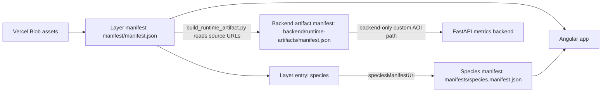
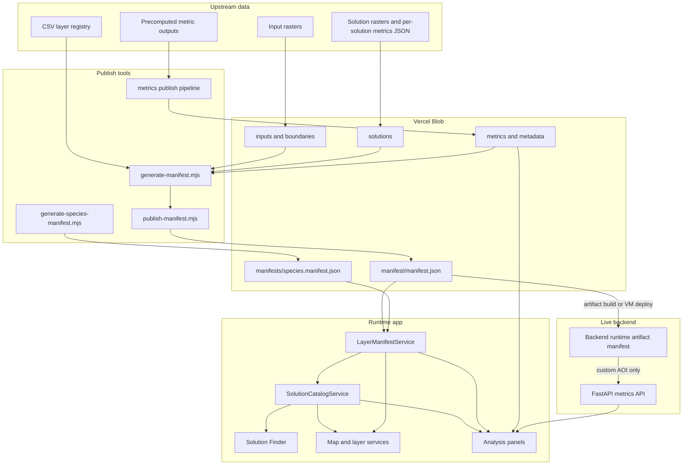
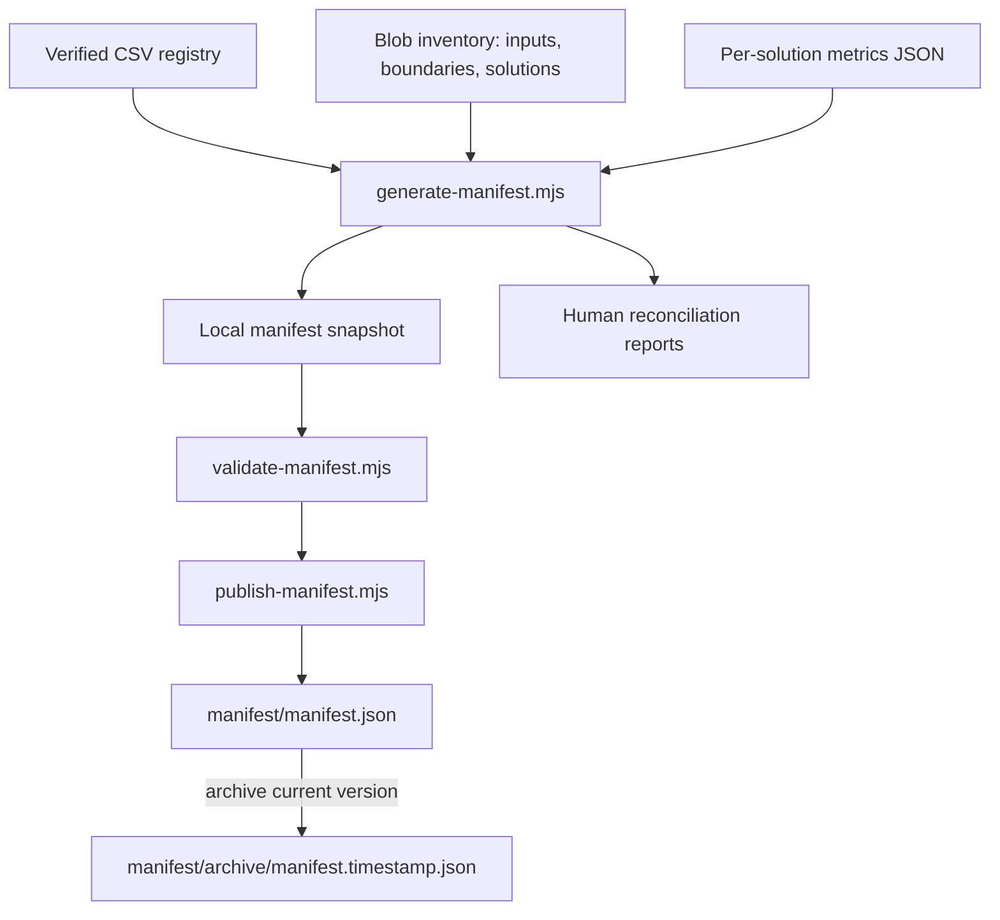
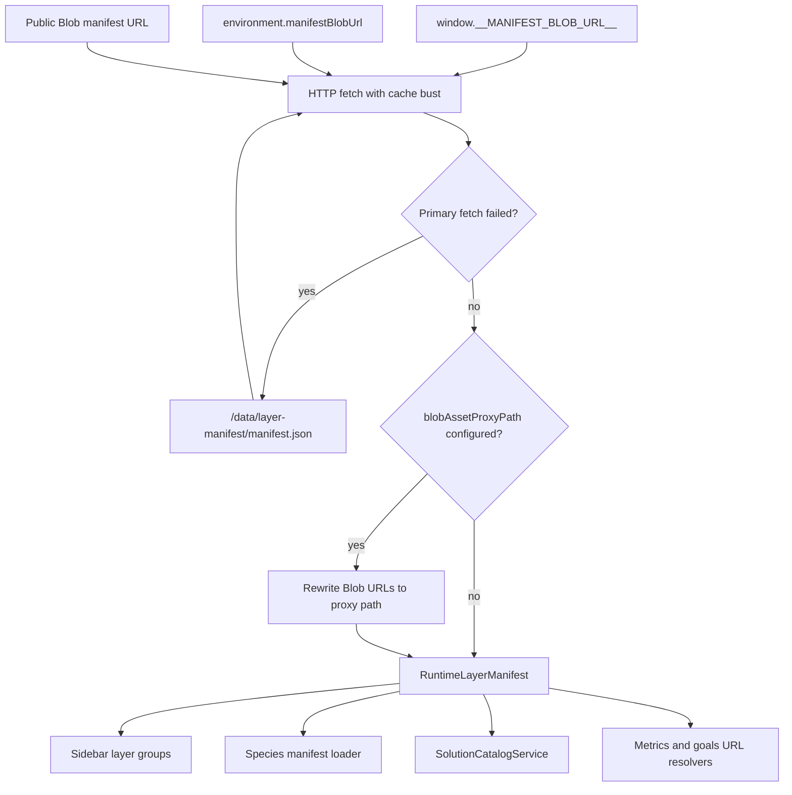
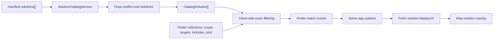
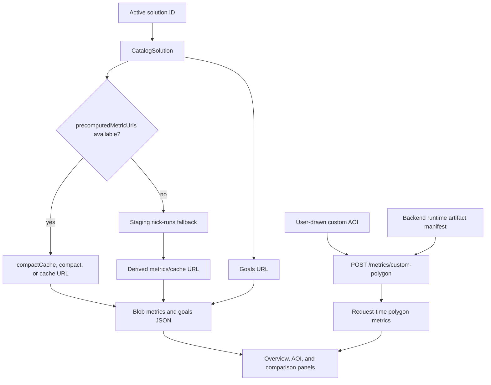
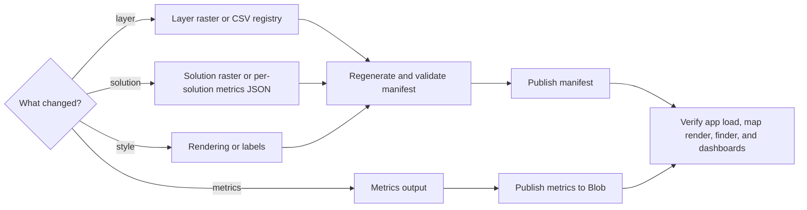

# Data Flow And Blob Storage

_Last updated: 2026-06-26_

This document is the developer-facing overview for how runtime data moves through the DISES decision-making tool. It focuses on the backend data path: Vercel Blob, the runtime layer manifest, solution discovery, precomputed metrics, and the smaller live metrics backend.

The shortest version is: Blob stores the large files, the manifest tells the app what exists, Angular loads and filters that manifest, and the backend only handles live custom-area metrics that cannot be answered from static Blob files.

## Mental Model

The app is manifest-first. The browser does not list Blob prefixes or infer available assets on its own. Instead, generation scripts list Blob, reconcile those files with source registries and solution metadata, publish a small JSON manifest, and let the frontend consume that manifest as the runtime catalog.

There are three related manifest concepts:

- The runtime layer manifest at `manifest/manifest.json` is the main app-facing index for categories, layers, solutions, metadata URLs, metric URLs, and rendering settings.
- The species manifest at `manifests/species.manifest.json` is a secondary index for thousands of species layers. The main manifest points to it through the `species` layer entry.
- The backend artifact manifest at `backend/runtime-artifacts/manifest.json` is separate, backend-only, and usually gitignored or mounted at deploy time. The Angular app never reads it; FastAPI uses it for `/ready` and for `POST /metrics/custom-polygon` when a user draws a custom AOI.



## Documentation Stability

Some parts of this architecture are stable enough to document as the intended mental model. Other parts are current implementation details that may change as the app is refactored. When writing follow-on docs, keep that distinction clear.

Document these as stable concepts:

- Blob stores large runtime assets; the app should not bundle rasters, metrics caches, or generated artifacts.
- The runtime layer manifest is the app-facing catalog for layers, solutions, metadata, metrics, and rendering configuration.
- Solution discovery is currently static: `solutions[]` in the manifest becomes the frontend solution catalog, and the Solution Finder filters that catalog in the browser.
- Most dashboard metrics are precomputed and Blob-backed; the live backend is mainly for custom AOI calculations that require request-time geometry.
- The layer manifest, species manifest, and backend artifact manifest are different contracts and should be named explicitly.

Document these lightly, preferably as known gaps or implementation notes:

- Mock `/api/solutions/*` paths and demo fallbacks. They are useful development history, not the primary architecture.
- Staging-specific metric paths such as `nick-runs` and any runtime code that guesses those URLs.
- String heuristics that infer target levels or feature sets from solution IDs and names.
- Internal structure of large UI files such as `map-layers-panel`, `panel-switcher`, and map rendering components.
- Exact internals of `generate-manifest.mjs` beyond the source inputs, outputs, and publish contract.

## End-To-End Flow



## Blob Layout

Vercel Blob is the current object-storage layer for published geospatial assets. The public Blob host is `https://aagibolq28slyfof.public.blob.vercel-storage.com`; local write/list operations require `BLOB_READ_WRITE_TOKEN`, but token values should never be printed or committed.

| Prefix | What Lives There | Main Consumers |
| --- | --- | --- |
| `inputs/` | Feature, cost, include, and other input rasters used by maps, metrics, and manifest generation. | `generate-manifest.mjs`, map layer services, metrics pipelines |
| `boundaries/` and `inputs/boundaries/` | Boundary layers used for known AOIs and precomputed metric lookup. | Manifest generation, analysis panels, metrics pipelines |
| `solutions/` | Prioritizr solution rasters and per-solution metrics JSON. | Manifest generation, solution map rendering |
| `manifest/` | Canonical runtime layer manifest and archived versions. | `LayerManifestService`, metrics/artifact scripts |
| `manifests/` | Secondary manifests such as the species manifest. | `LayerManifestService.getSpeciesManifest()` |
| `metadata/` | Per-layer metadata JSON. | Layer details and future documentation surfaces |
| `metrics/` | Cached metrics, compact metrics, goals, and live metric artifacts. | Analysis panels and metrics loaders |

## Runtime Manifest Shape

The detailed contract lives in [`frontend/layer-manifest/README.md`](../../frontend/layer-manifest/README.md) and [`frontend/layer-manifest/manifest.schema.json`](../../frontend/layer-manifest/manifest.schema.json). At a high level, the manifest is a compact index like this:

```jsonc
{
  "version": "0.2.0",
  "generatedAt": "2026-06-26T00:00:00.000Z",
  "publicBlobHost": "https://aagibolq28slyfof.public.blob.vercel-storage.com",
  "sourceCsv": {
    "path": "data/...",
    "updatedAt": "..."
  },
  "categories": [
    {
      "id": "ecosystems",
      "spanishLabel": "...",
      "englishLabel": "...",
      "layerIds": ["ecosistemas"]
    }
  ],
  "layers": [
    {
      "id": "ecosistemas",
      "dataRole": "feature_layer",
      "category": "ecosystems",
      "displayUrl": "https://.../inputs/features/ecosystems/ecosistemas.tif",
      "metadataUrl": "https://.../metadata/ecosistemas.metadata.json",
      "precomputedMetricUrls": {}
    }
  ],
  "solutions": [
    {
      "id": "ecos17_estr30_runap_hf",
      "scope": "nacional",
      "displayUrl": "https://.../solutions/nacional/ecos17_estr30_runap_hf.tif",
      "finderInputs": {
        "scope": "nacional",
        "targetFeatureSet": "strategic_ecosystems",
        "targetPercent": null,
        "includeLayerIds": []
      },
      "inputLayerIds": {
        "features": ["ecosistemas", "paramos"],
        "cost": null,
        "includes": [],
        "excludes": []
      },
      "precomputedMetricUrls": {
        "goals": "https://.../metrics/goals/ecos17_estr30_runap_hf.goals.json"
      }
    }
  ]
}
```

The manifest should stay small enough to load quickly. Long source notes, licensing detail, provenance, and validation history belong in metadata files or pipeline reports, not in every runtime layer entry.

## Generation And Publish Path

The main generator is [`frontend/layer-manifest/generate-manifest.mjs`](../../frontend/layer-manifest/generate-manifest.mjs). It combines two sources of truth:

- The verified CSV registry describes required conceptual layers and their intended categories.
- Vercel Blob describes which files are actually available under public prefixes.

Generation writes local development artifacts and reconciliation reports, then [`frontend/layer-manifest/publish-manifest.mjs`](../../frontend/layer-manifest/publish-manifest.mjs) archives the current remote manifest and uploads the new one to `manifest/manifest.json`.



The key frontend scripts are:

```bash
npm --prefix frontend run generate:layer-manifest
npm --prefix frontend run validate:layer-manifest
npm --prefix frontend run publish:layer-manifest
```

Species layers use [`frontend/layer-manifest/generate-species-manifest.mjs`](../../frontend/layer-manifest/generate-species-manifest.mjs) because listing every species in the main manifest would make the main runtime payload too large.

## Runtime Load Path

[`LayerManifestService`](../../frontend/src/app/core/services/layer-manifest.service.ts) is the browser entry point. It resolves the manifest URL in this order:

1. `window.__MANIFEST_BLOB_URL__`
2. `environment.manifestBlobUrl`
3. The hardcoded public Blob URL for `manifest/manifest.json`

If the primary fetch fails, the service falls back to `/data/layer-manifest/manifest.json` for local development. If `environment.blobAssetProxyPath` is configured, it rewrites manifest URLs that start with `manifest.publicBlobHost` to the proxy path before the rest of the app sees them.

Once loaded, the manifest feeds:

- Left-sidebar layer groups and map raster loading from `layers[]`.
- Species preload and species catalog loading through `speciesManifestUrl`.
- Solution catalog construction from `solutions[]`.
- Analysis panel metric URL resolution through precomputed metric URLs and known Blob path conventions.



## Solution Discovery

Solutions are static runtime data today. The app does not call a live backend to generate, list, or match solutions.

[`SolutionCatalogService`](../../frontend/src/app/core/services/solution-catalog.service.ts) subscribes to `LayerManifestService`, reads `manifest.solutions`, filters out conflict-cost solutions, and maps each manifest entry into a `CatalogSolution`. The Solution Finder then filters that in-memory catalog based on scope, target feature set, target level, includes, and cost settings.



When a user applies a solution:

1. The selected `CatalogSolution` becomes the active app solution.
2. Map services fetch the solution raster from `displayUrl`.
3. Analysis services load cached metrics or goals from `precomputedMetricUrls` or known `metrics/` Blob paths.
4. Custom drawn AOIs call the live backend because they require polygon-specific calculations.

This means solution correctness depends mostly on the generated manifest and Blob-side per-solution metrics JSON paired with each solution raster. If a solution is missing, mislabeled, or not findable, start by checking that JSON, the generated `solutions[]` entry, and the reconciliation report.

## Metrics And Live Backend

Most analysis data is static and Blob-backed. The Python pipeline under [`data/metrics/`](../../data/metrics/README.md) reads the manifest, downloads or caches needed rasters, computes metrics, and publishes app-readable JSON back to Blob. The frontend then expands or reads those cached documents in the analysis panels.

The FastAPI backend is narrower. It supports live custom-polygon metrics and readiness checks around runtime artifacts. Its artifact contract is documented in [`backend/artifacts/README.md`](../../backend/artifacts/README.md). Those artifacts are not the same as the runtime layer manifest; they are local files the backend needs after it has been built or synced from manifest-referenced source data.



## Changing Data

Use these workflows as starting points. The exact commands may change while the app is still under active development, so verify against the linked READMEs before publishing production data.



### Add Or Update A Layer

1. Add or update the source raster in the expected Blob prefix, such as `inputs/features/`, `inputs/costs/`, or `inputs/includes/`.
2. Update the verified CSV registry if the conceptual layer, category, label, or usage flag changed.
3. Run `npm --prefix frontend run generate:layer-manifest`.
4. Review the reconciliation reports under `frontend/development-artifacts/layer-manifest/reports/`.
5. Run `npm --prefix frontend run validate:layer-manifest`.
6. Publish with `npm --prefix frontend run publish:layer-manifest` when the generated manifest is correct.
7. Verify the app can load the layer from the left sidebar and render its `displayUrl`.

### Add Or Update A Solution

1. Publish the solution raster and per-solution metrics JSON under `solutions/`.
2. Regenerate the layer manifest so the generator can hydrate `solutions[]`.
3. Check `solutions-reconciliation-report.json` to confirm the solution was included.
4. Validate and publish the manifest.
5. Verify the Solution Finder can locate the solution, the map can render it, and analysis panels can resolve metrics or show expected missing-metric states.

For COG-specific updates, follow [`frontend/scripts/data-deploy/readme.md`](../../frontend/scripts/data-deploy/readme.md). That flow uploads converted COGs and patches `displayCogUrl` into the live manifest while preserving the legacy `displayUrl`.

### Add Or Update Metrics

1. Run the metrics pipeline from [`data/metrics/`](../../data/metrics/README.md) against the intended manifest.
2. Inspect generated metrics locally before upload.
3. Publish metrics with the pipeline publish script, using `--dry-run` first when changing a batch.
4. Confirm the manifest solution entry has explicit `precomputedMetricUrls` or that the frontend loader can derive the expected Blob path.
5. Verify overview, AOI, comparison, and goals panels for at least one affected solution.

### Change Rendering Or Labels

Layer labels, category placement, and rendering settings are partly generated from source registry data and partly normalized inside the manifest generator. Prefer changing the upstream CSV or generator-owned mapping before hand-editing a published manifest.

The protected manifest style publish path in [`frontend/api/dev/manifest-style-publish.ts`](../../frontend/api/dev/manifest-style-publish.ts) can archive and write style edits, but it should be treated as a controlled publishing path, not a replacement for keeping generation inputs understandable.

## Key References

- [`frontend/layer-manifest/README.md`](../../frontend/layer-manifest/README.md): detailed manifest contract and CSV/Blob reconciliation workflow.
- [`frontend/layer-manifest/manifest.schema.json`](../../frontend/layer-manifest/manifest.schema.json): formal manifest schema.
- [`frontend/layer-manifest/generate-manifest.mjs`](../../frontend/layer-manifest/generate-manifest.mjs): main generation script.
- [`frontend/layer-manifest/publish-manifest.mjs`](../../frontend/layer-manifest/publish-manifest.mjs): publish and archive script.
- [`frontend/src/app/core/services/layer-manifest.service.ts`](../../frontend/src/app/core/services/layer-manifest.service.ts): runtime manifest loading.
- [`frontend/src/app/core/services/solution-catalog.service.ts`](../../frontend/src/app/core/services/solution-catalog.service.ts): solution catalog mapping.
- [`frontend/scripts/data-deploy/readme.md`](../../frontend/scripts/data-deploy/readme.md): solution COG upload and manifest publish flow.
- [`data/metrics/README.md`](../../data/metrics/README.md): metrics pipeline and publish flow.
- [`backend/artifacts/README.md`](../../backend/artifacts/README.md): backend runtime artifact manifest.
- [`docs/handoffs/parques-it-auth-blob-storage-eng.md`](../handoffs/parques-it-auth-blob-storage-eng.md): IT handoff counterpart for auth and Blob storage.

## Known Gaps

- The app supports `blobAssetProxyPath`, but the current repo does not clearly expose a full Blob proxy implementation. Treat direct Blob URL versus proxy behavior as a deployment decision to verify before handoff.
- Some finder matching behavior still relies on solution IDs or names when manifest metadata is incomplete, especially target percentages embedded in names like `ecos17` or `estr30`.
- The layer manifest and backend artifact manifest are easy to confuse. The backend artifact manifest is an ops/backend deployment artifact for readiness and custom AOI metrics, not part of the browser runtime catalog.
- Local fallback manifests are development conveniences. The canonical runtime source is the published Blob manifest unless an environment override points elsewhere.
- The system is still actively changing, so this document should describe stable mental models and link to operational READMEs for exact commands.
