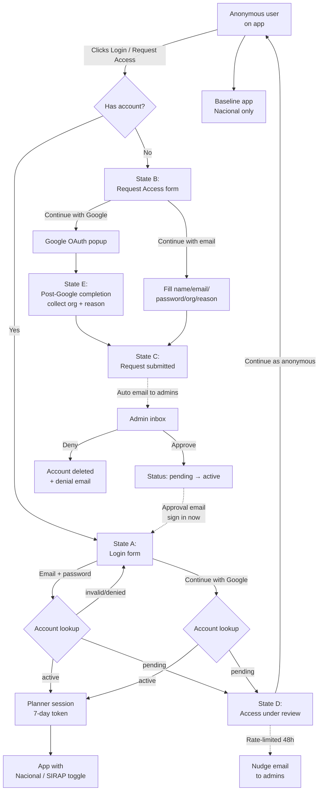

# Login & Register — MVP System Design

**Status:** Draft — awaiting team review
**Last updated:** 2026-04-17
**Scope:** Just enough auth to support a "Nacional / SIRAP" geographic-scope toggle. Everything else is explicitly deferred.

---

## 1. Why This Exists (Problem Statement)

The MDD describes a rich three-tier auth model (Public / Decision Maker / Manager) with LDAP, SSO, custom data upload, scenario saving, etc. We are **not building that**. With the deadline approaching, the only concrete user-visible benefit of "being logged in" for MVP is one toggle:

> **Anonymous users see Nacional data only. Logged-in users see a "Nacional | SIRAP" scope toggle.**

SIRAP data itself may not exist yet — the toggle can ship with SIRAP disabled or empty. The point is the mechanism. Everything else in the MDD's auth story is a post-MVP enhancement.

---

## 2. User Types (MVP)

| Type          | Access            | Can see / do                                                        |
|---------------|-------------------|---------------------------------------------------------------------|
| **Anonymous** | Public URL        | Everything the app does today, Nacional scope only                  |
| **Planner**   | Login required    | Everything Anonymous sees **+** the Nacional / SIRAP scope toggle   |
| **Admin**     | Approval only     | No in-app UI in MVP. Admins approve/deny access requests via email. |

> **Note:** The MDD's "Tier 3 Manager" admin dashboard (data ingestion, publishing, queue management) is **not** in this MVP. The only admin action we need to support is "approve or deny an access request."

The existing `UserTier` enum (`Public = 1`, `DecisionMaker = 2`, `Manager = 3`) and `AuthService` (7-day localStorage token, `provider: 'local' | 'google'`) stay as-is.

---

## 3. What Login Unlocks (MVP)

Only this:

- A visible **"Scope: Nacional | SIRAP"** toggle (location TBD — likely header or left sidebar)
- That toggle, when the user switches to SIRAP, filters/augments data shown to the SIRAP level

That's it. No scenario saving, no upload, no compare, no advanced reports.

**Deferred (not MVP):**
- Scenario save/name
- Custom data upload
- Scenario comparison
- Advanced thematic reports (PDF)
- Any Manager/Admin dashboard UI

---

## 4. Authentication Methods

Two options, offered at **both login and registration**:

1. **Email + password** (local provider — already wired in `AuthService`)
2. **Continue with Google** (Google OAuth — `AuthService` already supports `provider: 'google'`)

Users pick either path when requesting access. Whatever they pick is what they'll use to sign in later. No forced conversion between methods.

**Not in MVP:** LDAP, Active Directory, PNNC institutional SSO, "Forgot Password" flow (if someone forgets, they contact admin).

---

## 5. Registration Flow — "Request Access"

Registration is **not self-serve**. It's: user submits credentials → account stored as `pending` → admin approves or denies → status flips to `active` (or account deleted).

### 5.1 The pending-account model (important)

Unlike a classic "credentials emailed on approval" flow, **we create the account immediately with `status: 'pending'`**. This is what makes the friendly pending-login UX in §5.5 possible.

- User submits a Request Access form that **includes credentials** (either an email/password pair OR a completed Google OAuth handshake)
- Backend writes the account with `status: 'pending'`
- User can *attempt* to log in with those credentials right away, but the system recognizes the pending status and shows the State D "access under review" modal (§5.5) — it does not grant a Planner session

### 5.2 User submits request

Request Access form offers two parallel paths at the top:

- **Continue with Google** — completes OAuth, then shows the **post-Google completion form** (see below)
- **Continue with email** — user fills in all fields manually inline

### 5.2a Email path fields

- **Full name** (required)
- **Email** (required)
- **Password** + **Confirm password** (required)
- **Organization / SIRAP** (optional, free-text)
- **Reason for access** (optional, free-text, helps admins triage)

### 5.2b Google path — post-OAuth completion form (State F)

After the OAuth popup returns successfully, we show a short **completion form** so we can still capture app-specific context that Google doesn't know about:

- Top ribbon: "Signed in with Google ✓" (reassures the user OAuth worked)
- **Identity card** showing the Google name, email, and avatar — locked/read-only, with a small "From Google" pill
- **Organization / SIRAP** (optional, free-text) — with helper text "Helps admins recognize you faster"
- **Reason for access** (optional, free-text)
- Submit button + a helper line clarifying both fields are truly optional ("you can submit without them")

Design rationale: Google OAuth handles *identity* (who you are); the completion form captures *domain context* (which SIRAP, why you want in). Same pattern as Notion, Linear, and Vercel — never silently submit a request with only the Google profile, because it denies the user a moment of confirmation and denies admins useful triage context.

**This state only appears during Request Access.** Returning Google users who already have an active account never see it — they go straight to a session. Pending Google users get routed to State D instead.

### 5.2c Submission outcome

On submit (either path), the user sees **State C "Request submitted" confirmation** — a simple panel saying their request is in review.

### 5.3 Admin receives notification

An email is sent to a configured admin distribution list containing:

- The applicant's name, email, organization, reason, auth provider used
- Two action links: **Approve** and **Deny**

Backend implementation detail; UI side just needs to know approvals happen out-of-band.

### 5.4 Admin decision

- **Approved:** Account status flips from `pending` → `active`. User gets an email: "You've been approved, sign in at …". No credentials in the email — they set their password (or used Google) at registration time, so their existing credentials just start working.
- **Denied:** Account row deleted. User gets a short rejection email.

### 5.5 If user attempts to log in while pending (State D)

This is the new "pending login" state, added after the original doc.

- User enters email/password **or** clicks Continue with Google
- Backend identifies the account, sees `status: 'pending'`, returns a pending-specific response (not a session, not an error)
- Frontend shows **State D — "Access request under review"** modal containing:
  - Submitted date ("Submitted 2 days ago")
  - Request ID (e.g., `REQ-2026-0417-A3F2`)
  - Typical response time (1–3 business days)
  - Honest framing of what they *can* still do while anonymous: use the app in its baseline form (everything except the Nacional / SIRAP scope toggle)
  - Primary action: **Continue as anonymous** (dismiss)
  - Secondary action: **Email admins for an update** — rate-limited to once per 48 hours. If within cooldown, button is disabled and shows "Next nudge available in Xh."
- User does not receive a Planner session; their next browsing session continues as Anonymous

### 5.6 UI implications

- The Register tab / button is labeled **"Request Access"** (not "Sign up" or "Register"), because approval is not instant.
- After submitting, show State C (confirmation), not a disappearing toast.
- Login form carries a helper link: "Don't have an account? → Request access"
- Login submit must handle three distinct outcomes: `active → session`, `pending → State D`, `invalid → inline error`.

---

## 5.7 Modal States — Complete List

No new Angular routes are needed. All auth UX lives inside one overlay component with the following states:

| State | Purpose | Trigger |
|-------|---------|---------|
| A | Login form | User clicks "Login / Request Access" in header |
| B | Request Access form (email path) | User switches to "Request access" |
| C | Request submitted (pending confirmation) | Immediately after successful request submission |
| D | Access request under review | Login attempt on an account with `status: 'pending'` |
| E | Post-Google completion form | After Google OAuth returns during Request Access (see §5.2b) |
| — | Inline error (invalid credentials, denied, etc.) | Login attempt on nonexistent/deleted account — shown as a red helper line under the form, not a dedicated state |

**Variant-specific note:** The v5 stacked-entry-card mockup uses local labels (State A–F) that differ slightly from the canonical labels above because v5 has an extra "entry choices" state before the email form expands. The mapping is:

| v5 local | Canonical | Description |
|----------|-----------|-------------|
| v5-A | (pre-A) | Entry choices — three-door chooser |
| v5-B | A | Login form (expanded email path) |
| v5-C | B | Request Access form (email path) |
| v5-D | C | Pending confirmation |
| v5-E | D | Access under review |
| v5-F | E | Post-Google completion |

---

## 6. Admin Approval — Why Out-of-Band

We considered three options:

| Option                       | Pros                                            | Cons                                                | Pick for MVP? |
|------------------------------|-------------------------------------------------|-----------------------------------------------------|---------------|
| Out-of-band email approval   | Zero UI surface area; admin works in their inbox| Needs backend + email wiring                        | **Yes**       |
| Domain allowlist (auto-approve) | Zero admin effort                            | Can't vet individuals; risky if SIRAP staff use Gmail| No           |
| In-app admin page            | Best admin UX                                   | Requires a whole Tier 3 dashboard feature           | No (deferred) |

Out-of-band email wins because it adds no UI scope — the only *new* screens we have to design are login, request-access, and the pending-confirmation state. The approval mailbox can evolve into an in-app admin page later without changing the user-facing flow.

---

## 7. Session & Persistence

**Already implemented** in `AuthService`:

- 7-day session stored in `localStorage` under `dmt.auth.session`
- Automatic restore on app load via `syncTierFromStoredSession()`
- Logout clears storage and resets tier to Public
- Session token carries provider (`local` | `google`) and tier

MVP additions needed: **none on the frontend**. No "Remember Me" checkbox (default is always 7 days), no session-expiry warning modal (out of MVP scope; the token just expires and the user logs in again).

---

## 8. User Flow (Diagram)

---

## 9. Out of Scope for MVP (Explicit)

Flagging so we don't accidentally rebuild the MDD in a sprint:

- ☐ In-app admin dashboard (approve/deny queue, user management)
- ☐ Forgot password flow
- ☐ Remember Me checkbox / session duration picker
- ☐ Session expiry warning modal
- ☐ LDAP / Active Directory / PNNC SSO
- ☐ Custom data upload (Tier 2 MDD feature)
- ☐ Scenario save / compare / advanced reports (Tier 2 MDD features)
- ☐ Species group fragmentation (Tier 3 MDD feature)
- ☐ Layer ingestion / deprecation workflow (Tier 3 MDD feature)
- ☐ Audit log of approvals / denials
- ☐ Self-serve profile editing (change email, change name)

All of these are in the MDD and will need to come back, but not now.

---

## 10. Open Questions

1. **Where does the Nacional / SIRAP toggle live?** Header next to the language switcher? Top of left sidebar? This doc doesn't decide that — it's a separate UI placement question.
2. **What backend sends the approval emails?** Node service, Supabase function, plain SMTP? Team decision.
3. **What email address is the admin distribution list?** Needs a real mailbox before we ship.
4. **Google OAuth client ID / consent screen** — needs to be registered under a project owned by PNNC or the Spatial Lab before go-live.
5. **Should the Request Access form capture which SIRAP region** the user belongs to, as a structured dropdown (vs free-text organization)? Answered for MVP: **free-text optional field** is enough; structure can come later if we build per-SIRAP data scoping.
6. **What happens if someone requests access with an email that's already approved?** Likely: admin sees the duplicate and denies with a "you already have an account" note. No special UI handling in MVP.

---

## 11. Implementation Hooks (Already in Codebase)

- `frontend/src/app/core/services/auth.service.ts` — handles login/logout, session storage
- `frontend/src/app/core/models/user-tier.model.ts` — `UserTier` enum
- `frontend/src/app/core/guards/tier-access.guard.ts` — route guard, used to gate SIRAP-only routes
- `frontend/src/app/core/layout/header/header.html` — existing Login / Register popover, ready to be re-treated based on mockup selection

---

## 12. Related

- `docs/design/MASTER_DESIGN_DOCUMENT.md` §2.2, §2.3, §4.8.1, §4.9.2 — full auth vision (post-MVP)
- `development-artifacts/mockups/login-register/` — five visual treatments of this flow (for review)
