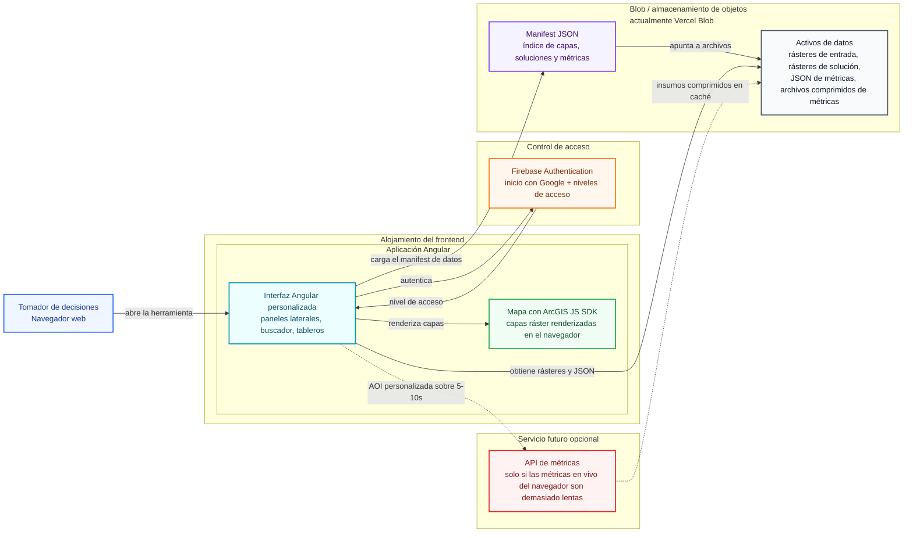
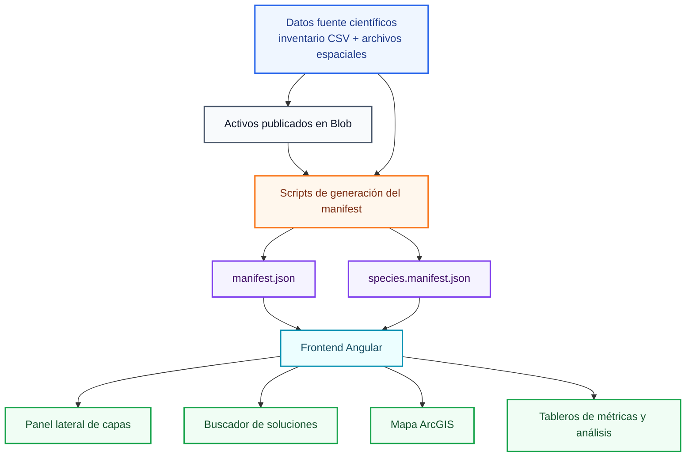
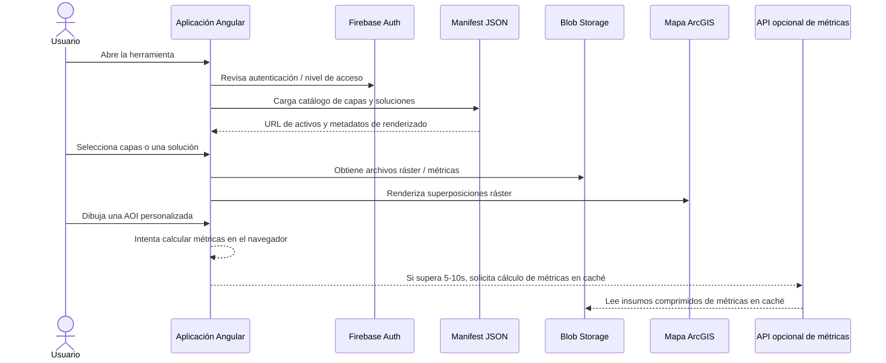
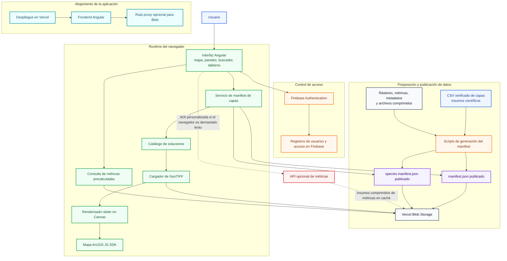

# Borrador de diapositivas sobre la arquitectura del sistema para GTIC

Este borrador está pensado para una reunión breve con GTIC / PNN sobre compatibilidad de infraestructura. El objetivo es mostrar qué componentes existen, cómo los alojamos actualmente, qué opciones equivalentes podrían funcionar y qué podemos decir hoy sobre requisitos de hardware/runtime.

Duración recomendada: **4 diapositivas principales más 1 diapositiva opcional de apéndice**. Mantenga la reunión enfocada en compatibilidad de infraestructura: componentes, opciones de despliegue, requisitos provisionales y pruebas pendientes.

## Diagrama para copiar y pegar en diapositivas

Use este diagrama como visual principal en Google Slides. Péguelo en [Mermaid Live Editor](https://mermaid.live/), expórtelo como SVG o PNG e inserte esa imagen en la diapositiva.

En la vista previa de Markdown (Cursor / VS Code / GitHub), los bloques **` ```mermaid ` a menudo se reemplazan por un diagrama renderizado**, lo que oculta el control normal para copiar el código fuente. El bloque desplegable de abajo duplica el **mismo diagrama como texto plano** para que la vista previa mantenga un botón de **copiar al portapapeles** en ese bloque. Pegue el contenido en Mermaid Live **sin** envolverlo en comillas invertidas adicionales.

<details open id="gtic-slide-diagram-copy-source-es">
<summary><strong>Copiar fuente del diagrama</strong> — use el icono de copiar de la barra de herramientas de la vista previa en este bloque</summary>

```text
%%{init: {"theme": "base", "themeVariables": {"background": "#ffffff", "fontFamily": "Inter, Arial, sans-serif", "primaryTextColor": "#0f172a", "lineColor": "#64748b", "clusterBkg": "#f8fafc", "clusterBorder": "#cbd5e1"}}}%%
flowchart LR
  User["Tomador de decisiones<br/>Navegador web"]:::user

  subgraph Frontend["Alojamiento del frontend"]
    subgraph AngularApp["Aplicación Angular<br/>despliegue en Vercel"]
      App["Interfaz Angular personalizada<br/>paneles laterales, buscador, tableros"]:::app
      ArcGIS["Mapa con ArcGIS JS SDK<br/>capas ráster renderizadas en el navegador"]:::map
    end
  end

  subgraph Auth["Control de acceso"]
    Firebase["Firebase Authentication<br/>inicio con Google + niveles de acceso"]:::auth
  end

  subgraph Storage["Blob / almacenamiento de objetos<br/>actualmente Vercel Blob"]
    Manifest["Manifest JSON<br/>índice de capas, soluciones y métricas"]:::manifest
    Assets["Activos de datos<br/>rásteres de entrada, rásteres de solución,<br/>JSON de métricas, archivos comprimidos de métricas"]:::storage
  end

  subgraph Optional["Servicio futuro opcional"]
    MetricsAPI["API de métricas<br/>solo si las métricas en vivo del navegador son demasiado lentas"]:::optional
  end

  User -->|"abre la herramienta"| App
  App <-->|"autentica"| Firebase
  App -->|"carga el manifest de datos (JSON)"| Manifest
  Manifest -->|"apunta a archivos"| Assets
  App -->|"obtiene rásteres + JSON"| Assets
  App -->|"renderiza capas"| ArcGIS
  App -. "AOI personalizada > 5-10 s" .-> MetricsAPI
  MetricsAPI -. "insumos comprimidos en caché" .-> Assets

  style AngularApp fill:#ecfeff,stroke:#0891b2,stroke-width:2px,color:#164e63;
  classDef user fill:#eff6ff,stroke:#2563eb,stroke-width:2px,color:#1e3a8a;
  classDef app fill:#ecfeff,stroke:#0891b2,stroke-width:2px,color:#164e63;
  classDef map fill:#f0fdf4,stroke:#16a34a,stroke-width:2px,color:#14532d;
  classDef auth fill:#fff7ed,stroke:#f97316,stroke-width:2px,color:#7c2d12;
  classDef manifest fill:#f5f3ff,stroke:#7c3aed,stroke-width:2px,color:#3b0764;
  classDef storage fill:#f8fafc,stroke:#475569,stroke-width:2px,color:#0f172a;
  classDef optional fill:#fef2f2,stroke:#dc2626,stroke-width:2px,stroke-dasharray: 6 4,color:#7f1d1d;
```

</details>

Vista previa renderizada (solo diagrama — copie la fuente con estilo desde el bloque anterior):



## Secuencia recomendada de diapositivas

### Diapositiva 1: Lo que GTIC necesita saber

**Mensaje:** La aplicación es principalmente una herramienta web estática con object storage para los activos de datos. La principal pregunta abierta de infraestructura es si las métricas en el navegador serán suficientemente rápidas, o si necesitaremos una API pequeña de métricas.

**Puntos para la diapositiva:**

- Frontend: aplicación web Angular.
- Datos: archivos ráster, metadatos y métricas en blob/object storage.
- Autenticación: Firebase hoy; reemplazable si GTIC requiere otro proveedor de identidad.
- Cómputo: principalmente en el navegador; API opcional solo si las métricas en vivo son demasiado lentas.

### Diapositiva 2: Componentes y opciones de alojamiento

**Mensaje:** La arquitectura actual se divide en pocos componentes de infraestructura. Vercel/Firebase son decisiones actuales de implementación, no requisitos obligatorios si GTIC prefiere otra infraestructura.

Use el diagrama anterior como visual principal de la diapositiva; copie desde el bloque expandido **Copiar fuente del diagrama** para Mermaid Live.

**Puntos para la diapositiva:**

- Frontend estático: Vercel hoy; podría moverse a alojamiento estático de GTIC.
- Blob/object storage: Vercel Blob hoy; podría moverse a S3-compatible o almacenamiento institucional.
- Autenticación: Firebase hoy; podría moverse a SSO institucional si se requiere.
- API opcional de métricas: todavía no requerida; solo si los cálculos de AOI personalizada no cumplen el objetivo de rendimiento.

### Diapositiva 3: Flujo de datos y manifest

**Mensaje:** Blob storage contiene los activos de datos; el manifest es el contrato en tiempo de ejecución que le dice al frontend dónde vive cada activo y cómo debe usarse.



**Lo que indexa el manifest:**

- Rásteres de entrada que se pueden mostrar en el mapa.
- Rásteres de soluciones generadas a partir de escenarios de priorización.
- URL de metadatos y métricas precalculadas.
- Insumos comprimidos de métricas para cálculos en vivo.
- Un manifest secundario de especies, para que miles de capas de especies queden fuera del manifest principal.

### Diapositiva 4: Flujo de usuario en tiempo de ejecución

**Mensaje:** La mayoría de las interacciones de usuario pueden ejecutarse desde el navegador usando activos estáticos. Solo se necesita una API de métricas separada si los cálculos de polígonos personalizados en el navegador son demasiado lentos.



**Puntos para la diapositiva:**

- Se prefieren métricas precalculadas cuando las fronteras o escenarios se conocen de antemano.
- Las métricas en vivo para polígonos dibujados por usuarios son la principal incertidumbre de rendimiento.
- Si los cálculos en vivo son suficientemente rápidos, no se necesita servidor de métricas.
- Si son demasiado lentos, se agrega una API pequeña que lea insumos optimizados en caché.

### Diapositiva 5: Requisitos provisionales y decisiones abiertas

**Mensaje:** Estas son estimaciones de trabajo, no requisitos finales. Seguimos probando volumen de datos, memoria del navegador y rendimiento de métricas para AOI personalizada.

**Estimación actual:**

- Almacenamiento: aproximadamente 1-2 GB hoy; probablemente 4-5 GB en el corto plazo.
- Alojamiento del frontend: alojamiento web estático es suficiente.
- Alojamiento de datos: blob/object storage para GeoTIFF, JSON, metadatos y archivos comprimidos de métricas.
- Navegador: navegador moderno con soporte para Canvas; la memoria depende de los rásteres seleccionados y de las operaciones de métricas en vivo.
- Cómputo servidor: no requerido hoy, salvo que las métricas de AOI personalizada superen el tiempo objetivo de respuesta.

**Preguntas para GTIC / PNN:**

- ¿Vercel es aceptable, o debemos apuntar a alojamiento estático institucional?
- ¿Vercel Blob es aceptable, o los activos deben moverse al object storage preferido por GTIC?
- ¿Las URL públicas de activos son aceptables, o se requiere acceso privado/proxificado?
- ¿Firebase es aceptable, o debemos integrar identidad institucional?
- ¿Hay políticas requeridas de respaldos, logs, monitoreo, disponibilidad o retención de datos?

### Diapositiva 6: Apéndice opcional - diagrama más detallado del sistema

Use esta diapositiva solo si la audiencia pide más detalle técnico.



## Encuadre recomendado para GTIC

Debemos enmarcar esto como una revisión de compatibilidad de infraestructura, no como una entrega final de requisitos. El diseño actual es intencionalmente simple: frontend estático, object storage para activos de datos, Firebase para autenticación por ahora y renderizado de mapas en el navegador.

La principal pregunta de hardware sigue siendo empírica: ¿pueden las métricas de AOI personalizada ejecutarse con suficiente rapidez en el navegador para los tamaños de datos y flujos de usuario esperados? Si la respuesta es sí, los requisitos de servidor se mantienen mínimos. Si no, la adición probable es una API pequeña de métricas, no un backend geoespacial grande.

## Preguntas para GTIC

- ¿Es aceptable el alojamiento web estático para el frontend, o debemos prepararnos para desplegarlo en un entorno institucional específico?
- ¿Es aceptable el blob/object storage para rásteres, JSON, metadatos y activos comprimidos de métricas?
- ¿Son aceptables las URL públicas de activos, o todos los activos de datos deben ser privados, proxificados o controlados por acceso?
- ¿Es aceptable Firebase Authentication para inicio con Google, o se requiere un proveedor institucional de identidad?
- Si se necesita una API de métricas, ¿qué opciones de runtime/contenedor/servidor deberíamos usar?
- ¿Hay políticas requeridas para respaldos, registros, disponibilidad, monitoreo o retención de datos?

## Qué no sobreprometer todavía

- No presentar las estimaciones actuales como requisitos finales de hardware.
- No prometer que todas las métricas de AOI personalizada se ejecutarán completamente en el navegador hasta completar las pruebas de rendimiento.
- No dar a entender que Vercel Blob es obligatorio; la arquitectura depende de blob/object storage como patrón.
- No presentar la estimación de 4-5 GB como un techo permanente; enmarcarla como la estimación actual de corto plazo.
