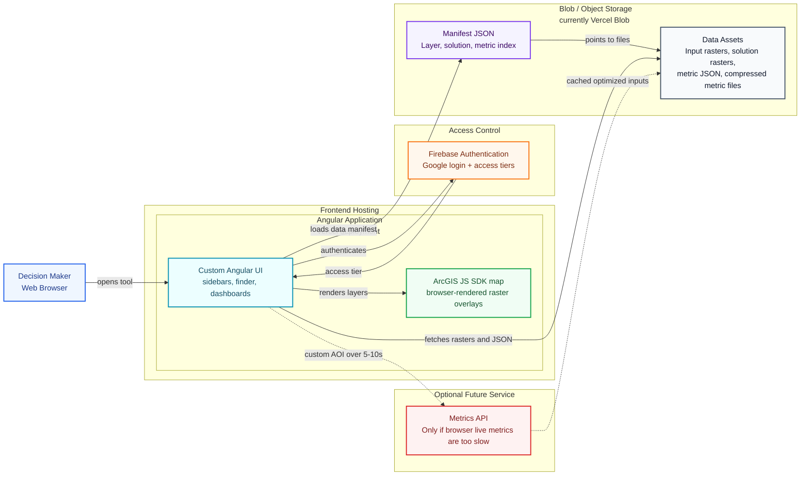
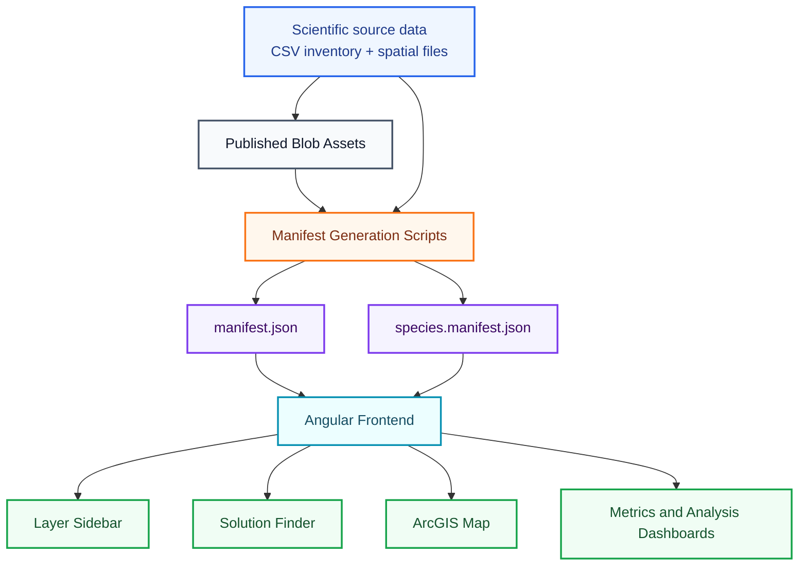
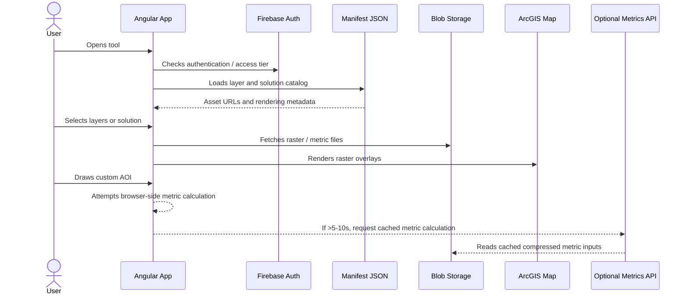
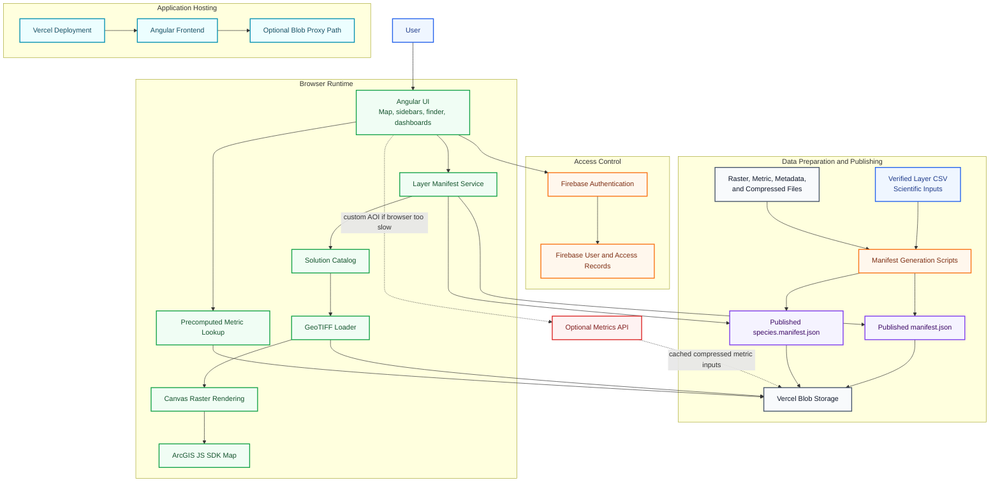

# GTIC System Architecture Slide Draft

This draft is intended for a short side meeting with GTIC / PNN about infrastructure compatibility. The goal is not to present final system requirements yet. The goal is to show the current architecture, explain the data flow, identify what is already known, and surface the few decisions that may need GTIC input before the August delivery window.

Recommended length: **5 core slides plus 1 optional appendix slide**. Five slides should be enough for a 10-15 minute architecture walkthrough without overwhelming the audience. The appendix can hold the more detailed diagram if GTIC asks deeper technical questions.

## Copy-Paste Slide Diagram

Use this as the main visual diagram for Google Slides. Paste into [Mermaid Live Editor](https://mermaid.live/), export as SVG or PNG, and insert that image into the slide.

In Markdown preview (Cursor / VS Code / GitHub), **` ```mermaid ` blocks are often replaced by a rendered diagram**, which hides the usual copy control on the source. The collapsible block below duplicates the **same diagram as plain text** so preview keeps a **copy-to-clipboard** button on that fence. Paste into Mermaid Live **without** wrapping it in extra backticks.

<details open id="gtic-slide-diagram-copy-source">
<summary><strong>Copy diagram source</strong> — use the preview toolbar copy icon on this block</summary>

```text
%%{init: {"theme": "base", "themeVariables": {"background": "#ffffff", "fontFamily": "Inter, Arial, sans-serif", "primaryTextColor": "#0f172a", "lineColor": "#64748b", "clusterBkg": "#f8fafc", "clusterBorder": "#cbd5e1"}}}%%
flowchart LR
  User["Decision Maker<br/>Web Browser"]:::user

  subgraph Frontend["Frontend Hosting"]
    subgraph AngularApp["Angular Application<br/>Vercel deployment"]
      App["Custom Angular UI<br/>sidebars, finder, dashboards"]:::app
      ArcGIS["ArcGIS JS SDK map<br/>browser-rendered raster overlays"]:::map
    end
  end

  subgraph Auth["Access Control"]
    Firebase["Firebase Authentication<br/>Google login + access tiers"]:::auth
  end

  subgraph Storage["Blob / Object Storage (currently Vercel Blob)"]
    Manifest["Manifest JSON<br/>Layer, solution, metric index"]:::manifest
    Assets["Data Assets<br/>Input rasters, solution rasters,<br/>metric JSON, compressed metric files"]:::storage
  end

  subgraph Optional["Optional Future Service"]
    MetricsAPI["Metrics API<br/>Only if browser live metrics are too slow"]:::optional
  end

  User -->|"opens tool"| App
  App <-->|"authenticates"| Firebase
  App -->|"loads data manifest (JSON)"| Manifest
  Manifest -->|"points to files"| Assets
  App -->|"fetches rasters + JSON"| Assets
  App -->|"renders layers"| ArcGIS
  App -. "custom AOI > 5-10 sec" .-> MetricsAPI
  MetricsAPI -. "cached optimized inputs" .-> Assets

  style AngularApp fill:#ecfeff,stroke:#0891b2,stroke-width:2px,color:#164e63;
  classDef user fill:#eff6ff,stroke:#2563eb,stroke-width:2px,color:#1e3a8a;
  classDef app fill:#ecfeff,stroke:#0891b2,stroke-width:2px,color:#164e63;
  classDef map fill:#f0fdf4,stroke:#16a34a,stroke-width:2px,color:#14532d;
  classDef auth fill:#fff7ed,stroke:#f97316,stroke-width:2px,color:#7c2d12;
  classDef manifest fill:#f5f3ff,stroke:#7c3aed,stroke-width:2px,color:#3b0764;
  classDef storage fill:#f8fafc,stroke:#475569,stroke-width:2px,color:#0f172a;
  classDef optional fill:#fef2f2,stroke:#dc2626,stroke-width:2px,stroke-dasharray: 6 4,color:#7f1d1d;
```

</details>

Rendered preview (diagram only — copy the styled source from the block above):



## Recommended Slide Sequence

### Slide 1: Purpose Of The Architecture Conversation

**Message:** The tool is still in development, but the major architecture direction is clear enough to review for infrastructure fit.

**What to say:**

- We want early alignment with GTIC / PNN infrastructure before final documentation is delivered.
- The current design keeps the system flexible by relying mostly on static web hosting and blob/object storage.
- Final software and platform requirements will be refined after scalability testing and live-metric performance checks.

### Slide 2: Current High-Level Architecture

**Message:** The application is a static-first web tool: an Angular frontend loads a manifest, retrieves spatial assets from blob storage, and renders them in the browser.

Use the slide diagram above as the main slide visual; copy from the expanded **Copy diagram source** block for Mermaid Live.

**Speaker notes:**

- Vercel Blob is the current storage provider, but this pattern can map to other blob/object storage providers.
- The manifest avoids hardcoding thousands of data URLs in application code.
- The map rendering path is browser-based: the frontend fetches GeoTIFFs, converts them to canvas-backed image overlays, and displays them with the ArcGIS JavaScript SDK.

### Slide 3: Data And Manifest Flow

**Message:** Blob storage holds the data assets; the manifest is the runtime contract that tells the frontend where each asset lives and how it should be used.



**What the manifest currently indexes:**

- Mappable input rasters.
- Solution rasters generated from prioritization scenarios.
- Metadata URLs.
- Precomputed metric JSON URLs.
- Compressed data files for live-metric calculation.
- A secondary species manifest, so thousands of species layers do not bloat the main manifest.

### Slide 4: Runtime User Flow

**Message:** Most user interactions can run from the browser using static assets. A separate metrics API is only needed if browser-side custom polygon calculations are too slow.



**Speaker notes:**

- Precomputed metrics are preferred where boundaries or scenarios are known in advance.
- Live metrics for arbitrary user-drawn polygons are the main performance uncertainty.
- The decision point is empirical: if live calculations stay under the target interaction time, the browser-only architecture remains simpler.

### Slide 5: Provisional Requirements And Open Decisions

**Message:** We can share current assumptions and decision points, but final requirements should wait for scalability and performance testing.

**Current assumptions:**

- Storage: 1-2 GB currently, with an estimated near-term ceiling of 4-5 GB.
- Hosting: Angular frontend deployed on Vercel; equivalent static web hosting may be possible.
- Data delivery: Blob/object storage for rasters, JSON, metadata, and compressed metric inputs.
- Authentication: Firebase Authentication currently supports Google-based login and access tiers.
- Map runtime: ArcGIS JavaScript SDK in the browser.
- Browser runtime: modern browser with Canvas support and sufficient memory for selected raster operations.

**Open decisions for GTIC / PNN discussion:**

- Whether Vercel hosting is acceptable, or whether the app should be deployable to GTIC / PNN-preferred hosting.
- Whether Vercel Blob is acceptable, or whether assets should move to a preferred object storage provider.
- Whether Firebase Authentication is acceptable, or whether a different institutional identity provider is required.
- Whether GTIC requires private asset access, network restrictions, audit logging, or specific backup/retention policies.
- Whether an optional metrics API is needed after browser-side performance testing.

### Slide 6: Optional Appendix - More Detailed System Diagram

Use this only if the audience asks for more technical detail.



## Recommended Framing For GTIC

### English

We are not yet presenting final software requirements. We are presenting the current architecture and the likely requirement envelope so GTIC can identify compatibility concerns early. The tool is currently designed as a static-first web application with object storage for data assets, Firebase for authentication, and browser-side spatial rendering through the ArcGIS JavaScript SDK.

The main unresolved technical question is whether live metric calculations for custom user-drawn areas can run fast enough in the browser. If they cannot, we may introduce a small metrics API that keeps optimized metric inputs cached in memory. That decision should be based on scalability testing rather than assumed upfront.

### Spanish Draft

Todavia no estamos presentando los requisitos finales de software. Estamos presentando la arquitectura actual y el rango probable de requisitos para que GTIC pueda identificar posibles temas de compatibilidad con anticipacion. La herramienta esta disenada actualmente como una aplicacion web de tipo "static-first", con almacenamiento de objetos para los activos de datos, Firebase para autenticacion, y renderizado espacial en el navegador mediante el ArcGIS JavaScript SDK.

La principal pregunta tecnica pendiente es si los calculos de metricas en vivo para areas personalizadas dibujadas por los usuarios pueden ejecutarse con suficiente rapidez en el navegador. Si no cumplen el objetivo de rendimiento, podriamos incorporar una API pequena de metricas que mantenga datos optimizados en memoria para calculos rapidos. Esa decision deberia basarse en pruebas de escalabilidad, no en una suposicion inicial.

## Questions To Ask GTIC

- Is static web hosting acceptable for the frontend, or should we prepare for deployment into a specific institutional environment?
- Is object/blob storage acceptable for raster, JSON, metadata, and compressed metric assets?
- Are public asset URLs acceptable, or must all data assets be private, proxied, or access-controlled?
- Is Firebase Authentication acceptable for Google-based login, or is an institutional identity provider required?
- Are there required policies for backups, logs, uptime, monitoring, or data retention?
- Are there restrictions on using Vercel, Firebase, or other cloud-hosted services?

## What Not To Overclaim Yet

- Do not promise final hosting requirements until GTIC confirms acceptable infrastructure.
- Do not promise that all custom AOI metrics will run fully in the browser until performance testing is complete.
- Do not imply that Vercel Blob is mandatory; the architecture depends on blob/object storage as a pattern.
- Do not present the 4-5 GB estimate as a permanent ceiling; frame it as the current near-term estimate.
