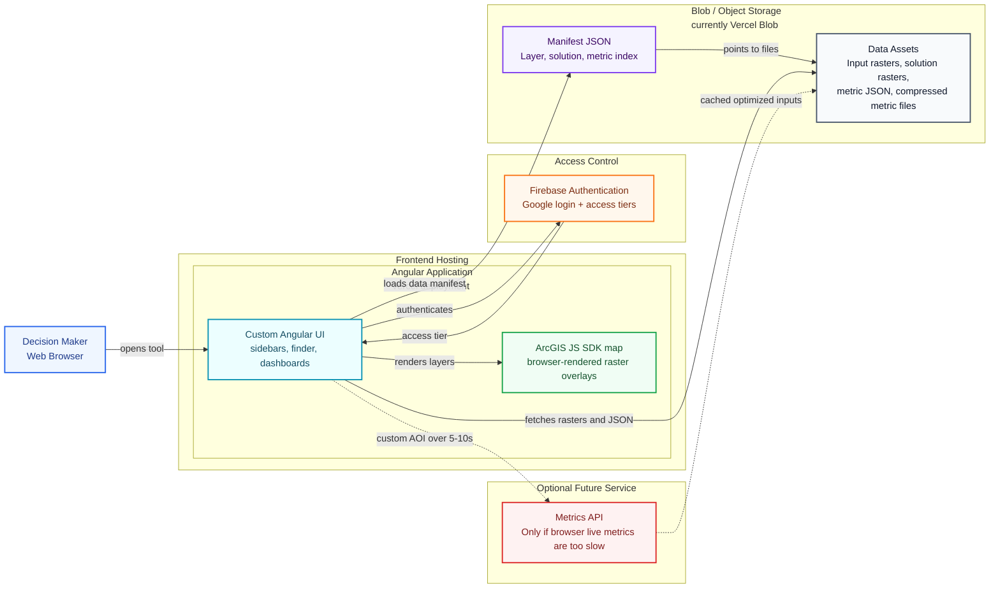
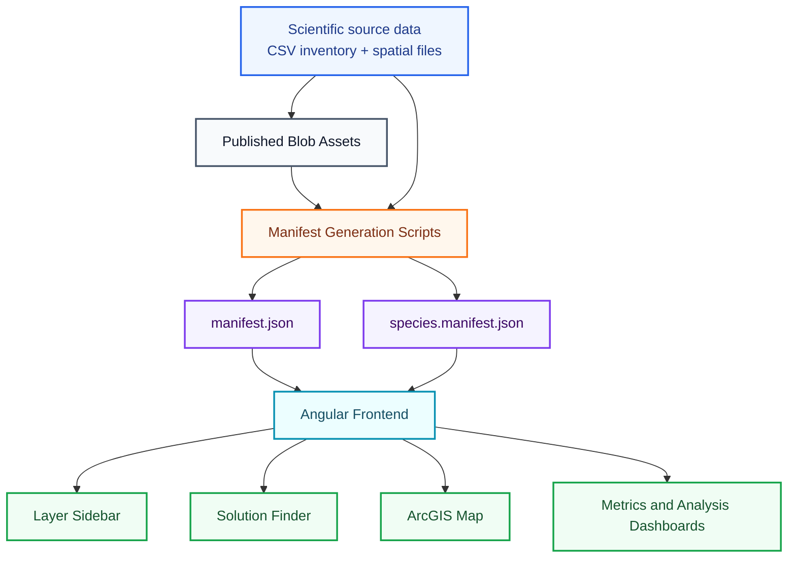
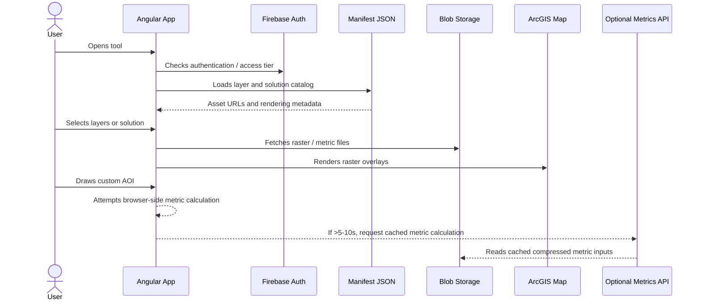
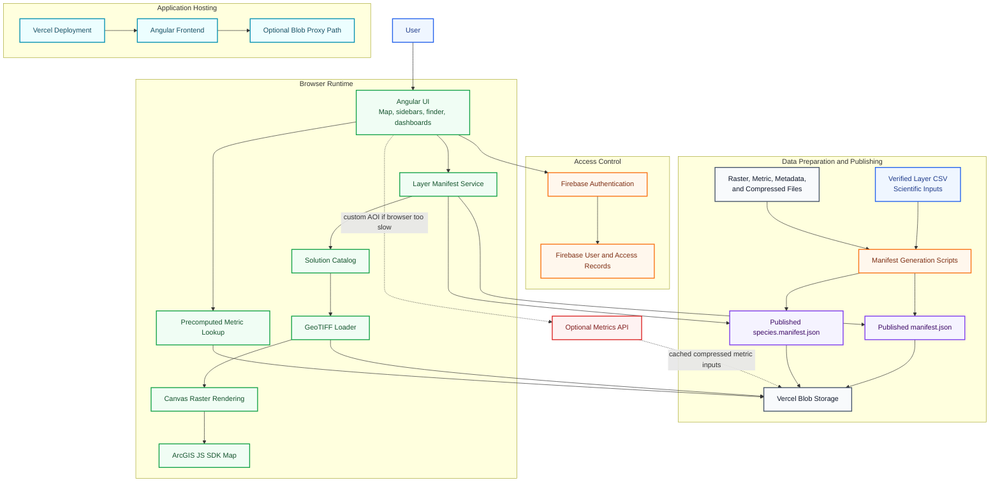

# GTIC System Architecture Slide Draft

This draft is intended for a short side meeting with GTIC / PNN about infrastructure compatibility. The goal is to show what components exist, how we currently host them, what equivalent hosting options may work, and what we can say today about hardware/runtime requirements.

Recommended length: **4 core slides plus 1 optional appendix slide**. Keep the meeting focused on infrastructure fit: components, deployment options, provisional requirements, and what still needs testing.

## Copy-Paste Slide Diagram

Use this as the main visual diagram for Google Slides. Paste into [Mermaid Live Editor](https://mermaid.live/), export as SVG or PNG, and insert that image into the slide.

In Markdown preview (Cursor / VS Code / GitHub), **` ```mermaid ` blocks are often replaced by a rendered diagram**, which hides the usual copy control on the source. The collapsible block below duplicates the **same diagram as plain text** so preview keeps a **copy-to-clipboard** button on that fence. Paste into Mermaid Live **without** wrapping it in extra backticks.

<details open id="gtic-slide-diagram-copy-source">
<summary><strong>Copy diagram source</strong> — use the preview toolbar copy icon on this block</summary>

```text
%%{init: {"theme": "base", "themeVariables": {"background": "#ffffff", "fontFamily": "Inter, Arial, sans-serif", "primaryTextColor": "#0f172a", "lineColor": "#64748b", "clusterBkg": "#f8fafc", "clusterBorder": "#cbd5e1"}}}%%
flowchart LR
  User["Decision Maker<br/>Web Browser"]:::user

  subgraph Frontend["Frontend Hosting"]
    subgraph AngularApp["Angular Application<br/>Vercel deployment"]
      App["Custom Angular UI<br/>sidebars, finder, dashboards"]:::app
      ArcGIS["ArcGIS JS SDK map<br/>browser-rendered raster overlays"]:::map
    end
  end

  subgraph Auth["Access Control"]
    Firebase["Firebase Authentication<br/>Google login + access tiers"]:::auth
  end

  subgraph Storage["Blob / Object Storage (currently Vercel Blob)"]
    Manifest["Manifest JSON<br/>Layer, solution, metric index"]:::manifest
    Assets["Data Assets<br/>Input rasters, solution rasters,<br/>metric JSON, compressed metric files"]:::storage
  end

  subgraph Optional["Optional Future Service"]
    MetricsAPI["Metrics API<br/>Only if browser live metrics are too slow"]:::optional
  end

  User -->|"opens tool"| App
  App <-->|"authenticates"| Firebase
  App -->|"loads data manifest (JSON)"| Manifest
  Manifest -->|"points to files"| Assets
  App -->|"fetches rasters + JSON"| Assets
  App -->|"renders layers"| ArcGIS
  App -. "custom AOI > 5-10 sec" .-> MetricsAPI
  MetricsAPI -. "cached optimized inputs" .-> Assets

  style AngularApp fill:#ecfeff,stroke:#0891b2,stroke-width:2px,color:#164e63;
  classDef user fill:#eff6ff,stroke:#2563eb,stroke-width:2px,color:#1e3a8a;
  classDef app fill:#ecfeff,stroke:#0891b2,stroke-width:2px,color:#164e63;
  classDef map fill:#f0fdf4,stroke:#16a34a,stroke-width:2px,color:#14532d;
  classDef auth fill:#fff7ed,stroke:#f97316,stroke-width:2px,color:#7c2d12;
  classDef manifest fill:#f5f3ff,stroke:#7c3aed,stroke-width:2px,color:#3b0764;
  classDef storage fill:#f8fafc,stroke:#475569,stroke-width:2px,color:#0f172a;
  classDef optional fill:#fef2f2,stroke:#dc2626,stroke-width:2px,stroke-dasharray: 6 4,color:#7f1d1d;
```

</details>

Rendered preview (diagram only — copy the styled source from the block above):



## Recommended Slide Sequence

### Slide 1: What GTIC Needs To Know

**Message:** The application is mostly a static web tool with object storage for data assets. The main open infrastructure question is whether browser-side metrics stay fast enough, or whether we need a small metrics API.

**Slide bullets:**

- Frontend: Angular web app.
- Data: raster, metadata, and metric files in blob/object storage.
- Auth: Firebase today, replaceable if GTIC requires another identity provider.
- Compute: mostly browser-side; optional API only if live metrics are too slow.

### Slide 2: Components And Hosting Options

**Message:** The current architecture maps cleanly to a small number of infrastructure components. Vercel/Firebase are current implementation choices, not hard requirements unless GTIC accepts them.

Use the slide diagram above as the main slide visual; copy from the expanded **Copy diagram source** block for Mermaid Live.

**Slide bullets:**

- Static frontend: Vercel now; could move to GTIC static hosting.
- Blob/object storage: Vercel Blob now; could move to S3-compatible or institutional object storage.
- Authentication: Firebase now; could move to institutional SSO if needed.
- Optional metrics API: not required yet; only needed if browser-side custom AOI calculations miss performance targets.

### Slide 3: Data And Manifest Flow

**Message:** Blob storage holds the data assets; the manifest is the runtime contract that tells the frontend where each asset lives and how it should be used.



**What the manifest indexes:**

- Mappable input rasters.
- Solution rasters generated from prioritization scenarios.
- Metadata and precomputed metric URLs.
- Compressed metric inputs for live calculations.
- A secondary species manifest, so thousands of species layers stay out of the main manifest.

### Slide 4: Runtime User Flow

**Message:** Most user interactions can run from the browser using static assets. A separate metrics API is only needed if browser-side custom polygon calculations are too slow.



**Slide bullets:**

- Precomputed metrics are preferred where boundaries or scenarios are known in advance.
- Live metrics for user-drawn polygons are the main performance uncertainty.
- If live calculations are fast enough, no metrics server is needed.
- If they are too slow, add a small API that reads optimized cached inputs.

### Slide 5: Provisional Requirements And Open Decisions

**Message:** These are working estimates, not final requirements. We are continuing to test data volume, browser memory, and custom AOI metric performance.

**Current estimate:**

- Storage: roughly 1-2 GB today; likely 4-5 GB near-term.
- Frontend hosting: static web hosting is sufficient.
- Data hosting: blob/object storage for GeoTIFF, JSON, metadata, and compressed metric files.
- Browser: modern browser with Canvas support; memory needs depend on selected rasters and live metric operations.
- Server compute: none required today, unless custom AOI metrics exceed target response time.

**Questions for GTIC / PNN:**

- Is Vercel acceptable, or should we target institutional static hosting?
- Is Vercel Blob acceptable, or should assets move to GTIC-preferred object storage?
- Are public asset URLs acceptable, or do assets need private/proxied access?
- Is Firebase acceptable, or should we integrate institutional identity?
- Are there required policies for backups, logs, monitoring, uptime, or data retention?

### Slide 6: Optional Appendix - More Detailed System Diagram

Use this only if the audience asks for more technical detail.



## Recommended Framing For GTIC

We should frame this as an infrastructure fit check, not a final requirements handoff. The current design is intentionally simple: static frontend, object storage for data assets, Firebase authentication for now, and browser-side map rendering.

The main hardware question is still empirical: can custom AOI metrics run fast enough in the browser for the expected data sizes and user workflows? If yes, server requirements stay minimal. If no, the likely addition is a small metrics API, not a large geospatial processing backend.

## Questions To Ask GTIC

- Is static web hosting acceptable for the frontend, or should we prepare for deployment into a specific institutional environment?
- Is object/blob storage acceptable for raster, JSON, metadata, and compressed metric assets?
- Are public asset URLs acceptable, or must all data assets be private, proxied, or access-controlled?
- Is Firebase Authentication acceptable for Google-based login, or is an institutional identity provider required?
- If a metrics API is needed, what runtime/container/server options should we target?
- Are there required policies for backups, logs, uptime, monitoring, or data retention?

## What Not To Overclaim Yet

- Do not present current estimates as final hardware requirements.
- Do not promise all custom AOI metrics will run fully in the browser until performance testing is complete.
- Do not imply that Vercel Blob is mandatory; the architecture depends on blob/object storage as a pattern.
- Do not present the 4-5 GB estimate as a permanent ceiling; frame it as the current near-term estimate.
