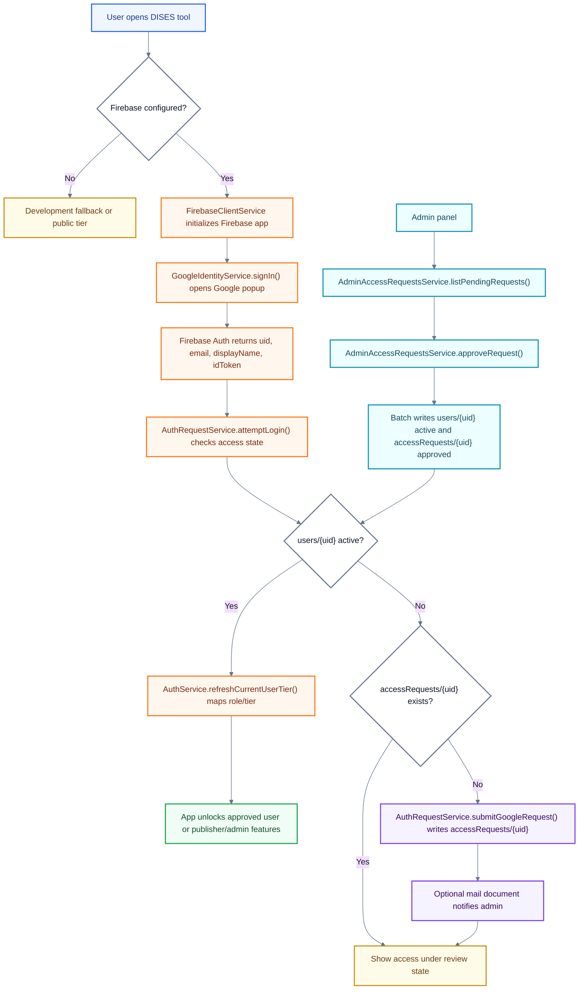
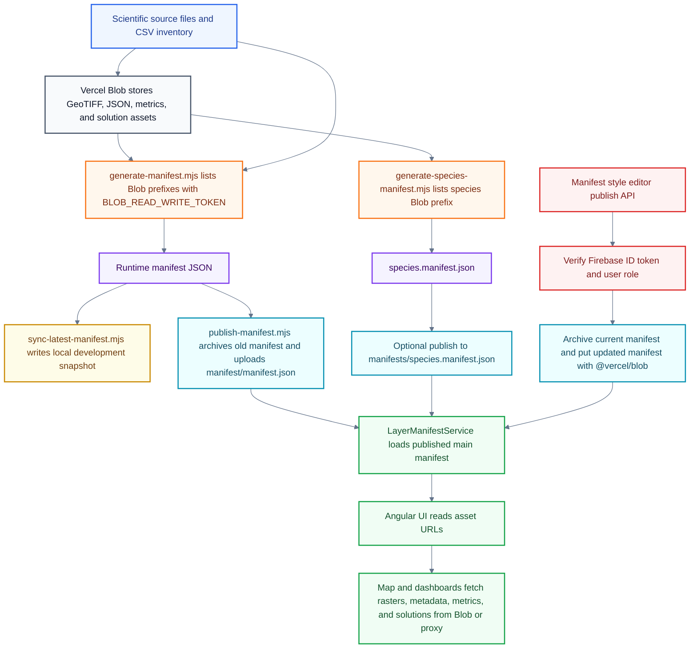

# Parques IT Authentication And Blob Storage Handoff

_Last updated: 2026-05-21_  
_Prepared for: Andre, Parques IT cloud engineering review_  
_Scope: Firebase Authentication flow and Vercel Blob Storage flow_

## Purpose

This document gives Parques IT a concise understanding of the two current cloud-facing flows in the DISES decision-making tool: Firebase-based authentication and Vercel Blob-backed data asset storage. The goal is to help the cloud engineering team understand what exists today, where deployment and storage assumptions live in the code, and what decisions should be made before the final August handoff.

The near-term objective is infrastructure alignment. If Parques can provide a GitHub repository inside its own ecosystem before the final handoff, development can begin targeting the right deployment environment, CI/CD expectations, authentication ownership, and blob/object-storage target earlier. That should reduce the risk of late migration issues when the project is transferred in August.

This is not a full security audit or an argument that Firebase and Vercel Blob must remain permanent. They are the current implementation choices. If Parques / GTIC prefers institutional identity or object storage, the architecture can be discussed as an authentication provider plus object-storage pattern.

## 1. Firebase Authentication Flow

### High-Level Overview

The app separates identity from authorization.

- **Identity:** Firebase Authentication signs the user in with Google and gives the browser a Firebase user identity.
- **Authorization:** Firestore records decide whether that Firebase user is pending, active, denied, admin, or science publisher.
- **Access tiers:** approved Firestore records map users into app tiers such as public/anonymous access, approved decision-maker access, and manager/publisher/admin access.
- **App behavior:** Angular watches Firebase auth state, reads `users/{uid}`, and maps the approved record into the app's existing access tiers.

The key Firestore collections are:

- `accessRequests/{uid}`: pending or reviewed access requests from people who signed in but are not yet approved.
- `users/{uid}`: approved user records, including `status`, `tier`, `role`, and `isAdmin`.
- `mail`: optional notification documents for admin emails when a new access request is saved.

### Mermaid Flow

### Function-Level Breakdown

| File / function | Role in the flow | Notes for Parques / IT |
| --- | --- | --- |
| `frontend/src/app/core/services/firebase-client.service.ts` / `isEnabled` | Checks whether Firebase is enabled and has a configured project ID. | Firebase is optional by environment; if disabled, the app does not initialize Firebase Auth or Firestore. |
| `frontend/src/app/core/services/firebase-client.service.ts` / `ensureApp()` | Initializes the Firebase web client from Angular environment config. | Firebase web config is client-side configuration, not a privileged service-account secret. |
| `frontend/src/app/core/services/firebase-client.service.ts` / `subscribeToAuthState()` | Subscribes to Firebase Auth state changes with `onAuthStateChanged`. | This is the main browser-side session watcher. |
| `frontend/src/app/core/services/firebase-client.service.ts` / `getUserDocument()` | Reads `users/{uid}` from Firestore. | This is where an authenticated identity becomes an app authorization record. |
| `frontend/src/app/features/auth/services/google-identity.service.ts` / `signIn()` | Chooses Firebase Google sign-in when Firebase is enabled. | Falls back to a stub or Google Identity Services only when Firebase is not configured. |
| `frontend/src/app/features/auth/services/google-identity.service.ts` / `firebaseSignIn()` | Opens `signInWithPopup(auth, new GoogleAuthProvider())` and returns the Firebase ID token/profile. | The ID token is later useful for trusted server-side operations. |
| `frontend/src/app/core/services/auth.service.ts` / `syncTierFromFirebaseUser()` | Reacts to signed-in/signed-out Firebase users and updates app tier/admin state. | Signed-out users fall back to public tier unless development bypass is enabled. |
| `frontend/src/app/core/services/auth.service.ts` / `readUserTier()` | Maps Firestore `status`, `tier`, and legacy `role` fields into `UserTier`. | `status: active` is required before the app grants elevated access. |
| `frontend/src/app/features/auth/services/auth-request.service.ts` / `attemptLogin()` | Checks whether a Google Firebase user is active, pending, or invalid. | Google users read `users/{uid}` first, then `accessRequests/{uid}`. |
| `frontend/src/app/features/auth/services/auth-request.service.ts` / `submitFirebaseGoogleRequest()` | Writes a pending Google request into `accessRequests/{uid}`. | Includes email, display name, provider, organization/reason, timestamps, and `status: pending`. |
| `frontend/src/app/features/auth/services/auth-request.service.ts` / `createAdminNotification()` | Optionally writes a `mail` document to notify an admin address. | Depends on `environment.firebase.accessRequestNotificationEmail`; exact email delivery depends on Firebase mail infrastructure. |
| `frontend/src/app/features/auth/services/admin-access-requests.service.ts` / `listPendingRequests()` | Lists pending requests for active admins. | Requires the current signed-in user to be an active admin in `users/{uid}`. |
| `frontend/src/app/features/auth/services/admin-access-requests.service.ts` / `approveRequest()` | Batch writes the approved `users/{uid}` record and marks `accessRequests/{uid}` approved. | This is the main in-app approval path. |
| `frontend/src/app/features/auth/services/admin-access-requests.service.ts` / `updateUserAccess()` | Updates tier/admin flags for an existing active user. | Used for post-approval role changes. |
| `frontend/api/dev/manifest-style-publish.ts` / `publishManifestStyleRequest()` | Verifies a Firebase ID token server-side before protected manifest writes. | This is the current example of a trusted server boundary for higher-risk actions. |
| `frontend/api/dev/manifest-style-publish.ts` / `hasManifestStylePublishAccess()` | Allows manifest publishing only for active Manager-tier, science publisher, admin, or `isAdmin` users. | This is the pattern to reuse for any future protected write. |

### Auth Ownership And Open Questions

- Should Firebase Authentication remain acceptable for launch, or should the app move to a Parques / GTIC identity provider?
- Who should own the Firebase project and Firebase Admin service account long-term?
- Which production, staging, preview, and local domains should be authorized?
- Should user approval remain in the current Firestore/admin-panel model, or should Parques require a different account lifecycle process?
- What audit trail, deprovisioning, and role-review process does Parques require?

## 2. Vercel Blob Storage Flow

### High-Level Overview

Vercel Blob is the current object-storage layer for published geospatial assets and runtime manifests. The app does not scan Blob directly in the browser. Instead, Node scripts list Blob contents, combine that inventory with verified CSV inputs, generate manifest JSON files, and publish those manifests back to Blob.

At runtime, Angular loads the published main manifest from Blob or from a configured proxy path. The manifest points the app to GeoTIFFs, metric files, metadata JSON, solution rasters, and a secondary species manifest. This keeps the deployed frontend small while allowing large data files to live in object storage.

Important current values:

- Store name: `decision-making-tool-blob`
- Public Blob host: `https://aagibolq28slyfof.public.blob.vercel-storage.com`
- Required local/runtime token for writes and Blob listing: `BLOB_READ_WRITE_TOKEN`
- Public asset prefixes include `inputs/`, `manifest/`, `manifests/`, `metadata/`, `metrics/`, and `solutions/`

Do not send or print token values. It is safe to document the environment variable name and whether the token is required.

### Mermaid Flow

### Function-Level Breakdown

| File / function | Role in the flow | Notes for Parques / IT |
| --- | --- | --- |
| `frontend/layer-manifest/generate-manifest.mjs` / `listBlobPrefix()` | Calls `vercel blob list` with `BLOB_READ_WRITE_TOKEN` for a prefix. | This is a local/dev script path and requires the Blob read/write token. |
| `frontend/layer-manifest/generate-manifest.mjs` / `readBlobInventory()` | Lists input Blob prefixes and deduplicates Blob records. | Blob is treated as the source of truth for available files. |
| `frontend/layer-manifest/generate-manifest.mjs` / `readSolutionBlobInventory()` | Lists `solutions/` Blob assets. | Feeds solution raster and metadata entries into the runtime manifest. |
| `frontend/layer-manifest/generate-manifest.mjs` / `main()` | Builds the runtime manifest from CSV inputs, Blob inventory, metrics, solutions, and metadata. | The generated manifest is the browser-facing contract. |
| `frontend/layer-manifest/generate-species-manifest.mjs` / `listBlobPage()` | Pages through the species Blob prefix using `vercel blob list`. | Designed for thousands of species files without putting them all in the main manifest. |
| `frontend/layer-manifest/generate-species-manifest.mjs` / `publishSpeciesManifestToVercelBlob()` | Archives and uploads `manifests/species.manifest.json`. | Uses the same token and public Blob upload pattern as the main manifest. |
| `frontend/layer-manifest/publish-manifest.mjs` / `listBlobByPrefix()` | Finds the current published `manifest/manifest.json`. | Used before archiving and replacing the main manifest. |
| `frontend/layer-manifest/publish-manifest.mjs` / `copyBlob()` | Archives the previous manifest into `manifest/archive/`. | Keeps a rollback trail for published manifest changes. |
| `frontend/layer-manifest/publish-manifest.mjs` / `putBlob()` | Uploads the new manifest to `manifest/manifest.json`. | Uses `--force` and the read/write token. |
| `frontend/src/app/core/services/layer-manifest.service.ts` / `resolveManifestUrl()` | Chooses the runtime manifest URL from `window.__MANIFEST_BLOB_URL__`, `environment.manifestBlobUrl`, or the public Blob URL. | Production currently points through `/api/blob-proxy/manifest/manifest.json`. |
| `frontend/src/app/core/services/layer-manifest.service.ts` / `loadManifestWithFallback()` | Loads the main manifest and falls back to local `/data/layer-manifest/manifest.json` if needed. | Adds cache busting for remote manifest requests. |
| `frontend/src/app/core/services/layer-manifest.service.ts` / `getSpeciesManifest()` | Loads and caches the secondary species manifest. | The main manifest contains `speciesManifestUrl`; this function fetches that secondary file. |
| `frontend/src/app/core/services/layer-manifest.service.ts` / `withProxiedBlobUrls()` | Rewrites public Blob URLs to a configured proxy path when `blobAssetProxyPath` is set. | Useful if Parques requires assets to be served through a controlled/proxied route. |
| `frontend/api/dev/manifest-style-publish.ts` / `getBlobClient()` | Loads the `@vercel/blob` server client. | This API route performs server-side Blob writes, not browser-side writes. |
| `frontend/api/dev/manifest-style-publish.ts` / `getCurrentManifestBlob()` | Lists the currently published manifest via `@vercel/blob`. | Uses the server-side `BLOB_READ_WRITE_TOKEN`. |
| `frontend/api/dev/manifest-style-publish.ts` / `publishManifestStyleRequest()` | Verifies Firebase authorization, archives the current manifest, writes the updated manifest, and records the publish in Firestore. | This is the protected-write pattern for Blob-backed manifest updates. |

### Blob Ownership And Open Questions

- Is public Vercel Blob hosting acceptable for these geospatial assets, or should assets move to Parques / GTIC object storage?
- If public Blob URLs are not acceptable, should the app use a proxy path, private bucket, signed URLs, or institutional network controls?
- Who should own and rotate `BLOB_READ_WRITE_TOKEN`?
- What backup, retention, logging, and rollback policy should apply to `manifest/archive/` and species manifest archives?
- Should manifest publish operations remain in Vercel serverless functions, or should Parques host the write path elsewhere?

## Meeting Questions For Andre And The Cloud Engineer

1. Is Firebase Authentication acceptable as the current identity provider, or should we plan for institutional SSO?
2. Is the Firestore `accessRequests/{uid}` and `users/{uid}` approval model acceptable for first launch?
3. Who should own Firebase project administration and service-account credentials after handoff?
4. Is Vercel Blob acceptable as public object storage for raster, manifest, metadata, metric, and solution files?
5. If object storage needs to move, what storage API or bucket policy should the project target?
6. Should runtime asset access remain public, or does Parques require a proxy/private-access model?
7. Are there required policies for audit logs, backups, token rotation, uptime, or data retention?

## Scope Notes

- This handoff intentionally avoids long code excerpts. The tables above name the functions and files that a developer should inspect.
- Firebase client config and public Blob URLs are not treated as privileged secrets.
- Firebase Admin credentials, service-account private keys, and `BLOB_READ_WRITE_TOKEN` are privileged and should remain in environment variables or managed secret storage.
- Browser UI checks are not enough for sensitive writes. Protected writes should follow the existing server-side pattern: verify Firebase ID token, read Firestore role, then perform the write with server-held credentials.
