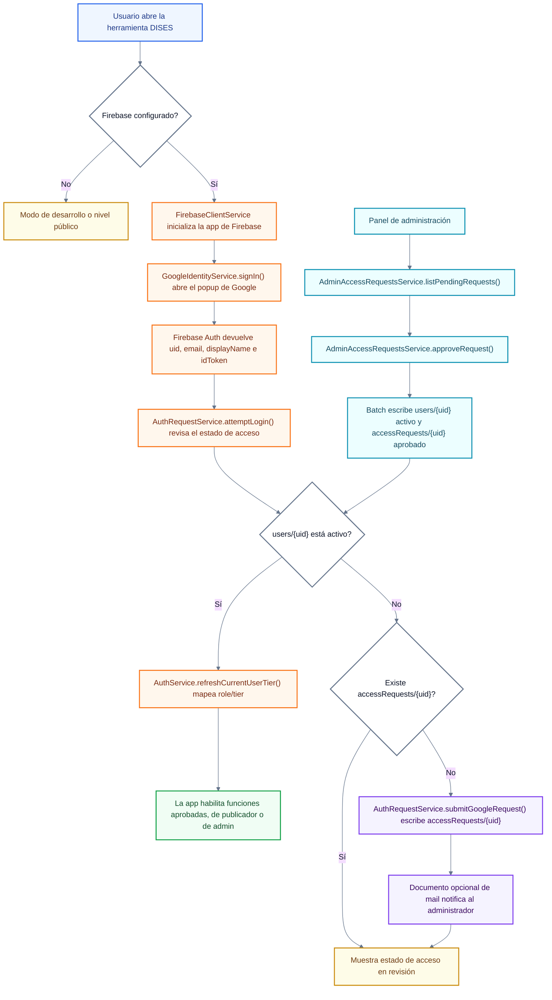
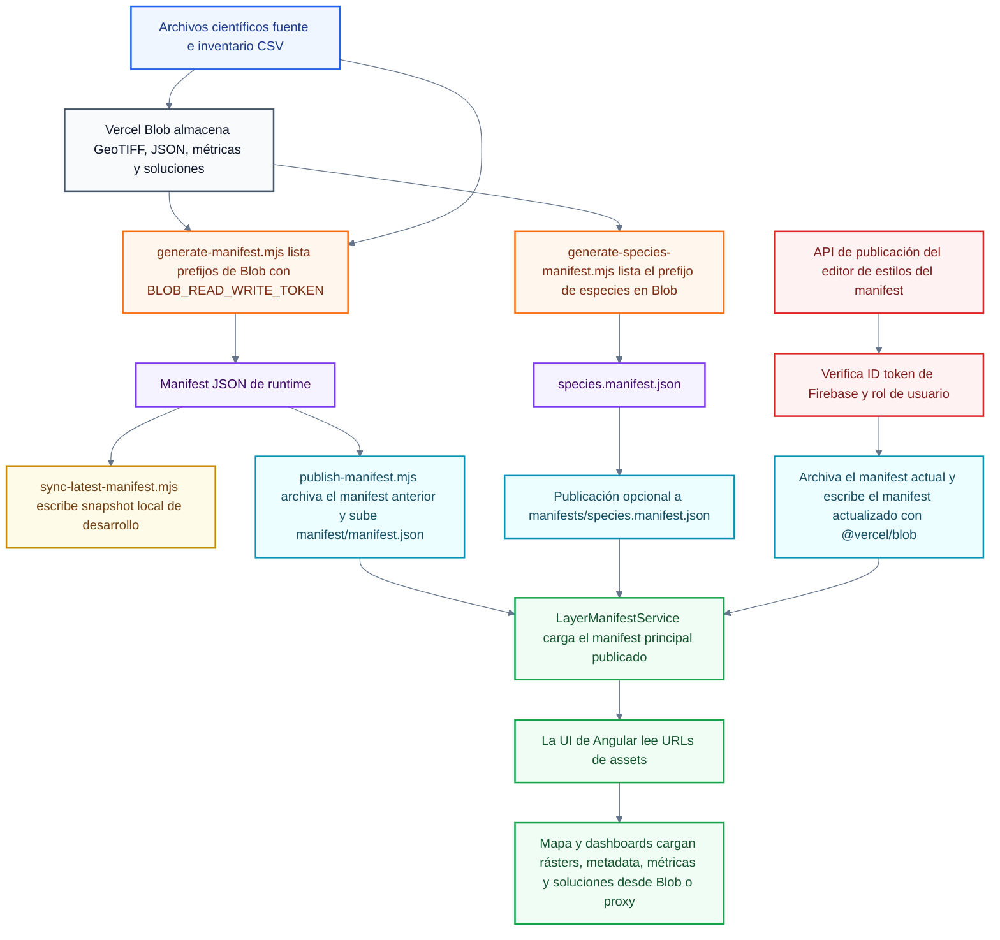

# Entrega técnica de autenticación y Blob Storage para Parques IT

_Última actualización: 2026-05-21_  
_Preparado para: Andre, revisión de ingeniería cloud de Parques IT_  
_Alcance: flujo de Firebase Authentication y flujo de Vercel Blob Storage_

## Propósito

Este documento le da a Parques IT una comprensión concisa de los dos flujos actuales del proyecto DISES que dependen de servicios cloud: la autenticación basada en Firebase y el almacenamiento de datos en Vercel Blob. El objetivo es ayudar al equipo de ingeniería cloud a entender qué existe hoy, dónde viven las suposiciones de despliegue y almacenamiento en el código, y qué decisiones conviene tomar antes de la entrega final en agosto.

El objetivo de corto plazo es alinear infraestructura. Si Parques puede proveer un repositorio de GitHub dentro de su propio ecosistema antes de la entrega final, el desarrollo puede empezar a apuntar antes al entorno correcto de despliegue, las expectativas de CI/CD, la propiedad de autenticación y el destino correcto para blob/object storage. Eso debería reducir el riesgo de problemas tardíos de migración cuando el proyecto se transfiera en agosto.

Este documento no es una auditoría completa de seguridad ni un argumento de que Firebase y Vercel Blob tengan que permanecer de forma permanente. Son las decisiones actuales de implementación. Si Parques / GTIC prefiere identidad institucional u object storage institucional, la arquitectura se puede discutir como un patrón de proveedor de autenticación más object storage.

## 1. Flujo de Firebase Authentication

### Resumen de alto nivel

La aplicación separa identidad de autorización.

- **Identidad:** Firebase Authentication inicia la sesión del usuario con Google y le entrega al navegador una identidad de usuario de Firebase.
- **Autorización:** los registros de Firestore deciden si ese usuario de Firebase está pendiente, activo, denegado, es administrador o es publicador científico.
- **Niveles de acceso:** los registros aprobados de Firestore asignan a los usuarios a niveles de la aplicación, como acceso público/anónimo, acceso aprobado para tomadores de decisión y acceso de manager/publicador/administrador.
- **Comportamiento de la aplicación:** Angular observa el estado de autenticación de Firebase, lee `users/{uid}` y mapea el registro aprobado a los niveles de acceso existentes de la aplicación.

Las colecciones principales de Firestore son:

- `accessRequests/{uid}`: solicitudes de acceso pendientes o revisadas de personas que iniciaron sesión, pero todavía no han sido aprobadas.
- `users/{uid}`: registros de usuarios aprobados, incluyendo `status`, `tier`, `role` e `isAdmin`.
- `mail`: documentos opcionales de notificación para correos a administradores cuando se guarda una nueva solicitud de acceso.

### Flujo en Mermaid

### Desglose a nivel de funciones

| Archivo / función | Rol en el flujo | Notas para Parques / IT |
| --- | --- | --- |
| `frontend/src/app/core/services/firebase-client.service.ts` / `isEnabled` | Revisa si Firebase está habilitado y tiene un project ID configurado. | Firebase es opcional por ambiente; si está deshabilitado, la app no inicializa Firebase Auth ni Firestore. |
| `frontend/src/app/core/services/firebase-client.service.ts` / `ensureApp()` | Inicializa el cliente web de Firebase desde la configuración de ambiente de Angular. | La configuración web de Firebase es configuración del cliente; no es un secreto privilegiado de service account. |
| `frontend/src/app/core/services/firebase-client.service.ts` / `subscribeToAuthState()` | Se suscribe a cambios de estado de Firebase Auth con `onAuthStateChanged`. | Es el observador principal de sesión en el navegador. |
| `frontend/src/app/core/services/firebase-client.service.ts` / `getUserDocument()` | Lee `users/{uid}` desde Firestore. | Aquí una identidad autenticada se convierte en un registro de autorización de la app. |
| `frontend/src/app/features/auth/services/google-identity.service.ts` / `signIn()` | Usa inicio de sesión de Google con Firebase cuando Firebase está habilitado. | Solo cae a un stub o a Google Identity Services cuando Firebase no está configurado. |
| `frontend/src/app/features/auth/services/google-identity.service.ts` / `firebaseSignIn()` | Abre `signInWithPopup(auth, new GoogleAuthProvider())` y devuelve el token/perfil de Firebase. | El ID token es útil después para operaciones confiables del lado del servidor. |
| `frontend/src/app/core/services/auth.service.ts` / `syncTierFromFirebaseUser()` | Reacciona a usuarios de Firebase con o sin sesión y actualiza el tier/admin state de la app. | Los usuarios sin sesión vuelven al nivel público, salvo que esté habilitado el bypass de desarrollo. |
| `frontend/src/app/core/services/auth.service.ts` / `readUserTier()` | Mapea `status`, `tier` y campos legacy de `role` de Firestore a `UserTier`. | Se requiere `status: active` antes de que la app otorgue acceso elevado. |
| `frontend/src/app/features/auth/services/auth-request.service.ts` / `attemptLogin()` | Revisa si un usuario Google/Firebase está activo, pendiente o inválido. | Los usuarios de Google leen primero `users/{uid}` y luego `accessRequests/{uid}`. |
| `frontend/src/app/features/auth/services/auth-request.service.ts` / `submitFirebaseGoogleRequest()` | Escribe una solicitud pendiente de Google en `accessRequests/{uid}`. | Incluye email, nombre, proveedor, organización/razón, timestamps y `status: pending`. |
| `frontend/src/app/features/auth/services/auth-request.service.ts` / `createAdminNotification()` | Opcionalmente escribe un documento `mail` para notificar a una dirección administradora. | Depende de `environment.firebase.accessRequestNotificationEmail`; la entrega exacta del correo depende de la infraestructura de mail en Firebase. |
| `frontend/src/app/features/auth/services/admin-access-requests.service.ts` / `listPendingRequests()` | Lista solicitudes pendientes para administradores activos. | Requiere que el usuario actual con sesión sea un administrador activo en `users/{uid}`. |
| `frontend/src/app/features/auth/services/admin-access-requests.service.ts` / `approveRequest()` | Escribe en batch el registro aprobado `users/{uid}` y marca `accessRequests/{uid}` como aprobado. | Es la ruta principal de aprobación dentro de la app. |
| `frontend/src/app/features/auth/services/admin-access-requests.service.ts` / `updateUserAccess()` | Actualiza los flags de tier/admin para un usuario activo existente. | Se usa para cambios de rol posteriores a la aprobación. |
| `frontend/api/dev/manifest-style-publish.ts` / `publishManifestStyleRequest()` | Verifica un ID token de Firebase del lado del servidor antes de escrituras protegidas del manifest. | Es el ejemplo actual de un límite confiable de servidor para acciones de mayor riesgo. |
| `frontend/api/dev/manifest-style-publish.ts` / `hasManifestStylePublishAccess()` | Permite publicar el manifest solo a usuarios activos de tier Manager, publicadores científicos, admins o `isAdmin`. | Este es el patrón que se debe reutilizar para cualquier escritura protegida futura. |

### Propiedad de autenticación y preguntas abiertas

- ¿Firebase Authentication es aceptable para el lanzamiento, o la app debe migrar a un proveedor de identidad de Parques / GTIC?
- ¿Quién debe ser dueño del proyecto de Firebase y del service account de Firebase Admin a largo plazo?
- ¿Qué dominios de producción, staging, preview y local deben estar autorizados?
- ¿La aprobación de usuarios debe mantenerse en el modelo actual de Firestore/panel de administración, o Parques requiere otro proceso de ciclo de vida de cuentas?
- ¿Qué proceso de auditoría, desactivación de usuarios y revisión de roles requiere Parques?

## 2. Flujo de Vercel Blob Storage

### Resumen de alto nivel

Vercel Blob es la capa actual de object storage para activos geoespaciales publicados y manifests de runtime. La app no escanea Blob directamente desde el navegador. En cambio, scripts de Node listan el contenido de Blob, combinan ese inventario con insumos CSV verificados, generan archivos JSON de manifest y publican esos manifests de vuelta en Blob.

En runtime, Angular carga el manifest principal publicado desde Blob o desde una ruta proxy configurada. El manifest apunta la app hacia GeoTIFFs, archivos de métricas, JSON de metadata, rásters de soluciones y un manifest secundario de especies. Esto mantiene pequeño el frontend desplegado y permite que archivos grandes de datos vivan en object storage.

Valores actuales importantes:

- Nombre del store: `decision-making-tool-blob`
- Host público de Blob: `https://aagibolq28slyfof.public.blob.vercel-storage.com`
- Token local/runtime requerido para escrituras y listado de Blob: `BLOB_READ_WRITE_TOKEN`
- Prefijos públicos de assets incluyen `inputs/`, `manifest/`, `manifests/`, `metadata/`, `metrics/` y `solutions/`

No se deben enviar ni imprimir valores de tokens. Es seguro documentar el nombre de la variable de ambiente y si el token es requerido.

### Flujo en Mermaid

### Desglose a nivel de funciones

| Archivo / función | Rol en el flujo | Notas para Parques / IT |
| --- | --- | --- |
| `frontend/layer-manifest/generate-manifest.mjs` / `listBlobPrefix()` | Llama `vercel blob list` con `BLOB_READ_WRITE_TOKEN` para un prefijo. | Es una ruta de script local/desarrollo y requiere el token read/write de Blob. |
| `frontend/layer-manifest/generate-manifest.mjs` / `readBlobInventory()` | Lista prefijos de input en Blob y deduplica registros de Blob. | Blob se trata como la fuente de verdad para los archivos disponibles. |
| `frontend/layer-manifest/generate-manifest.mjs` / `readSolutionBlobInventory()` | Lista assets de Blob bajo `solutions/`. | Alimenta entradas de ráster de solución y metadata al manifest de runtime. |
| `frontend/layer-manifest/generate-manifest.mjs` / `main()` | Construye el manifest de runtime desde CSVs, inventario de Blob, métricas, soluciones y metadata. | El manifest generado es el contrato que consume el navegador. |
| `frontend/layer-manifest/generate-species-manifest.mjs` / `listBlobPage()` | Recorre por páginas el prefijo de especies en Blob usando `vercel blob list`. | Diseñado para miles de archivos de especies sin ponerlos todos en el manifest principal. |
| `frontend/layer-manifest/generate-species-manifest.mjs` / `publishSpeciesManifestToVercelBlob()` | Archiva y sube `manifests/species.manifest.json`. | Usa el mismo token y patrón de carga pública a Blob que el manifest principal. |
| `frontend/layer-manifest/publish-manifest.mjs` / `listBlobByPrefix()` | Encuentra el `manifest/manifest.json` publicado actualmente. | Se usa antes de archivar y reemplazar el manifest principal. |
| `frontend/layer-manifest/publish-manifest.mjs` / `copyBlob()` | Archiva el manifest anterior en `manifest/archive/`. | Mantiene una ruta de rollback para cambios publicados del manifest. |
| `frontend/layer-manifest/publish-manifest.mjs` / `putBlob()` | Sube el nuevo manifest a `manifest/manifest.json`. | Usa `--force` y el token read/write. |
| `frontend/src/app/core/services/layer-manifest.service.ts` / `resolveManifestUrl()` | Escoge la URL del manifest de runtime desde `window.__MANIFEST_BLOB_URL__`, `environment.manifestBlobUrl` o la URL pública de Blob. | Producción actualmente apunta por `/api/blob-proxy/manifest/manifest.json`. |
| `frontend/src/app/core/services/layer-manifest.service.ts` / `loadManifestWithFallback()` | Carga el manifest principal y cae a `/data/layer-manifest/manifest.json` local si es necesario. | Agrega cache busting para solicitudes remotas del manifest. |
| `frontend/src/app/core/services/layer-manifest.service.ts` / `getSpeciesManifest()` | Carga y cachea el manifest secundario de especies. | El manifest principal contiene `speciesManifestUrl`; esta función carga ese archivo secundario. |
| `frontend/src/app/core/services/layer-manifest.service.ts` / `withProxiedBlobUrls()` | Reescribe URLs públicas de Blob a una ruta proxy configurada cuando `blobAssetProxyPath` está definido. | Útil si Parques requiere servir assets mediante una ruta controlada/proxy. |
| `frontend/api/dev/manifest-style-publish.ts` / `getBlobClient()` | Carga el cliente de servidor `@vercel/blob`. | Esta ruta de API realiza escrituras a Blob del lado del servidor, no desde el navegador. |
| `frontend/api/dev/manifest-style-publish.ts` / `getCurrentManifestBlob()` | Lista el manifest publicado actualmente mediante `@vercel/blob`. | Usa el `BLOB_READ_WRITE_TOKEN` del lado del servidor. |
| `frontend/api/dev/manifest-style-publish.ts` / `publishManifestStyleRequest()` | Verifica autorización de Firebase, archiva el manifest actual, escribe el manifest actualizado y registra la publicación en Firestore. | Es el patrón de escritura protegida para actualizaciones del manifest respaldado por Blob. |

### Propiedad de Blob y preguntas abiertas

- ¿El hosting público en Vercel Blob es aceptable para estos assets geoespaciales, o deben moverse a object storage de Parques / GTIC?
- Si las URLs públicas de Blob no son aceptables, ¿la app debe usar una ruta proxy, bucket privado, URLs firmadas o controles de red institucionales?
- ¿Quién debe ser dueño de `BLOB_READ_WRITE_TOKEN` y encargarse de su rotación?
- ¿Qué política de backups, retención, logging y rollback debe aplicar a `manifest/archive/` y a los archivos archivados del manifest de especies?
- ¿Las operaciones de publicación del manifest deben permanecer en funciones serverless de Vercel, o Parques debe alojar esa ruta de escritura en otro lugar?

## Preguntas para la reunión con Andre y el ingeniero cloud

1. ¿Firebase Authentication es aceptable como proveedor actual de identidad, o debemos planear SSO institucional?
2. ¿El modelo de aprobación en Firestore con `accessRequests/{uid}` y `users/{uid}` es aceptable para el primer lanzamiento?
3. ¿Quién debe ser dueño de la administración del proyecto Firebase y de las credenciales de service account después de la entrega?
4. ¿Vercel Blob es aceptable como object storage público para rásters, manifests, metadata, métricas y archivos de soluciones?
5. Si el object storage debe moverse, ¿qué API de storage o política de bucket debe usar el proyecto?
6. ¿El acceso a assets en runtime puede permanecer público, o Parques requiere un modelo proxy/privado?
7. ¿Existen políticas requeridas para audit logs, backups, rotación de tokens, uptime o retención de datos?

## Notas de alcance

- Este handoff evita intencionalmente extractos largos de código. Las tablas anteriores nombran las funciones y archivos que un desarrollador debería revisar.
- La configuración cliente de Firebase y las URLs públicas de Blob no se tratan como secretos privilegiados.
- Las credenciales de Firebase Admin, private keys de service account y `BLOB_READ_WRITE_TOKEN` son privilegiados y deben permanecer en variables de ambiente o almacenamiento administrado de secretos.
- Los controles de UI en el navegador no son suficientes para escrituras sensibles. Las escrituras protegidas deben seguir el patrón existente del lado del servidor: verificar el ID token de Firebase, leer el rol en Firestore y luego ejecutar la escritura con credenciales mantenidas en el servidor.
