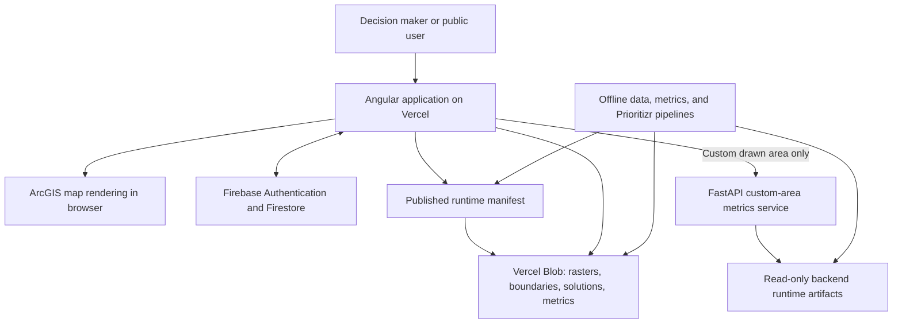
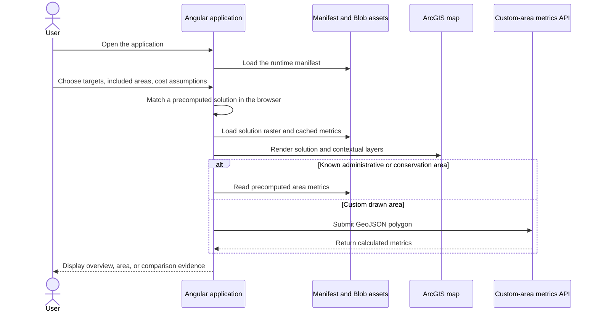

[← Back to handoff overview](./README.md)

# System Architecture and Operating Model

> **Status: repository-derived, verified against current source code.** Production platform settings (actual Vercel project configuration, DNS, VM ownership) still need confirmation — see [Architecture decisions requiring validation](#architecture-decisions-requiring-validation).

## System purpose

The Decision Making Tool is a browser-based conservation-planning application for Colombia. Users choose among precomputed conservation solutions, visualize them with contextual layers on an ArcGIS map, inspect precomputed indicators for known administrative or conservation areas, and request live metrics when they draw a custom area of interest (AOI). Optimization runs offline — the browser never runs Prioritizr or generates new optimization solutions.

The active stack is: an Angular single-page application, public object storage holding manifests and geospatial assets, Firebase for identity and authorization, and a narrow FastAPI computation service for custom polygons. The archived R/Shiny and Node/PostgreSQL implementation under `legacy-r-shiny-app/` is **not** part of the current production runtime.

## Production architecture

## Component responsibilities

| Component                  | Technology and host                                           | Responsibility                                                                       | Operational note                                                                              |
| -------------------------- | ------------------------------------------------------------- | ------------------------------------------------------------------------------------ | --------------------------------------------------------------------------------------------- |
| Web application            | Angular 21 on Vercel                                          | Solution selection, map interaction, dashboards, authentication UI, exports.         | Static SPA hosting requires HTTPS and SPA fallback routing to `index.html`.                   |
| Runtime catalog and assets | JSON manifests + public-read Vercel Blob                      | Indexes and serves GeoTIFFs, GeoJSON, solution rasters, metric caches, and metadata. | The manifest is the runtime catalog; the app never scans storage directly.                    |
| Identity and authorization | Firebase Authentication + Cloud Firestore                     | Google sign-in, access requests, approved user tiers, administrative records.        | Project ownership, backups, authorized domains, and account lifecycle need handoff decisions. |
| Custom-area computation    | FastAPI, Uvicorn, Rasterio, Docker on a separate VM           | Computes selected metrics for user-drawn polygons.                                   | Requires runtime raster artifacts; exposes `/health` and `/ready`.                            |
| Protected publication      | Vercel serverless endpoint                                    | Verifies an approved manager before publishing manifest-style changes.               | Requires Firebase admin credentials and the Blob write token.                                 |
| Offline processing         | Node, Python, geospatial tools, upstream Prioritizr workflows | Builds solutions, Cloud Optimized GeoTIFFs, manifests, and precomputed metrics.      | Operator workflows, not end-user runtime services.                                            |

## Core user workflow

## Runtime and deployment requirements

| Layer              | Requirement                                                                                                                                                 | Status                                                                                                               |
| ------------------ | ----------------------------------------------------------------------------------------------------------------------------------------------------------- | -------------------------------------------------------------------------------------------------------------------- |
| Frontend toolchain | Node.js 22 (CI), npm 10.9.2 (declared by `frontend/package.json`). Production build via `npm run build:vercel` from `frontend/`.                            | ✅ Verified                                                                                                          |
| Frontend hosting   | HTTPS, static-file delivery, SPA fallback routing, build-time environment variables, same-origin rewrite for `/metrics-api`.                                | ✅ Verified                                                                                                          |
| Backend Python     | **Python 3.12** is the canonical container and CI runtime, with FastAPI, Uvicorn, NumPy, Pydantic, and Rasterio.                                            | ✅ Verified — standardized during the handoff review so production and CI exercise the same Python minor version.    |
| Backend host       | Docker + Docker Compose, a read-only runtime-artifact volume, outbound access to retrieve source assets during artifact creation, HTTPS route to port 8000. | ✅ Verified                                                                                                          |
| Client             | Modern browser with Canvas and WebGL support; outbound HTTPS to the app, Blob host, Firebase/Google identity, ArcGIS dependencies, and the metrics API.     | ✅ Verified                                                                                                          |
| Storage            | ~1–2 GB today, ~4–5 GB estimated near-term.                                                                                                                 | 🟡 Team confirmation required — these are internal planning estimates, not an independently measured Blob inventory. |

## Configuration categories

Credentials and other confidential configuration values are intentionally excluded from this handoff. Parques IT needs owners, a secure storage location, and a rotation process for each category below — not the values themselves.

| Category                         | Variables                                                                                                                                                                           |
| -------------------------------- | ----------------------------------------------------------------------------------------------------------------------------------------------------------------------------------- |
| Firebase client configuration    | `FIREBASE_API_KEY`, `FIREBASE_AUTH_DOMAIN`, `FIREBASE_PROJECT_ID`, `FIREBASE_STORAGE_BUCKET`, `FIREBASE_MESSAGING_SENDER_ID`, `FIREBASE_APP_ID`, optional `FIREBASE_MEASUREMENT_ID` |
| Application routing and features | `MANIFEST_BLOB_URL`, `BLOB_ASSET_PROXY_PATH`, `METRICS_API_BASE_URL`, `ENABLE_MANIFEST_EDITOR`, optional access-request notification config                                         |
| Protected server operations      | `BLOB_READ_WRITE_TOKEN`, Firebase admin credential variables, production manifest-write guards                                                                                      |
| Backend artifacts                | `DMT_ARTIFACT_DIR`, `DMT_ARTIFACT_MANIFEST`, `DMT_ARTIFACT_REQUIRED`, `DMT_ARTIFACT_SCHEMA_VERSION`, `DMT_METRICS_PIPELINE_PATH`                                                    |

## Operational health and recovery

- The metrics service exposes `/health` (liveness) and `/ready` (runtime-artifact readiness). Readiness fails when required artifacts are unavailable or invalid.
- Manifest publication archives the previous manifest; a rollback script can restore an archived version.
- 🔴 **Gap — no evidence found:** No centralized error reporting, uptime monitor, log shipping, or alerting configuration was found in the active repository.
- 🔴 **Gap — no evidence found:** Blob backup automation, scheduled Firestore exports, recovery objectives, and a tested disaster-recovery procedure have no owner or acceptance criteria yet.
- Runtime artifacts must be rebuilt after relevant raster or manifest changes, or live custom-area results can drift from precomputed results.

## Architecture decisions requiring validation

- Confirm the actual production domain, Vercel project settings, build settings, and full environment-variable inventory.
- Confirm whether the app must read public Blob URLs directly or use an authenticated institutional proxy. A proxy configuration hook exists, but no complete Blob proxy implementation was found.
- Confirm ownership of the metrics VM: DNS, TLS renewal, OS patching, firewall policy, scaling, and artifact rebuilds.
- Decide whether Firebase Google sign-in is acceptable or Parques institutional SSO is required.
- Confirm the archived R/Shiny stack is formally excluded from the handoff deployment scope.
- Define monitoring, log retention, service objectives, backup ownership, recovery objectives, and escalation contacts.

Detailed repository evidence

- Active project scope and legacy boundary: `README.md`
- Runtime data architecture: `docs/architecture/data-flow-and-blob-storage.md`
- Prior Parques auth/storage handoff notes: `docs/handoffs/parques-it-auth-blob-storage-eng.md`, `docs/handoffs/parques-it-auth-blob-storage-es.md`
- Frontend build and dependencies: `frontend/package.json`, `frontend/angular.json`
- Vercel routing and metrics proxy: `frontend/vercel.json`
- Runtime manifest loading: `frontend/src/app/core/services/layer-manifest.service.ts`
- Solution matching and catalog: `frontend/src/app/core/services/solution-catalog.service.ts`, `frontend/src/app/core/models/solution-matching.utils.ts`
- Map and solution rendering: `frontend/src/app/features/map/map-view/map-view.ts`, `frontend/src/app/features/map/services/solution-layer.service.ts`
- Cached and custom-area metrics: `frontend/src/app/core/services/solution-metrics-loader.service.ts`, `frontend/src/app/core/services/api.service.ts`, `backend/app/main.py`
- Backend container and operations: `backend/Dockerfile`, `backend/docker-compose.yml`, `backend/README.md`
- Manifest and metric publication: `frontend/layer-manifest/README.md`, `data/metrics/README.md`
- CI toolchain and checks: `.github/workflows/ci.yml`

