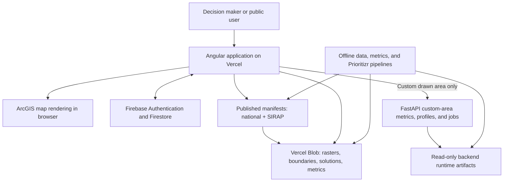

[← Back to handoff overview](./README.md)

# System Architecture and Operating Model

> **Status: repository-derived, verified against current source code.** Production platform settings (actual Vercel project configuration, DNS, VM ownership) still need confirmation — see [Architecture decisions requiring validation](#architecture-decisions-requiring-validation).

## Read this if

- You are reviewing the system picture, components, runtime, and configuration — continue on this page.
- You need Firebase project ownership, billing, authorized domains, or admin transfer — that checklist is in [`cybersecurity.md`](./cybersecurity.md#firebase-project-transfer-checklist), not an Architecture runbook.
- You need the live FastAPI routes, job queue, and artifact variables — skip to [Custom-area FastAPI surface](#custom-area-fastapi-surface) on this page.

## System purpose

The Decision Making Tool is a browser-based conservation-planning application for Colombia. Users choose among precomputed conservation solutions, visualize them with contextual layers on an ArcGIS map, inspect precomputed indicators for known administrative or conservation areas, and request live metrics when they draw a custom area of interest (AOI). Optimization runs offline — the browser never runs Prioritizr or generates new optimization solutions.

The active stack is: an Angular single-page application hosted as a static SPA on Vercel (the frontend is not Dockerized), public object storage holding manifests and geospatial assets, Firebase for identity and authorization, and a FastAPI computation service on a separate VM for custom-area metrics, area profiles, and queued species-coverage jobs. The archived R/Shiny and Node/PostgreSQL implementation under `legacy-r-shiny-app/` is **not** part of the current production runtime.

## Production architecture



## Component responsibilities

| Component                  | Technology and host                                           | Responsibility                                                                       | Operational note                                                                              |
| -------------------------- | ------------------------------------------------------------- | ------------------------------------------------------------------------------------ | --------------------------------------------------------------------------------------------- |
| Web application            | Angular 21 on Vercel                                          | Solution selection, map interaction, dashboards, authentication UI, exports.         | Static SPA on Vercel; not Dockerized. Requires HTTPS and SPA fallback routing to `index.html`. |
| Runtime catalog and assets | JSON manifests + public-read Vercel Blob                      | Indexes and serves GeoTIFFs, GeoJSON, solution rasters, metric caches, and metadata. | The app loads two catalog batches: GTIC production `catalog-releases/3.0.5` → national `manifest/manifest.json` (172 = 168 land + 4 marine) plus SIRAP `sirap-2026-09-02-v6` (56) = 228. This branch may point at `catalog-releases/3.0.6` test. The app never scans storage directly. |
| Identity and authorization | Firebase Authentication + Cloud Firestore                     | Google sign-in, access requests, approved user tiers, administrative records.        | Project ownership, backups, authorized domains, and account lifecycle need handoff decisions. |
| Custom-area computation    | FastAPI, Uvicorn, Rasterio, Docker on a separate VM           | Live metrics, area profiles, and queued species-coverage jobs for user-drawn polygons. National vs SIRAP artifacts are selected by `solution_id`. | Docker Compose on the metrics VM only. Exposes `/health`, `/ready`, `POST /metrics/custom-polygon`, `POST /area-profile/custom-polygon`, and species-coverage jobs (1 worker, max 10 queued, HTTP 429 when full). |
| Protected publication (DEPRECATED / retired) | Vercel serverless endpoint                          | The in-app manifest style editor is not a supported operator workflow. Layer appearance in the map layers panel (left sidebar) is the supported styling path. | Retired. The serverless publisher remains in the repository but is not an operator path.      |
| Offline processing         | Node, Python, geospatial tools, upstream Prioritizr workflows | Builds solutions, Cloud Optimized GeoTIFFs, manifests, and precomputed metrics.      | Operator workflows, not end-user runtime services.                                            |

## Core user workflow

```mermaid
sequenceDiagram
    actor User
    participant App as Angular application
    participant Blob as Manifest and Blob assets
    participant Map as ArcGIS map
    participant API as Custom-area metrics API

    User->>App: Open the application
    App->>Blob: Load the runtime manifest
    User->>App: Choose targets, included areas, cost assumptions
    App->>App: Match a precomputed solution in the browser
    App->>Blob: Load solution raster and cached metrics
    App->>Map: Render solution and contextual layers
    alt Known administrative or conservation area
        App->>Blob: Read precomputed area metrics
    else Custom drawn area
        App->>API: POST /metrics/custom-polygon or /area-profile/custom-polygon
        API-->>App: Calculated metrics or area profile
        opt Detailed species inventory
            App->>API: POST species-coverage job
            API-->>App: Job id (poll; 429 if queue is full)
        end
    end
    App-->>User: Display overview, area, or comparison evidence
```

<a id="runtime-and-deployment-requirements"></a>
## Runtime and deployment requirements

| Layer              | Requirement                                                                                                                                                 | Status                                                                                                               |
| ------------------ | ----------------------------------------------------------------------------------------------------------------------------------------------------------- | -------------------------------------------------------------------------------------------------------------------- |
| Frontend toolchain | Node.js 22 (CI), npm 10.9.2 (declared by `frontend/package.json`). Production build via `npm run build:vercel` from `frontend/`.                            | ✅ Verified                                                                                                          |
| Frontend hosting   | HTTPS, static-file delivery of the Angular SPA (the frontend is not Dockerized), SPA fallback routing, build-time environment variables, same-origin rewrite for `/metrics-api`. | ✅ Verified                                                                                                          |
| Backend Python     | FastAPI, Uvicorn, NumPy, Pydantic, and Rasterio. CI tests **Python 3.11 and 3.12**. The container image is still `python:3.11-slim`. Do not treat 3.12 as the verified container runtime until the Dockerfile matches CI. | 🟡 Team confirmation required — CI and Docker Python minor versions currently differ.    |
| Backend host       | Docker + Docker Compose, a read-only runtime-artifact volume (national plus optional SIRAP bundles), a writable job-queue SQLite volume, outbound access to retrieve source assets during artifact creation, HTTPS route to port 8000. | ✅ Verified                                                                                                          |
| Client             | Modern browser with Canvas and WebGL support; outbound HTTPS to the app, Blob host, Firebase/Google identity, ArcGIS dependencies, and the metrics API.     | ✅ Verified                                                                                                          |
| Storage            | ~1–2 GB today, ~4–5 GB estimated near-term.                                                                                                                 | 🟡 Team confirmation required — these are internal planning estimates, not an independently measured Blob inventory. |

## Configuration categories

Credentials and other confidential configuration values are intentionally excluded from this handoff. Parques IT needs owners, a secure storage location, and a rotation process for each category below — not the values themselves.

| Category                         | Variables                                                                                                                                                                           |
| -------------------------------- | ----------------------------------------------------------------------------------------------------------------------------------------------------------------------------------- |
| Firebase client configuration    | `FIREBASE_API_KEY`, `FIREBASE_AUTH_DOMAIN`, `FIREBASE_PROJECT_ID`, `FIREBASE_STORAGE_BUCKET`, `FIREBASE_MESSAGING_SENDER_ID`, `FIREBASE_APP_ID`, optional `FIREBASE_MEASUREMENT_ID` |
| Application routing and features | `MANIFEST_BLOB_URL`, `BLOB_ASSET_PROXY_PATH`, `METRICS_API_BASE_URL`, optional access-request notification config                                         |
| Protected server operations      | `BLOB_READ_WRITE_TOKEN`, Firebase admin credential variables, production manifest-write guards                                                                                      |
| Backend artifacts                | `DMT_ARTIFACT_DIR`, `DMT_ARTIFACT_MANIFEST`, `DMT_ARTIFACT_REQUIRED`, `DMT_ARTIFACT_SCHEMA_VERSION`, `DMT_METRICS_PIPELINE_PATH`, `DMT_SIRAP_ARTIFACT_ROOT`, `DMT_CUSTOM_POLYGON_JOB_DB`, `DMT_SOLUTION_CACHE_DIR`, `DMT_MESA_COVERAGE_REQUIRED`, `DMT_EXPECTED_COVERAGE_RELEASE_ID`, `DMT_EXPECTED_COVERAGE_CONTRACT_SHA256` |

## Operational health and recovery

- The metrics service exposes `/health` (liveness) and `/ready` (readiness). `/ready` fails when required national runtime artifacts are unavailable or invalid, **or** when the detailed-species worker is down. Missing SIRAP regional artifacts are reported in the readiness payload and currently do **not** fail `/ready`.
- Manifest publication archives the previous manifest; a rollback script can restore an archived version.
- 🔴 **Gap — no evidence found:** No centralized error reporting, uptime monitor, log shipping, or alerting configuration was found in the active repository.
- 🔴 **Gap — no evidence found:** Blob backup automation, scheduled Firestore exports, recovery objectives, and a tested disaster-recovery procedure have no owner or acceptance criteria yet.
- Runtime artifacts must be rebuilt after relevant raster or manifest changes, or live custom-area results can drift from precomputed results.

<a id="architecture-decisions-requiring-validation"></a>
## Architecture decisions requiring validation

- Confirm the actual production domain, Vercel project settings, build settings, and full environment-variable inventory. As of 7 Sep 2026 the live Vercel app (`decision-making-tool-tau.vercel.app`) responded; the intended custom domain was 404 when last probed.
- Confirm whether the app must read public Blob URLs directly or use an authenticated institutional proxy. A proxy configuration hook exists, but no complete Blob proxy implementation was found.
- Confirm ownership of the metrics VM: DNS, TLS renewal, OS patching, firewall policy, scaling, and rebuilds of national and SIRAP custom-AOI artifacts plus the species-coverage job database.
- Decide whether Firebase Google sign-in is acceptable or Parques institutional SSO is required.
- Confirm the archived R/Shiny stack is formally excluded from the handoff deployment scope.
- Define monitoring, log retention, service objectives, backup ownership, recovery objectives, and escalation contacts.

<details>
<summary>Detailed repository evidence</summary>

- Active project scope and legacy boundary: `README.md`
- Runtime data architecture: `docs/architecture/data-flow-and-blob-storage.md`
- Prior Parques auth/storage handoff notes: `docs/handoffs/parques-it-auth-blob-storage-eng.md`, `docs/handoffs/parques-it-auth-blob-storage-es.md`
- Frontend build and dependencies: `frontend/package.json`, `frontend/angular.json`
- Vercel routing and metrics proxy: `frontend/vercel.json`
- Runtime manifest loading: `frontend/src/app/core/services/layer-manifest.service.ts`
- Solution matching and catalog: `frontend/src/app/core/services/solution-catalog.service.ts`, `frontend/src/app/core/models/solution-matching.utils.ts`
- Map and solution rendering: `frontend/src/app/features/map/map-view/map-view.ts`, `frontend/src/app/features/map/services/solution-layer.service.ts`
- Cached and custom-area metrics: `frontend/src/app/core/services/solution-metrics-loader.service.ts`, `frontend/src/app/core/services/api.service.ts`, `backend/app/main.py`
- Backend container and operations: `backend/Dockerfile`, `backend/docker-compose.yml`, `backend/app/main.py`, `backend/app/config.py`, `backend/README.md`
- Manifest and metric publication: `frontend/layer-manifest/README.md`, `data/metrics/README.md`
- CI toolchain and checks: `.github/workflows/ci.yml`

</details>

## Custom-area FastAPI surface

The frontend is a Vercel static Angular SPA. It is not Dockerized. Only the metrics API runs in Docker Compose on a separate VM. The browser calls this service for drawn custom AOIs; known administrative and conservation areas still use precomputed Blob metrics.

User-facing custom-area routes:

| Method | Path | What it does |
| ------ | ---- | ------------ |
| GET | `/health` | Process liveness. HTTP 200 means the process is up. |
| GET | `/ready` | Readiness. HTTP 503 when required national runtime artifacts are missing or invalid, or when the detailed-species worker is unavailable. Missing SIRAP regional artifacts are listed in the payload and currently do not fail this check. |
| POST | `/metrics/custom-polygon` | Live selected metrics for a GeoJSON `Polygon` or `MultiPolygon`. Optional `solution_id` selects the national artifact bundle or a SIRAP regional bundle. |
| POST | `/area-profile/custom-polygon` | Sectioned area profile for a drawn polygon against a selected solution (ecosystems, land cover, species inventory summary, and related sections). |
| POST | `/area-profile/custom-polygon/species-coverage/jobs` | Enqueue a detailed species-coverage job. HTTP 202, or 200 if an identical completed job can be reused. One background worker. At most 10 queued jobs; further POSTs return HTTP 429 with `Retry-After`. |
| GET | `/area-profile/custom-polygon/species-coverage/jobs/{job_id}` | Poll job status and result. |
| DELETE | `/area-profile/custom-polygon/species-coverage/jobs/{job_id}` | Cancel a queued or running job. |

Artifact and job storage:

- National custom-AOI rasters: `DMT_ARTIFACT_DIR` / `DMT_ARTIFACT_MANIFEST`.
- SIRAP regional custom-AOI rasters: `DMT_SIRAP_ARTIFACT_ROOT` (default `runtime-artifacts/sirap`), one subdirectory per region (`eje-cafetero`, `orinoquia`). Compose does not currently pin this variable; from the container working directory `/backend` the default resolves onto the read-only artifact volume at `/backend/runtime-artifacts/sirap`.
- Species-coverage job state: SQLite at `DMT_CUSTOM_POLYGON_JOB_DB` (Compose default `/backend/runtime-cache/jobs.sqlite3` on the writable `runtime-cache` volume).

An internal ops probe for queue diagnostics exists. It is not a GTIC user-facing feature and is not part of the product UI.
