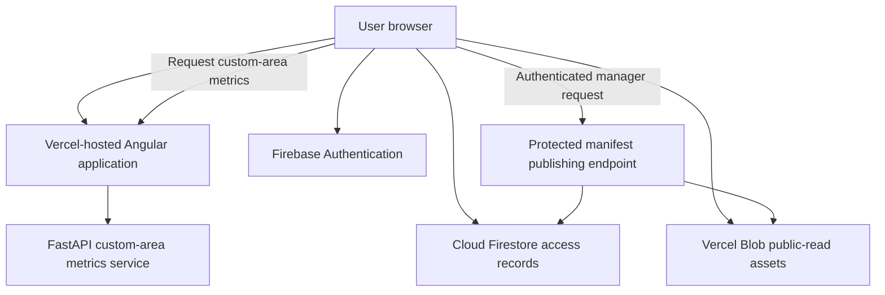

[← Back to handoff overview](./README.md)

# Cybersecurity and Data Protection

> **Status: repository-derived, verified against current source code.** Production policy, infrastructure ownership, and Colombian institutional security requirements still need Parques IT decisions — see [Security decisions requested](#security-decisions-requested-from-parques-it).

## Security overview

The active application is an Angular single-page application hosted by Vercel. It uses Firebase Authentication for Google sign-in, Cloud Firestore for access and authorization records, public-read Vercel Blob storage for geospatial assets and generated outputs, and a FastAPI service for custom-area metrics. A legacy R/Shiny and Node/PostgreSQL implementation remains in the repository but is not part of the current production path.

**The core policy question for this handoff:** the current design protects _writes_ far more strongly than _reads_.

|                                                                 | Current protection                                                                                            |
| --------------------------------------------------------------- | ------------------------------------------------------------------------------------------------------------- |
| Privileged writes (manifest publishing, Firestore role changes) | Server-side authorization: Firebase ID-token verification + Firestore role check + explicit deployment flags. |
| Reads (geospatial assets, custom-polygon metrics)               | Reachable without application authentication — protected only by being unlisted, not by an access check.      |

Parques IT must decide whether this public-read research-data model is acceptable, or whether data and computation must be restricted to approved users.

## Current trust boundaries

## Controls confirmed in the repository

- Firebase Google sign-in supplies user identity; Firestore user records determine application tier and administrative privileges. (The Google sign-in service also contains a demo/stub fallback path used only when Firebase is disabled — that fallback is not the production path and should not be cited as evidence of real authentication.)
- Firestore security rules validate protected record shapes and deny unmatched access by default.
- The manifest-publishing endpoint verifies a Firebase identity token, checks the corresponding Firestore role, and requires explicit deployment flags before allowing a write.
- Privileged Blob and Firebase server credentials are expected through environment variables and excluded from source control. Credentials and other confidential configuration values must never be copied into handoff documentation.
- Manifest publication creates archived versions that support rollback of the active manifest.
- Backend requests use typed validation and reject unsupported geometry types and unknown metric identifiers.

## Findings and risk register

Each finding below combines what was found, why it matters, the likelihood/impact assessment, and the owner who needs to act — merged into one table so nothing is tracked twice.

| ID     | Finding                                                                                                                      | Why it matters                                                                                                                                       | Likelihood / impact                                               | Required response                                                                                                             | Owner to confirm                             |
| ------ | ---------------------------------------------------------------------------------------------------------------------------- | ---------------------------------------------------------------------------------------------------------------------------------------------------- | ----------------------------------------------------------------- | ----------------------------------------------------------------------------------------------------------------------------- | -------------------------------------------- |
| SEC-01 | Geospatial assets are publicly readable by URL.                                                                              | Conflict, Indigenous-territory, species, or consultation-related datasets may need a policy decision even when technically sourced from public data. | High likelihood by design; impact depends on data classification. | Parques IT approves public access, or requires private storage with authenticated delivery.                                   | Parques information security and data owners |
| SEC-02 | The custom-polygon metrics endpoint has no application authentication or rate limit.                                         | Repeated complex requests could exhaust CPU/memory or increase operating cost.                                                                       | Moderate likelihood and impact.                                   | Add an API gateway or reverse proxy with authentication, request limits, timeouts, polygon complexity limits, and monitoring. | Application team and infrastructure owner    |
| SEC-03 | Many application tiers are enforced in the interface rather than at the asset boundary.                                      | A control hidden in the browser does not prevent direct access to a public URL.                                                                      | Depends on data classification per asset.                         | Define which capabilities and datasets truly require server-side authorization.                                               | Application team                             |
| SEC-04 | Production security headers are not explicitly configured in the repository.                                                 | Missing browser protections increase exposure to clickjacking, content injection, and content-type confusion.                                        | Moderate likelihood, low-to-moderate impact.                      | Add baseline headers; introduce Content Security Policy in report-only mode before enforcement.                               | Application team                             |
| SEC-05 | No dependency scanning, security alerting, incident-response runbook, or disaster-recovery plan was found in the repository. | Vulnerabilities or operational incidents may go undetected or be handled inconsistently.                                                             | Moderate likelihood, high operational impact.                     | Assign owners; define scanning, alerting, credential rotation, backup, recovery, and escalation procedures.                   | Parques IT and project leadership            |
| —      | Compromise of Blob write or Firebase administrative credentials                                                              | Lower likelihood, but critical impact if it happens.                                                                                                 | Low likelihood, critical impact.                                  | Use a Parques-managed secrets vault, least privilege, documented rotation, audited publishing activity.                       | Parques IT                                   |

## Security decisions requested from Parques IT

- Is public, unauthenticated access acceptable for every currently published geospatial layer and generated output?
- Must the application use a Parques institutional identity provider instead of Firebase Google sign-in?
- Should the metrics service be public, authenticated through an API gateway, restricted by network policy, or hosted entirely inside Parques infrastructure?
- Who owns the Firebase project, Blob storage, server credentials, backups, monitoring, vulnerability management, and incident response after handoff?
- What retention, audit, encryption, data-classification, and Colombian privacy requirements apply to user records, logs, and planning datasets?
- Is Vercel an approved production platform, and which WAF, header, TLS, domain, and availability standards must apply?

Detailed repository evidence

- Authentication and tier mapping: `frontend/src/app/core/services/auth.service.ts`
- Firebase client integration: `frontend/src/app/core/services/firebase-client.service.ts`
- Google identity flow (production path; also contains a demo/stub fallback used only when Firebase is disabled): `frontend/src/app/features/auth/services/google-identity.service.ts`
- Firestore authorization policy: `firestore.rules`
- Protected manifest publishing endpoint: `frontend/api/dev/manifest-style-publish.ts`
- Manifest validation and rollback: `frontend/layer-manifest/validate-manifest.mjs`, `frontend/layer-manifest/rollback-manifest.mjs`
- Frontend routing to the metrics service: `frontend/vercel.json`
- FastAPI entry point and CORS policy: `backend/app/main.py`
- Polygon request validation: `backend/app/models.py`, `backend/app/polygon_metrics.py`
- CI checks: `.github/workflows/ci.yml`
- Related architecture references: `docs/architecture/data-flow-and-blob-storage.md`, `docs/handoffs/parques-it-auth-blob-storage-eng.md`, `docs/gtic-system-architecture-slides.md`

