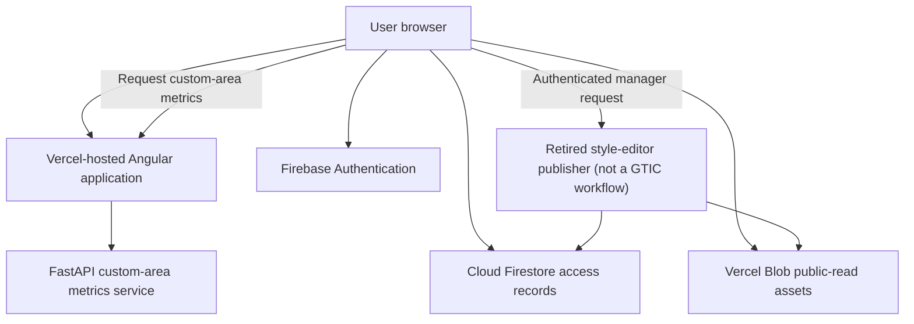

[← Back to handoff overview](./README.md)

# Cybersecurity and Data Protection

> **Status: repository-derived, verified against current source code.** Production policy, infrastructure ownership, and Colombian institutional security requirements still need Parques IT decisions — see [Security decisions requested](#security-decisions-requested-from-parques-it).

## Security overview

The active application is an Angular single-page application hosted by Vercel. It uses Firebase Authentication for Google sign-in, Cloud Firestore for access and authorization records, public-read Vercel Blob storage for geospatial assets and generated outputs, and a FastAPI service for custom-area metrics. A legacy R/Shiny and Node/PostgreSQL implementation remains in the repository but is not part of the current production path.

**The core policy question for this handoff:** the current design protects _writes_ far more strongly than _reads_.

|                                                                 | Current protection                                                                                            |
| --------------------------------------------------------------- | ------------------------------------------------------------------------------------------------------------- |
| Privileged writes (manifest publishing, Firestore role changes) | Server-side authorization: Firebase ID-token verification + Firestore role check + explicit deployment flags. |
| Reads (geospatial assets, custom-polygon metrics)               | Reachable without application authentication — protected only by being unlisted, not by an access check.      |

Parques IT must decide whether this public-read research-data model is acceptable, or whether data and computation must be restricted to approved users.

## Current trust boundaries

## Controls confirmed in the repository

- Firebase Google sign-in supplies user identity; Firestore user records determine application tier and administrative privileges. (The Google sign-in service also contains a demo/stub fallback path used only when Firebase is disabled — that fallback is not the production path and should not be cited as evidence of real authentication.)
- Firestore security rules validate protected record shapes and deny unmatched access by default.
- The leftover manifest-publishing endpoint (retired style editor) still verifies a Firebase identity token, checks the corresponding Firestore role, and requires explicit deployment flags before allowing a write. It is not a GTIC operator workflow.
- Privileged Blob and Firebase server credentials are expected through environment variables and excluded from source control. Credentials and other confidential configuration values must never be copied into handoff documentation.
- Manifest publication creates archived versions that support rollback of the active manifest.
- Backend requests use typed validation and reject unsupported geometry types and unknown metric identifiers.

## Findings and risk register

Each finding below combines what was found, why it matters, the likelihood/impact assessment, and the owner who needs to act — merged into one table so nothing is tracked twice.

## Priority decisions

- Accept public unauthenticated reads of published geospatial assets, or require private authenticated delivery (SEC-01).
- Choose the metrics API’s long-term home and whether it stays unauthenticated (SEC-02).
- Keep Firebase Google sign-in, or require a Parques institutional identity provider.
- Complete Firebase project Owner transfer, billing, authorized domains, and backups — see the checklist later on this page. Likelihood/impact ratings in the register below are unchanged.

| ID     | Finding                                                                                                                      | Why it matters                                                                                                                                       | Likelihood / impact                                               | Required response                                                                                                             | Owner to confirm                             |
| ------ | ---------------------------------------------------------------------------------------------------------------------------- | ---------------------------------------------------------------------------------------------------------------------------------------------------- | ----------------------------------------------------------------- | ----------------------------------------------------------------------------------------------------------------------------- | -------------------------------------------- |
| SEC-01 | Geospatial assets are publicly readable by URL.                                                                              | Conflict, Indigenous-territory, species, or consultation-related datasets may need a policy decision even when technically sourced from public data. | High likelihood by design; impact depends on data classification. | Parques IT approves public access, or requires private storage with authenticated delivery.                                   | Parques information security and data owners |
| SEC-02 | The custom-polygon metrics endpoint has no application authentication or rate limit.                                         | Repeated complex requests could exhaust CPU/memory or increase operating cost.                                                                       | Moderate likelihood and impact.                                   | Add an API gateway or reverse proxy with authentication, request limits, timeouts, polygon complexity limits, and monitoring. | Application team and infrastructure owner    |
| SEC-03 | Many application tiers are enforced in the interface rather than at the asset boundary.                                      | A control hidden in the browser does not prevent direct access to a public URL.                                                                      | Depends on data classification per asset.                         | Define which capabilities and datasets truly require server-side authorization.                                               | Application team                             |
| SEC-04 | Production security headers are not explicitly configured in the repository.                                                 | Missing browser protections increase exposure to clickjacking, content injection, and content-type confusion.                                        | Moderate likelihood, low-to-moderate impact.                      | Add baseline headers; introduce Content Security Policy in report-only mode before enforcement.                               | Application team                             |
| SEC-05 | No dependency scanning, security alerting, incident-response runbook, or disaster-recovery plan was found in the repository. | Vulnerabilities or operational incidents may go undetected or be handled inconsistently.                                                             | Moderate likelihood, high operational impact.                     | Assign owners; define scanning, alerting, credential rotation, backup, recovery, and escalation procedures.                   | Parques IT and project leadership            |
| —      | Compromise of Blob write or Firebase administrative credentials                                                              | Lower likelihood, but critical impact if it happens.                                                                                                 | Low likelihood, critical impact.                                  | Use a Parques-managed secrets vault, least privilege, documented rotation, audited publishing activity.                       | Parques IT                                   |

## Security decisions requested from Parques IT

- Is public, unauthenticated access acceptable for every currently published geospatial layer and generated output?
- Must the application use a Parques institutional identity provider instead of Firebase Google sign-in?
- Should the metrics service be public, authenticated through an API gateway, restricted by network policy, or hosted entirely inside Parques infrastructure?
- Who owns the Firebase project, Blob storage, server credentials, backups, monitoring, vulnerability management, and incident response after handoff?
- What retention, audit, encryption, data-classification, and Colombian privacy requirements apply to user records, logs, and planning datasets?
- Is Vercel an approved production platform, and which WAF, header, TLS, domain, and availability standards must apply?

Detailed repository evidence

- Authentication and tier mapping: `frontend/src/app/core/services/auth.service.ts`
- Firebase client integration: `frontend/src/app/core/services/firebase-client.service.ts`
- Google identity flow (production path; also contains a demo/stub fallback used only when Firebase is disabled): `frontend/src/app/features/auth/services/google-identity.service.ts`
- Firestore authorization policy: `firestore.rules`
- Retired style-editor publisher (not a GTIC workflow): `frontend/api/dev/manifest-style-publish.ts`
- Manifest validation and rollback: `frontend/layer-manifest/validate-manifest.mjs`, `frontend/layer-manifest/rollback-manifest.mjs`
- Frontend routing to the metrics service: `frontend/vercel.json`
- FastAPI entry point and CORS policy: `backend/app/main.py`
- Polygon request validation: `backend/app/models.py`, `backend/app/polygon_metrics.py`
- CI checks: `.github/workflows/ci.yml`
- Related architecture references: `docs/architecture/data-flow-and-blob-storage.md`, `docs/handoffs/parques-it-auth-blob-storage-eng.md`, `docs/gtic-system-architecture-slides.md`

## Firebase project transfer checklist

This is the procedure for making Parques / PNNC-GTIC the operator of the existing Firebase project. It does not close the still-open policy question of whether Google sign-in should later be replaced by an institutional identity provider. It is also not a capacity study: **no Firebase load, quota, or saturation tests have been run**, and this checklist does not claim any.

Do not copy Admin SDK keys, service-account JSON, or other privileged credentials into this document, tickets, or chat. The Angular web config (`projectId` and other public client fields) is not a privileged secret. Treat Admin credentials as vault material only.

Current project ID: `dises-decision-making-tool`. Auth hostname used by the app: `dises-decision-making-tool.firebaseapp.com`. Older sign-in flow notes live in [`parques-it-auth-blob-storage-eng.md`](../parques-it-auth-blob-storage-eng.md); that file is superseded for architecture and should be used only as background.

There are two different “owner” roles, and Parques needs both:

| Layer | What it controls | Where it lives |
| --- | --- | --- |
| Google Cloud / Firebase **project Owner** | Billing, authorized domains, Auth providers, Firestore rules deploys, exports, IAM | Firebase Console / Google Cloud IAM |
| In-app **super-admin** | Approve new accounts, assign staff roles, assign SIRAP regional admins | Cloud Firestore `users/{uid}` |

### 1. Add Parques as project Owner

- In Google Cloud IAM for `dises-decision-making-tool`, add at least two Parques / PNNC-GTIC Google accounts as **Owner**. Prefer institutional accounts, not personal Gmail, if Parques policy requires it.
- Also grant those accounts Firebase Console access. Owner is enough; do not invent extra custom roles unless Parques IAM policy says otherwise.
- Confirm the project’s Google Cloud organization/folder. If Parques requires the project to live in a PNNC organization, complete that org move while Spatial Lab still has Owner — do not leave a single remaining Owner mid-move.
- Keep at least one Spatial Lab Owner in place until the later step-down checks pass.
- Verify a Parques Owner can open Authentication, Firestore, Billing, and IAM without borrowing a Spatial Lab login.

### 2. Move billing

- Identify the Google Cloud billing account currently attached to the project.
- Attach a Parques-owned billing account before the last Spatial Lab Owner is removed. Firebase Authentication + Firestore in production typically require a billed (Blaze) project; confirm the plan in Console rather than assuming it.
- Confirm who receives budget alerts, and that invoices go to a Parques cost center.
- Do not store billing account numbers, payment instruments, or API keys in this handoff.

### 3. Confirm authorized domains

In Firebase Authentication → Settings → Authorized domains, keep only the hosts that should be allowed to complete Google sign-in:

- `localhost` (local development)
- `dises-decision-making-tool.firebaseapp.com` and `dises-decision-making-tool.web.app` (Firebase defaults)
- The live production frontend host (as of this writing the Vercel app is `decision-making-tool-tau.vercel.app`)
- Any **approved** custom domain, once DNS actually serves the app — do not add a domain that is still 404
- Preview or staging hosts only if Parques wants sign-in on those URLs

After the list is correct, have a Parques Owner complete a Google sign-in on production and on localhost. A domain missing from this list looks like a broken login, not an application bug.

### 4. Review Authentication and Firestore

- **Identity** is Firebase Authentication (Google sign-in). **Authorization** is Cloud Firestore. Signing in does not by itself grant decision-maker, manager, or admin privileges.
- Leave the Google sign-in provider enabled until Parques formally chooses a different identity provider.
- Review and, if Parques will operate the project, take ownership of deploying `firestore.rules` from this repository. Rules deny unmatched access by default.
- Principal collections to know (do not paste document contents into tickets):

| Collection | Purpose |
| --- | --- |
| `accessRequests/{uid}` | Pending or reviewed requests from people who signed in but are not yet approved as app users |
| `users/{uid}` | Approved user records: `status`, `tier`, `role`, `isAdmin` / `isSuperAdmin`, SIRAP grants |
| `userDirectory/{uid}` | Directory listing used when a regional SIRAP admin cannot read every `users` document |
| `sirapAccessRequests/{uid}_{sirapId}` | Per-region SIRAP data-access requests |
| `users/{uid}/savedSolutionScenarios/{id}` | Signed-in users’ saved scenarios (user data; include in backups) |
| `mail` | Optional admin-notification documents; client writes are denied by rules |

- Privileged server credentials (Firebase Admin / service accounts) stay in a Parques secrets vault. Rotate any key that Spatial Lab previously held before step-down.

### 5. Approve or deny users

Google identity and application access are separate. A person can sign in and still be pending.

- **New accounts.** The user signs in with Google and submits `accessRequests/{uid}`. Only an in-app **super-admin** can approve that request into `users/{uid}` with `status: active`. Until then the app stays on the public tier.
- **SIRAP data access.** After the account is active, the user can request Orinoquía and/or Eje Cafetero. A super-admin, or a regional admin for that SIRAP, approves or denies the region. Denial removes that region from `allowedSirapIds` without deleting the Google account.
- **Account-level deny.** Firestore rules allow `accessRequests/{uid}` to be marked `denied`. Do not leave a denied person as `users/{uid}` with `status: active`. If the in-app console has no account-deny control, a super-admin with Firestore Console access can set the request to `denied` and keep or set the user record inactive/denied.
- Regional SIRAP admins **cannot** approve brand-new Firebase accounts. They can only grant or revoke SIRAP regions they administer.

### 6. Promote Parques staff

Do this after at least one Parques operator can sign in.

- If Spatial Lab still has an in-app super-admin, that person promotes the first Parques staff account from the admin tools (tier, super-admin flag, SIRAP assignments).
- If no in-app super-admin remains, a Firebase project Owner bootstraps the first Parques super-admin in Firestore Console on `users/{uid}` **after that person has signed in once** (so the Auth uid exists): `status: active`, `isSuperAdmin: true`, `isAdmin: true`, `role: admin`, `tier: 3`. Then that Parques super-admin promotes everyone else. Do not share that uid in this document.
- Promote at least two Parques super-admins so one departure cannot lock the approval queue.
- Use Manager (`tier` 3 / `science_publisher`) only for staff who should receive publisher-level product privileges. Ordinary approved users are Decision Maker (`tier` 2 / `authorized_viewer`).

### 7. SIRAP regional admins versus global admin

These are application roles in `users/{uid}`, not Google Cloud IAM roles.

| Role | Firestore signals | What they can do | What they cannot do |
| --- | --- | --- | --- |
| Global / super-admin | Active user with `isSuperAdmin`, `isAdmin`, or `role: admin` | Approve new accounts, assign tiers, assign other super-admins, assign regional admins, grant or revoke any SIRAP | — |
| SIRAP regional admin | Active user with `administeredSirapIds` set (and not a super-admin) | See overlapping users; approve, deny, or revoke SIRAP access **only** for those regions | Approve new Google/Firebase accounts; change global tier or super-admin flags; administer a SIRAP they were not assigned |
| Approved SIRAP user | Active user with `allowedSirapIds` only | Use the SIRAP product line for granted regions | Administer anyone else |

Assign regional admins by writing `administeredSirapIds` to `orinoquia` and/or `eje-cafetero`. Eight SIRAP labels exist in the product; **only Orinoquía and Eje Cafetero currently have published data**, and Firestore rules only accept those two IDs.

A regional admin is not a Cloud project Owner. Do not grant Google Cloud Owner to people who only need to approve regional access requests.

### 8. Backups and exports

No Firebase backup/restore drill is documented in this repository today. Before Spatial Lab steps down, Parques should:

- Enable or confirm scheduled **Cloud Firestore managed exports** to a Parques-owned Cloud Storage bucket. Include subcollections (saved scenarios).
- Export Authentication users if Parques identity/retention policy requires a copy of Google-linked accounts.
- Confirm whether Firestore point-in-time recovery is on; enable it if Parques RPO requires it.
- Store exports in a private Parques bucket — not in public Vercel Blob.
- Record who can run a restore, and test one restore into a non-production project if Parques disaster-recovery policy requires it.

This is backup hygiene, not a load test, and it does not measure Auth or Firestore quotas under concurrent users.

### 9. Step down Spatial Lab

Only after a Parques Owner has demonstrated all of the following:

- Open Firebase Console as Owner without a Spatial Lab account
- Change (or verify) authorized domains
- Run a Firestore export to a Parques bucket
- Sign in to the production app
- Promote at least one additional Parques staff user
- Approve a test access request and grant/revoke one SIRAP region

Then:

- Downgrade or remove Spatial Lab Google Cloud Owner/Editor accounts. Never remove the last Owner.
- Revoke or rotate Admin SDK / service-account keys Spatial Lab used.
- Leave a dated break-glass contact for a short agreed window, then close it.
- Keep this checklist as the operator record; do not treat a leftover Spatial Lab login as the recovery plan.

