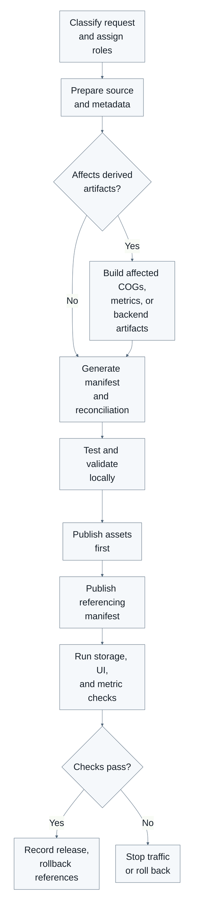

[← Back to Parques IT handoff](../README.md)

# Data Operations Runbooks

Use this page to choose the smallest runbook that safely completes a data change. A file upload is only storage: the application sees data through catalogs, manifests, metric artifacts, and backend runtime artifacts. Treat those pieces as one release contract and verify every piece that the change actually affects.

Not every change requires every downstream step. A label-only change may need only a manifest refresh; a map-only layer does not require metric regeneration; a calculation input can require metrics and backend artifacts even when its pathname does not change.

## How the release process works

1. **Register** the source, identity, metadata, and intended role.
2. **Build** only the derived assets affected by that role.
3. **Validate** local contracts and reconciliation reports.
4. **Publish** assets before the manifests that reference them.
5. **Verify** storage, UI behavior, known-AOI metrics, and custom-AOI metrics as applicable.
6. **Record** immutable paths, checksums, reports, and rollback references.

The generator's verified CSV, human-readable CSV snapshots, Blob contents, runtime layer manifest, species manifest, metrics, and backend artifact manifest are separate registries. They can drift unless the release explicitly reconciles them.

## Roles

- **Data publisher** — controls approved Blob writes, confirms pathnames and checksums, preserves rollback copies, and records who published what and when. This role does not approve scientific meaning.
- **Pipeline operator** — generates COGs, manifests, metrics, sparse data, and backend artifacts; reviews validation and reconciliation output; stops a release when contracts fail.
- **Application developer** — changes schemas, UI wiring, calculation behavior, category mappings, or unsupported workflows. New AOI types and exclude-layer support require this role.
- **Scientific reviewer** — confirms source suitability, units, transformations, NoData handling, category meaning, and expected metric results. Technical success is not scientific approval.

One person may hold more than one role, but the release record must state who performed each responsibility.

## Choose a runbook

| Request                                                                                     | Start here                                                    | Also use when needed                                                                                                                            |
| ------------------------------------------------------------------------------------------- | ------------------------------------------------------------- | ----------------------------------------------------------------------------------------------------------------------------------------------- |
| Add or replace one solution and its provenance                                              | [Adding solutions](./adding-solutions.md)                     | [Metrics and artifacts](./metrics-and-artifacts.md), then [Publishing and rollback](./publishing-and-rollback.md)                               |
| Replace the complete solution catalog                                                       | In development — not yet operator-ready; the separate catalog versioning/replacement workflow must be merged, documented, and tested | Current generation preserves published IDs absent from discovery; use the new workflow only after handoff verification                          |
| Add, replace, relabel, or retire a feature, cost, include, reference, or species layer      | [Managing layers](./managing-layers.md)                       | [Metrics and artifacts](./metrics-and-artifacts.md) only when calculations change; then [Publishing and rollback](./publishing-and-rollback.md) |
| Add or replace a department, municipality, SIRAP, RUNAP, or OMEC boundary                   | [Managing AOIs](./managing-aois.md)                           | [Metrics and artifacts](./metrics-and-artifacts.md), then [Publishing and rollback](./publishing-and-rollback.md)                               |
| Add a genuinely new metric or enable an existing metric for another domain                  | [Adding or enabling metrics](./adding-or-enabling-metrics.md) | [Metrics and artifacts](./metrics-and-artifacts.md), then [Publishing and rollback](./publishing-and-rollback.md)                               |
| Generate known-AOI metrics, compact metrics, sparse inputs, or custom-AOI backend artifacts | [Metrics and artifacts](./metrics-and-artifacts.md)           | [Publishing and rollback](./publishing-and-rollback.md)                                                                                         |
| Publish validated outputs, check the application, or recover from a bad release             | [Publishing and rollback](./publishing-and-rollback.md)       | Return to the source-specific runbook if regeneration is required                                                                               |
| Add a new AOI geography type, Finder control, or exclude workflow                           | Application developer review                                  | The current operator runbooks are insufficient                                                                                                  |

## Downstream impact

| Change                                                     | Manifest                                                                               | Known-AOI metrics                                | Custom-AOI backend artifacts                            | UI verification             |
| ---------------------------------------------------------- | -------------------------------------------------------------------------------------- | ------------------------------------------------ | ------------------------------------------------------- | --------------------------- |
| Label, description, category, or rendering metadata only   | Regenerate and publish                                                                 | No                                               | No                                                      | Yes                         |
| Map-only reference layer (`roleInMetricCalculation: none`) | Regenerate and publish                                                                 | No                                               | No                                                      | Yes                         |
| Replace a calculation raster at the same pathname          | Regenerate to confirm URLs/contracts                                                   | Regenerate affected metrics; bypass stale caches | Rebuild and restart when used live                      | Yes                         |
| Add an existing-type solution                              | Regenerate and publish                                                                 | Generate for the solution                        | Rebuild only if live artifacts depend on changed inputs | Finder, map, and metrics    |
| Add species rasters                                        | Regenerate/publish species manifest; main manifest only if its species pointer changes | Regenerate affected species metrics              | Verify/rebuild species artifacts where supported        | Search, render, and metrics |
| Change a known-AOI boundary                                | Regenerate if URL/metadata changes                                                     | Regenerate all solutions × all AOIs              | Rebuild if live calculation inputs changed              | Identify and metrics        |
| Change only a precomputed metrics artifact                 | Update manifest only when its URL changes                                              | Publish affected artifact                        | No                                                      | Metrics                     |

All-AOI recalculation is required when a catalog, calculator, domain applicability, shared metric source, schema, or boundary contract changes. A solution-raster-only change may be limited to that solution, but its output still includes every known AOI. See [Adding or enabling metrics](./adding-or-enabling-metrics.md) for the developer contract.

When uncertain, the pipeline operator and application developer should trace the manifest fields and calculation inputs before publishing; do not automatically rebuild everything as a substitute for understanding impact.

## Common release sequence

## Non-negotiable safety rules

1. Never publish before identifying the environment, exact Blob pathname, affected consumers, and rollback source.
2. Never print, paste, or document token values. Documentation may name environment variables only.
3. Run dry-run, generation, tests, validation, and reconciliation before writes whenever the repository supports them.
4. Publish referenced assets before publishing the manifest that points to them.
5. Do not hand-edit a live manifest. Generate it, validate it, and retain its archive reference.
6. Do not overwrite metrics unless a known-good local generation directory and publish report are retained. Metrics have no automatic archive.
7. Prefer immutable, release-versioned metric paths; overwriting long-cache paths can leave clients on stale bytes.
8. Refresh the browser before UI verification and recreate the backend container after rebuilding runtime artifacts.
9. Treat `/health` as process health only; required backend artifacts are safe for traffic only when `/ready` succeeds.
10. Stop when registries disagree, reconciliation has unexplained omissions, or scientific checks fail.
11. Excludes are not operator-ready: metadata supports `excludes[]`, but no dedicated source prefix, registry scan, or Finder workflow is wired.
12. Blob/storage disaster recovery is not tested or automated. A release archive is not a complete DR plan.

## Known release hazards

- The generator reads `data/Capas de entrada _ Input Layers - Capas de entrada requeridas (2).csv`; `data/input_layers_in_use.csv` and `data/input_layers_required.csv` are human-readable snapshots and can drift independently.
- Generated `compressedDataForLiveMetricsUrl` values can use `metrics/live/{id}.bin.gz`, while sparse builders produce `*.sparse.gz` beside source inputs. Verify the deployed format and URL rather than assuming equivalence.
- The frontend contains a hardcoded staging compact-metric fallback for `solutions/nick-runs/...` paths. Production releases should provide explicit, versioned `precomputedMetricUrls`.
- No generic repository uploader exists for feature, cost, include, exclude, reference, raw solution-pair, or most boundary assets.

## Glossary

- **Blob pathname** — path within Vercel Blob, such as `manifest/manifest.json`; it is distinct from a local path and from the full public URL.
- **COG** — Cloud Optimized GeoTIFF used for efficient map display.
- **Known AOI** — predefined geography, such as a department or SIRAP, whose metrics can be precomputed.
- **Custom AOI** — user-drawn polygon calculated by the FastAPI backend from runtime artifacts.
- **Registry** — source that declares what should exist and how it is interpreted; several registries exist and must agree.
- **Reconciliation report** — generated comparison of expected registry entries, Blob assets, categories, and solutions.
- **Runtime layer manifest** — app-facing catalog at `manifest/manifest.json`.
- **Species manifest** — secondary species catalog at `manifests/species.manifest.json`.
- **Backend artifact manifest** — VM-local `backend/runtime-artifacts/manifest.json` used for readiness and custom-AOI inputs.
- **Deploy asset manifest** — build-time `frontend/scripts/data-deploy/manifest.json`; it validates copied frontend assets and is not the runtime catalog.
- **Immutable release path** — versioned pathname whose bytes are never overwritten.
