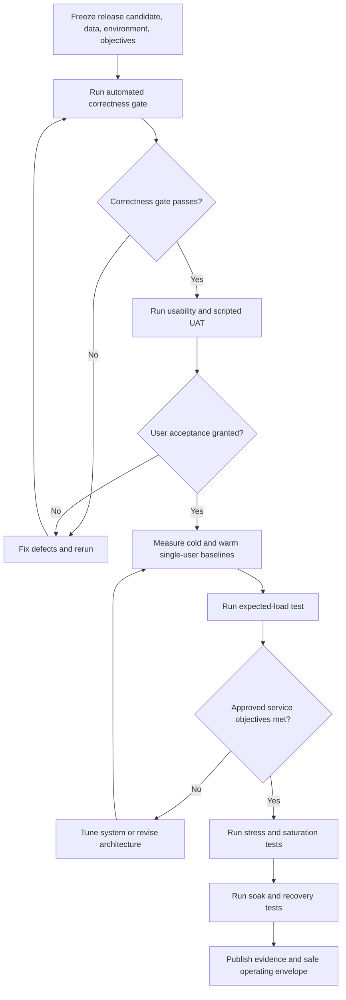

[← Back to handoff overview](./README.md)

# Performance, Load, and Saturation Testing

> **Current status: 🔴 Gap — no evidence found.** No validated saturation result exists. Automated correctness tests and a narrow browser responsiveness smoke test exist, but they do not establish production concurrency, throughput, latency under load, or a safe operating limit. This is the single largest evidence gap in the whole handoff.

## What each test type establishes

| Test type              | What it measures                                                                                                                |
| ---------------------- | ------------------------------------------------------------------------------------------------------------------------------- |
| **Load testing**       | Behavior at an agreed expected workload.                                                                                        |
| **Stress testing**     | Deliberately exceeds expected workload to identify degradation and failure behavior.                                            |
| **Saturation testing** | The reproducible point where added load no longer increases useful throughput, or causes an approved service objective to fail. |
| **Soak testing**       | Resource growth, leakage, or cumulative degradation during sustained operation.                                                 |

Usability sessions and UAT ([`usability-testing.md`](./usability-testing.md)) establish whether people can understand and successfully use the product. They are necessary handoff evidence, but they cannot substitute for these engineering capacity tests.

## Current testing evidence

A local run on July 29, 2026 produced the results below. These are real, reproduced numbers — not estimates.

| Suite                                        | Result                                                                                          |
| -------------------------------------------- | ----------------------------------------------------------------------------------------------- |
| Frontend unit tests (`npm test`)             | ✅ 303 passed / 36 files                                                                        |
| Manifest validation tests                    | ✅ 48 passed                                                                                    |
| Example-manifest schema validation           | ✅ Passed                                                                                       |
| Chromium map-panel browser smoke             | ✅ 2 passed                                                                                     |
| Metrics-pipeline tests (Python)              | ✅ 266 passed, 1 skipped                                                                        |
| **Backend tests (`backend/tests/`, pytest)** | ✅ **24 passed under Python 3.12 and 3.13** after correcting a drifted synthetic raster fixture |

The initial evidence checks left the working tree clean. The later fixture correction and handoff documentation updates are the reviewed changes described here.

<a id="backend-fixture-correction-and-remaining-production-concern"></a>
### Backend fixture correction and remaining production concern

The first backend run produced six failures with:

```
app.polygon_metrics.PolygonMetricError: Custom polygon raster calculation failed:
Solution selected_mask must equal the union of values 1 and 2.
```

The synthetic solution fixture marked all four raster cells as category `1`, while its AOI selected only the two left cells. That violated the current solution contract: `selected_mask` must equal the union of category values `1` and `2`. The fixture now represents the selected left column consistently, without weakening production validation. The full suite passes under Python 3.12 and 3.13.

**A separate production concern remains:** `build_custom_aoi_raster()` replaces `selected_mask` for the requested polygon while retaining category masks from the original solution. An arbitrary AOI that does not exactly match those categories may trigger the same validation error. This has not been fixed or covered by an explicit arbitrary-AOI regression test and requires separate engineering review.

Current evidence supports correctness claims for specific calculations, state transitions, manifest contracts, and fixture-based API behavior. It does **not** prove arbitrary-AOI category-mask correctness or support a production-scale capacity statement: no retained end-to-end load, stress, soak, or saturation suite and report exist. Recent remote GitHub Actions results were not inspected as part of this pass.

## Evidence gaps

- No formal browser end-to-end suite exercises the real ArcGIS map, Firebase, Blob assets, and live metrics backend together.
- No retained accessibility audit or test report was found.
- No k6, Locust, Artillery, JMeter, Gatling, or equivalent workload-testing suite was identified.
- No approved concurrent-user forecast, transaction mix, p95/p99 latency objective, error ceiling, resource-headroom target, or saturation report was found.
- The backend currently starts one Uvicorn process; the request model does not explicitly limit polygon vertices, request bytes, polygon count, or requested metric count.
- Browser-side GeoTIFF download, decoding, raster scanning, and canvas rendering create meaningful transfer, memory, and main-thread risks that backend-only testing would miss.

## Phased evidence plan



| Phase                          | What happens                                                                                                                                                                         | Exit criteria                                                                                                                                        |
| ------------------------------ | ------------------------------------------------------------------------------------------------------------------------------------------------------------------------------------ | ---------------------------------------------------------------------------------------------------------------------------------------------------- |
| 0 — Freeze                     | Fix the exact release commit, deployment, manifest, backend artifact, dataset versions, infrastructure specs, test accounts, third-party traffic policy, and expected-results owner. | Parques approves the workload assumptions and measurable service objectives.                                                                         |
| 1 — Automated correctness gate | Run frontend, manifest, backend, and metrics-pipeline tests; build production bundle; validate assets/schemas; add staging end-to-end smoke coverage.                                | All documented suites now pass, including the backend suite. The separate arbitrary-AOI concern above still requires engineering review. Retain machine-readable output, CI links, checksums, logs, screenshots, API samples. |
| 2 — Usability and UAT          | Run the process in [`usability-testing.md`](./usability-testing.md). Acceptance must include scientific-result validation, not just functional behavior.                             | UAT sign-off granted.                                                                                                                                |
| 3 — Single-user baseline       | Measure cold- and warm-cache critical journeys with production-sized assets and agreed browser/device/network profiles.                                                              | Baseline traces, HAR files, memory records, and backend profiles retained.                                                                           |
| 4 — Expected load              | Run the approved transaction mix at approved peak sessions/request rate for an agreed hold period.                                                                                   | Latency, errors, correctness, health, readiness, and resource headroom all stay within approved limits.                                              |
| 5 — Stress and saturation      | Increase traffic in controlled, repeatable steps beyond expected load; test the custom-area API separately from static Blob-backed journeys.                                         | First reproducible objective breach, throughput plateau, queue growth, error onset, limiting resource, and recovery behavior recorded.               |
| 6 — Soak and resilience        | Hold the safe normal workload for an agreed window; exercise restart, artifact-unavailable, object-storage-error, and downstream-timeout scenarios.                                  | Stable resource use, correct results, recovery within approved objectives.                                                                           |

## Workload model

Model each transaction separately before combining into a realistic mix:

- Initial application, ArcGIS, manifest, and map load.
- Find and apply a solution, including raster and metric retrieval.
- Add, style, reorder, and remove raster or vector layers.
- Select a known area and retrieve precomputed metrics.
- Draw small, medium, large, multipart, and high-vertex custom areas using both lightweight and expensive metric sets.
- Compare two solutions and render overlap.
- Export map imagery and metrics CSV.
- Authenticate, request access, and perform approved Firestore operations.
- Run health/readiness probes separately from user traffic.

Test cold CDN, warm CDN, warm browser, and warm backend states; terrestrial and marine assets; agreed desktop and network profiles; and both the current direct-Blob architecture and any approved private-storage/proxy target architecture.

## Measurements to retain

| Layer                         | Required measurements                                                                                                                                                                                    |
| ----------------------------- | -------------------------------------------------------------------------------------------------------------------------------------------------------------------------------------------------------- |
| Browser and map               | Web Vitals, time to usable map, solution-render time, main-thread long tasks, GeoTIFF transfer/decode/render time, peak memory, request count, cache behavior, errors, export duration.                  |
| Metrics backend               | Concurrency, throughput, p50/p95/p99 and max latency, timeouts, status distribution, CPU, memory, file I/O, queueing, geometry complexity, metric set, response size, result correctness, recovery time. |
| Storage and external services | Time to first byte, transfer throughput, cache status, error rate, Firebase latency and quota events, ArcGIS failures, proxy/CDN origin behavior.                                                        |
| Evidence context              | Commit SHA, manifest/artifact checksums, infrastructure specs, workload script and config, raw samples, logs, dashboards, timestamps, abort criteria, accepted exceptions.                               |

## Capacity statement rule

The eventual report must state the observed safe operating envelope, environment, transaction mix, test duration, dataset/artifact versions, service objectives, safety margin, limiting resource, and known exclusions. **It must report a reproduced breakpoint and the responsible bottleneck — not merely the largest load-generator setting attempted.**

## Decisions needed before performance testing

- Expected peak active sessions, daily users, geographic distribution, session duration, journey frequencies, realistic think times.
- Approved p95/p99 latency, error rate, availability, recovery, and resource-headroom objectives.
- Final hosting topology, VM/container size, reverse proxy, TLS termination, worker count, and public-vs-private storage model.
- Permission to generate traffic against Vercel Blob, ArcGIS, Firebase, and Firestore, or approved substitutes.
- Supported browsers, devices, networks, AOI complexity limits, request-size limits, metric limits, rate limits, and test abort criteria.
- Telemetry, centralized logging, alerting, retention, and the person authorized to approve the final operating envelope.

<details>
<summary>Detailed testing evidence references</summary>

- CI test lanes: `.github/workflows/ci.yml`
- Frontend test commands: `frontend/package.json`
- Frontend unit-test configuration: `frontend/angular.json`, `frontend/vitest.config.ts`
- Browser responsiveness smoke: `frontend/src/app/features/left-sidebar/map-layers-panel/map-layers-panel.browser.spec.ts`
- Metrics-pipeline tests: `data/metrics/python/tests/`, `data/metrics/python/pytest.ini`
- Backend tests: `backend/tests/`, `backend/pytest.ini` (see failure above: `backend/tests/test_raster_polygon_metrics.py`)
- Backend runtime and historical fixture benchmark: `backend/README.md`
- Browser GeoTIFF processing: `frontend/src/app/features/map/services/geotiff-loader.service.ts`
- Custom-area request model and processing: `backend/app/models.py`, `backend/app/polygon_metrics.py`
- Shared validation rule that the failing tests violate: `data/metrics/python/metrics_pipeline/raster_metrics.py`
- Backend worker and container configuration: `backend/Dockerfile`, `backend/docker-compose.yml`

</details>
