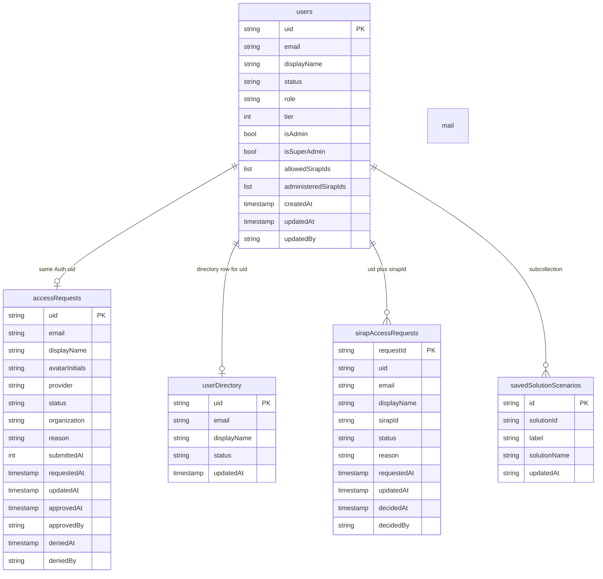
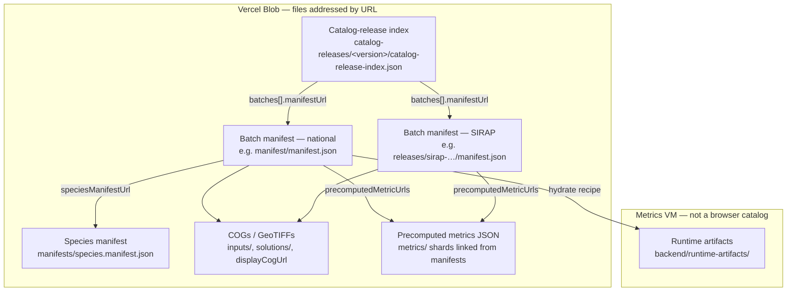

[← Back to handoff overview](../README.md)

# Entity-relationship / data model

> **Audience:** GTIC (Grupo de Tecnologías de Información y Comunicaciones).  
> **Status: repository-derived.** This page is the formal reception picture of stores that actually exist. It is **not** a third-normal-form (3NF) database design of Colombia’s geospatial rasters.

The production path uses three kinds of store:

1. **Cloud Firestore** — document collections for identity, access, and saved scenarios.
2. **Vercel Blob object files** — catalogs, Cloud Optimized GeoTIFFs (COGs), precomputed metric JSON, and related indexes. These are **files addressed by URL**, not SQL tables.
3. **SQLite on the metrics virtual machine (VM)** — a local job cache (`jobs.sqlite3`) for queued species-coverage work.

There is **no PostgreSQL** on the production path. A Node/PostgreSQL stack remains only under the archived `legacy-r-shiny-app/` tree.

Field names and allowed values below come from [`firestore.rules`](../../../../../firestore.rules) and [`cybersecurity.md`](../cybersecurity.md). Nothing else is invented.

---

## 1. Firestore (authorization and user records)

Identity is **Firebase Authentication** (Google sign-in). Authorization is **Cloud Firestore**. Signing in does not by itself grant Decision Maker, Manager, or admin privileges.

Principal collections (document IDs in braces):

| Collection | Purpose |
| --- | --- |
| `accessRequests/{uid}` | Pending or reviewed requests from people who signed in but are not yet approved as app users |
| `users/{uid}` | Approved user records: `status`, `tier`, `role`, `isAdmin` / `isSuperAdmin`, SIRAP (Sistema Regional de Áreas Protegidas) grants |
| `userDirectory/{uid}` | Directory listing used when a regional SIRAP admin cannot read every `users` document |
| `sirapAccessRequests/{uid}_{sirapId}` | Per-region SIRAP data-access requests |
| `users/{uid}/savedSolutionScenarios/{id}` | Signed-in users’ saved scenarios (user data; include in backups) |
| `mail` | Optional admin-notification documents; client writes are denied by rules |

`firestore.rules` also define `manifestStyleRequests`. That collection belongs to the **retired** in-app style editor, not a GTIC operator workflow, and is omitted from the diagram.

Rules deny unmatched access by default. Super-admin and saved-scenario writes additionally require a Time-based One-Time Password (TOTP) second factor (`sign_in_second_factor` / `second_factor_identifier` on the Firebase token). Those token claims are not Firestore fields.

### Firestore ERD

`mail` has **no field list** in `firestore.rules` or `cybersecurity.md`. Client `read` and `write` are denied (`allow read, write: if false`).

`sirapAccessRequests` document IDs are `{uid}_{sirapId}` (create rule). Firestore rules accept only `orinoquia` and `eje-cafetero` as SIRAP IDs.

### Declared value constraints (from rules)

| Field | Allowed values in `firestore.rules` |
| --- | --- |
| `accessRequests.provider` | `google`, `local` |
| `accessRequests.status` (admin update) | `pending`, `approved`, `denied` |
| `users.status` | `active`, `denied` |
| `users.role` | `authorized_viewer`, `science_publisher`, `admin` |
| `users.tier` | `1`, `2`, `3` |
| `allowedSirapIds` / `administeredSirapIds` | list, size ≤ 6, members only `orinoquia` and/or `eje-cafetero` |
| `sirapAccessRequests.status` (owner create) | `pending` |
| `sirapAccessRequests.status` (admin decision) | `approved` or `denied` from `pending`; `denied` from `approved` |
| `savedSolutionScenarios.label` | string, length 1–80 |

Application-tier wording used in the handoff: ordinary approved users are Decision Maker (`tier` 2 / `authorized_viewer`); Manager is `tier` 3 / `science_publisher`. See [`cybersecurity.md`](../cybersecurity.md#firebase-project-transfer-checklist).

---

## 2. Vercel Blob object “entities” (files, not tables)

Public Blob host: `https://aagibolq28slyfof.public.blob.vercel-storage.com`.

These objects are **JSON indexes and geospatial files**. They do not have foreign keys, joins, or a relational schema. The Angular app never lists storage prefixes; it starts from a catalog-release index and follows URLs.

| File kind | What it is | What it is not |
| --- | --- | --- |
| **Catalog-release index** | Tiny JSON (`format`: `runtime-catalog-release-v1`) that lists batch `manifestUrl`s. GTIC production today is `catalog-releases/3.0.5`. This branch may point at a test index such as `3.0.6`. There is no `latest.json`. | Not a database; not scanned by the app as a folder |
| **Batch manifests** | Fat JSON: categories, layers, solutions, rendering, and URLs to metric shards. National + SIRAP are **two** batches (architecture: 172 national + 56 SIRAP = 228 on the GTIC 3.0.5 catalog). The hydrate layer manifest can include `hydrationPackage`. | Not interchangeable with the backend artifact manifest |
| **COGs** | Cloud Optimized GeoTIFFs (and related GeoTIFFs/GeoJSON) for map display and calculation inputs, under prefixes such as `inputs/`, `solutions/`, `boundaries/` | Not rows; pixels are not entities |
| **Precomputed metrics** | Compact / cache / goals / MEC-by-geography / species-coverage JSON files linked from `precomputedMetricUrls` | Not computed at request time for known AOIs |
| **Species manifest** | Secondary index for thousands of species layers (`manifests/species.manifest.json`). The main batch points at it; listing every species in the national manifest would make that file too large. | Not a Firestore collection |
| **Runtime artifacts** | **Backend-only** files on the metrics VM (`DMT_ARTIFACT_DIR` / `backend/runtime-artifacts/`, plus optional SIRAP subdirs). Used for `/ready` and live custom-polygon math. Gitignored; built by hydrate. The Angular app never reads this tree. | Not part of the browser catalog |

The detailed layer-manifest *shape* (categories, layers, solutions) is a JSON Schema in [`frontend/layer-manifest/manifest.schema.json`](../../../../../frontend/layer-manifest/manifest.schema.json). That schema describes published catalog files. It is not a relational ERD.

Known public prefixes (from project Blob rules and [`data-flow-and-blob-storage.md`](../../../architecture/data-flow-and-blob-storage.md)) include `inputs/costs/`, `inputs/features/`, `inputs/features/species/`, `inputs/includes/`, `boundaries/`, `solutions/`, `manifest/`, `manifests/`, `metadata/`, and `metrics/`.

---

## 3. SQLite job cache (separate store)

Species-coverage job state lives in **SQLite**, not Firestore and not Blob.

| Item | Value from the repository |
| --- | --- |
| File | `jobs.sqlite3` |
| Environment variable | `DMT_CUSTOM_POLYGON_JOB_DB` |
| Compose default | `/backend/runtime-cache/jobs.sqlite3` on the writable `runtime-cache` volume |
| Role | Queue, poll, and cancel detailed species-coverage jobs for **drawn** custom polygons |

This is a local cache on the metrics VM. Do not treat it as the product’s system of record for users, catalogs, or rasters. Implementation lives in `backend/app/job_queue.py` (table `detailed_species_jobs`). Operators care that the volume is writable and that a full queue returns HTTP 429 — not that this file is a formal ERD.

See [`architecture.md`](../architecture.md#custom-area-fastapi-surface) and [`backend/README.md`](../../../../../backend/README.md).

---

## 4. What is not modeled

This reception item does **not** include, and the repository does **not** ship, a formal 3NF ERD of:

- Geospatial rasters, COG tiles, pixel values, or species bitset matrices
- Prioritizr (the offline conservation-optimization solver) decision variables or constraint tables
- ArcGIS (the browser map SDK) session or layer state
- Firebase Authentication user accounts as a SQL table (identity is the Auth `uid`; privileges are Firestore)
- A production PostgreSQL schema — legacy only, under `legacy-r-shiny-app/`
- Inferred columns for `mail` documents
- A single “database” that joins users to raster cells

Dashboard numbers for **known** areas are precomputed JSON on Blob. Live math for **drawn** polygons uses VM rasters plus this SQLite job file. Those are file and cache contracts, not a normalized geospatial database.

---

## Related pages

- Architecture and FastAPI surface: [`architecture.md`](../architecture.md)
- Firestore collections and Firebase transfer: [`cybersecurity.md`](../cybersecurity.md#firebase-project-transfer-checklist)
- Blob and catalog flow: [`docs/architecture/data-flow-and-blob-storage.md`](../../../architecture/data-flow-and-blob-storage.md)
- Operator runbooks: [`data-operations/README.md`](../data-operations/README.md)
- Spin-up vs publish: [repository `README.md`](../../../../../README.md)
- FAQ and common problems: [`faq-and-troubleshooting.md`](./faq-and-troubleshooting.md)
