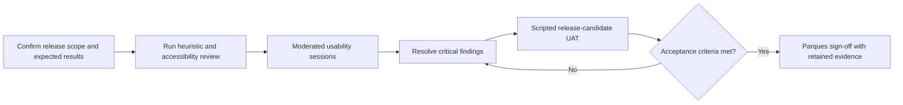

[← Back to handoff overview](./README.md)

# User Validation and Acceptance Testing

> **Status: ⚪ Planned after release stabilization; not yet executed.** Usability sessions and user-acceptance testing (UAT) will begin after the remaining layers and last-minute features are integrated and the team freezes a stable release candidate. This page is the agreed testing plan, not completed testing evidence. It is distinct from technical load, stress, and saturation testing — see [`performance-testing.md`](./performance-testing.md) for that.

User Acceptance Testing (UAT) is scripted pass/fail testing on a frozen release candidate, using real accounts for each product role. It is distinct from moderated usability sessions, which ask whether people can understand the interface, and from load, stress, and saturation testing.

## How to use this page

1. Freeze a release candidate first (entry criteria below). Nothing on this page is executed evidence.
2. Script UAT against the five accounts in **UAT accounts and roles**. Guest is required; the national product works without sign-in.
3. Read **Guest, Finder, and empty-state quirks** before scoring — do not fail testers for those shipped facts.
4. Run moderated usability, then scripted UAT, only after the freeze.

## Timing and entry criteria

Testing this work-in-progress build would produce findings against workflows that may still change. Begin recruitment and formal execution only after the project team:

- Integrates the remaining approved layers and last-minute features.
- Freezes the release commit, deployment URL, solution catalog, datasets, supported workflows, roles, and browsers.
- Resolves or explicitly excludes release-blocking defects and incomplete workflows.
- Approves expected scientific results, Spanish terminology, participant safeguards, and acceptance authority.

If release scope changes after testing begins, document the change and rerun affected scenarios before sign-off.

## Recommended validation model

Two stages: first, moderated usability sessions with representative conservation practitioners and decision makers; second, scripted user-acceptance testing (UAT) on a stable release candidate. This follows Nielsen's principle of testing the interface with real users while preserving a formal pass/fail stage for Parques acceptance.

## Participants and scope

- Recruit ~8–12 moderated participants: conservation practitioners, planners, and decision makers, with mixed GIS experience, primarily Spanish-language use.
- Include Parques IT representatives in formal UAT to validate authentication, permissions, browser compatibility, exports, and operational behavior. UAT must use the five accounts in **UAT accounts and roles**, including Guest.
- Include keyboard-heavy and accessibility-relevant participants where recruitment permits; test against WCAG 2.2 AA expectations.
- Treat sample findings as directional evidence, not population-level statistical proof.

## Representative scenarios

- Find and apply a national or marine solution using stated targets, included conservation areas, and a cost assumption, then explain the result in plain language.
- Add and manage contextual map layers, change visibility or opacity, and interpret the relationship between the layer and the active solution.
- Select a known area or draw a custom area, interpret its metrics, and verify exported evidence.
- Compare two solutions and correctly explain overlap, unique areas, and a meaningful trade-off (when comparison is in release scope).
- Switch between Spanish and English without losing workflow state or creating inconsistent terminology, labels, or units.
- Recover from empty results, missing data, loading delays, unavailable layers, validation errors, and interrupted workflows.
- Complete sign-in or an access request and verify the expected role-gated capability (when authentication is in release scope).

## Measures and initial acceptance signals

These thresholds are proposed starting points and must be approved by project leadership and Parques before testing begins. Time-on-task should initially be used diagnostically, not as a pass/fail threshold.

| Measure                      | What it establishes                                                                      | Proposed initial signal                                                         |
| ---------------------------- | ---------------------------------------------------------------------------------------- | ------------------------------------------------------------------------------- |
| Independent task completion  | Whether users can complete critical workflows without moderator instruction.             | At least 80% across core tasks.                                                 |
| Single Ease Question (SEQ)   | Perceived difficulty after each scenario.                                                | Median at least 5 of 7 for each critical workflow.                              |
| System Usability Scale (SUS) | Directional overall usability benchmark.                                                 | At least 70; not treated as contractual proof.                                  |
| Interpretation accuracy      | Whether users correctly explain solutions, map symbology, area metrics, and comparisons. | At least 80%, with no unresolved misleading conservation interpretation.        |
| Formal UAT                   | Whether agreed release behavior works for each required role and supported browser.      | All in-scope cases pass or have an explicitly accepted exception.               |
| Accessibility                | Whether critical flows remain perceivable and operable.                                  | No serious keyboard, focus, labeling, contrast, zoom, or screen-reader blocker. |

## Evidence package to retain

- Approved release scope, supported roles, browsers, datasets, and expected results.
- Participant screener, anonymized profile summary, consent status, recording policy.
- Moderator guide, scenario scripts, UAT cases, expected outcomes, test accounts.
- Task observations, completion ratings, errors, assistance given, accessibility results, timestamps.
- Permitted recordings/screenshots, plus representative exported PNG and CSV files.
- Severity-ranked findings mapped to usability principles, a defect log, owners, corrections, retest evidence.
- Approved Spanish and English terminology decisions.
- Final UAT sign-off identifying accepted exceptions and responsible approvers.

## Accessibility checks

- Complete critical workflows using the keyboard only; verify focus order, focus visibility, modal containment, Escape behavior, and focus restoration.
- Test 200% browser zoom and narrow layouts.
- Verify that map, chart, status, and comparison meaning does not rely on color alone.
- Verify accessible names, roles, states, errors, loading progress, and expanded/collapsed state with a screen reader.
- Ensure exported evidence includes enough textual context; a standalone map image is not an accessible analytical record.

## Open questions before recruitment

- Which workflows and roles are in the release candidate: marine, comparison, custom areas, authentication, administration, and each export type?
- Which browsers, screen sizes, network conditions, canonical solutions, areas, layers, and expected values will UAT support?
- Who approves Spanish conservation terminology, and who validates the scientific meaning and provenance of calculations?
- What participant privacy, consent, recording, retention, and formal sign-off rules apply?
- Which defect severities block acceptance, and who can approve an exception?

See the [Top decisions table](./README.md#top-decisions-parques-it-must-make) in the handoff overview for how these connect to the rest of the package.

## UAT accounts and roles

UAT needs five accounts, including Guest. The national product works without login; Guest is required even though the other four roles are signed-in. Admins open **Access management** from the header (Pending SIRAP Requests, Current SIRAP Access, Active Users). Today SIRAP catalog and data grants exist for Orinoquía and Eje Cafetero only.

A SIRAP admin cannot appoint other SIRAP admins. Administrator-assignment checkboxes, Super admin, new-account approval, and app tier 2 versus 3 are super-admin only.

| Role | How it is recognized | What this account can do | What this account cannot do |
| --- | --- | --- | --- |
| Guest | Not signed in | National Finder, map, AOI, and analysis | Save named scenarios (saves are Firestore); see SIRAP catalogs; open admin |
| Regular signed-in user | Google account, no SIRAP grant | Guest capabilities plus save, rename, recall, and remove named solutions (maximum 12) in Firestore. The left-sidebar label is what gets stored. | See SIRAP catalogs; open admin |
| SIRAP user | `allowedSirapIds` has at least one region (Orinoquía and/or Eje Cafetero) | SIRAP solutions for the granted region(s), plus regular-user saves | Open admin; use regions that were not granted |
| SIRAP admin | `administeredSirapIds` has at least one region, and the account is not super-admin | Approve or deny SIRAP access requests for assigned region(s); grant or revoke SIRAP **data** access (`allowedSirapIds`) for those regions only | Appoint other SIRAP admins; tick Super admin; approve brand-new accounts; set app tier 2 versus 3. The Administrator assignments UI is wrapped in `isSuperAdmin()` and is not shown to SIRAP admins. |
| Super-admin | `isSuperAdmin` | Approve new accounts; set Tier 2 versus Tier 3; assign SIRAP regional admins (`administeredSirapIds`); grant any SIRAP data access; see all regions | — |

## Screens already available to script

This list is not the UAT definition. UAT is the role-based pass/fail in **UAT accounts and roles**. After freeze, scripts can already exercise the analysis screens below. Treat the welcome overlay as intended onboarding, not a defect.

- The welcome modal appears on every load. That is desired onboarding; it is not meant to persist across refreshes. Until a scenario is chosen, the right sidebar also stays in a welcome state.
- The layer appearance editor in the left sidebar is the supported styling path. Testers can change fill colors, hatch (including mesh or dots), and borders, including separate colors for existing versus new coverage.
- Comparison uses a swipe control plus a three-color agreement overlay (shared area versus unique to each solution). Solution Finder can open in pick-scenario-B mode so the second solution is chosen from Finder.
- Drawn custom areas can run a species-inventory job (queued, with cancel and restart) and show live Corine Land Cover (CLC) land-use bars on the drawn polygon.
- Goals and coverage breakdown modals let testers search, sort, and inspect rows, including additional coverage on SIRAP solutions.
- CSV exports include a Finder preamble (targets, includes, cost, timestamp). The map can export as PNG. Area units toggle between km² and hectares.
- Marine Finder is available as a land/marine domain toggle, with a simplified marine option set and a fixed HHM cost.
- The `/about` page lists partner, funder, and institutional marks and is available without a selected scenario.

## Guest, Finder, and empty-state quirks testers will hit

Do not fail testers for these. They are shipped product facts, not defects, unless a freeze script treats them otherwise.

- **National works without signing in.** Guest users can run Finder, map, AOI, and national analysis. Google sign-in is required to request and use SIRAP scopes, not to use the national product.
- **Email login and email “request access” are UI demos.** They are not connected to Firebase. Production identity is Google. Testers who avoid Google will see a dead email path; that is not a production auth outage.
- **Existing-protected versus new-coverage split is on by default** when a solution is on the map. Layer appearance can recolor those two classes. The split itself is not an opt-in.
- **National land Finder requires Human Footprint 2022 or 2030** as the cost choice. A Carbon Opportunity Cost card is visible and always disabled; that is intentional unavailability, not a broken control.
- **Known administrative AOIs (department, municipality, SIRAP, RUNAP, OMEC) show empty land-use bars** (“not available yet”) on GTIC production `catalog-releases/3.0.5` (compact still lacks `land_use_*_pct_of_aoi`). Live CLC land-use bars work on **drawn** custom polygons. Do not fail GTIC UAT for empty known-AOI land-use. This branch’s local `catalog-releases/3.0.6` (land-use-aoi-TEST) can fill those bars and is not the GTIC freeze.
- **Carbon figures in the UI use `Mg·km²`.** That is a display string. Scientific unit sign-off is still open; do not treat the label as validated MgC/ha.
- **Net Benefit is hidden from Costs, and freshwater fish are removed from the species taxon list.** Those are intentional product cuts, not missing layers.
