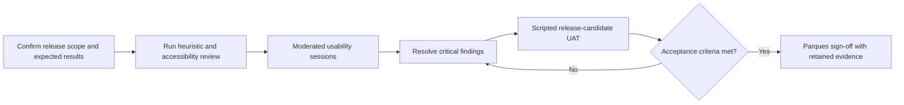

[← Back to handoff overview](./README.md)

# User Validation and Acceptance Testing

> **Status: ⚪ Planned after release stabilization; not yet executed.** Usability sessions and user-acceptance testing (UAT) will begin after the remaining layers and last-minute features are integrated and the team freezes a stable release candidate. This page is the agreed testing plan, not completed testing evidence. It is distinct from technical load, stress, and saturation testing — see [`performance-testing.md`](./performance-testing.md) for that.

## Timing and entry criteria

Testing this work-in-progress build would produce findings against workflows that may still change. Begin recruitment and formal execution only after the project team:

- Integrates the remaining approved layers and last-minute features.
- Freezes the release commit, deployment URL, solution catalog, datasets, supported workflows, roles, and browsers.
- Resolves or explicitly excludes release-blocking defects and incomplete workflows.
- Approves expected scientific results, Spanish terminology, participant safeguards, and acceptance authority.

If release scope changes after testing begins, document the change and rerun affected scenarios before sign-off.

## Recommended validation model

Two stages: first, moderated usability sessions with representative conservation practitioners and decision makers; second, scripted user-acceptance testing (UAT) on a stable release candidate. This follows Nielsen's principle of testing the interface with real users while preserving a formal pass/fail stage for Parques acceptance.

## Participants and scope

- Recruit ~8–12 moderated participants: conservation practitioners, planners, and decision makers, with mixed GIS experience, primarily Spanish-language use.
- Include Parques IT representatives in formal UAT to validate authentication, permissions, browser compatibility, exports, and operational behavior.
- Include keyboard-heavy and accessibility-relevant participants where recruitment permits; test against WCAG 2.2 AA expectations.
- Treat sample findings as directional evidence, not population-level statistical proof.

## Representative scenarios

- Find and apply a national or marine solution using stated targets, included conservation areas, and a cost assumption, then explain the result in plain language.
- Add and manage contextual map layers, change visibility or opacity, and interpret the relationship between the layer and the active solution.
- Select a known area or draw a custom area, interpret its metrics, and verify exported evidence.
- Compare two solutions and correctly explain overlap, unique areas, and a meaningful trade-off (when comparison is in release scope).
- Switch between Spanish and English without losing workflow state or creating inconsistent terminology, labels, or units.
- Recover from empty results, missing data, loading delays, unavailable layers, validation errors, and interrupted workflows.
- Complete sign-in or an access request and verify the expected role-gated capability (when authentication is in release scope).

## Measures and initial acceptance signals

These thresholds are proposed starting points and must be approved by project leadership and Parques before testing begins. Time-on-task should initially be used diagnostically, not as a pass/fail threshold.

| Measure                      | What it establishes                                                                      | Proposed initial signal                                                         |
| ---------------------------- | ---------------------------------------------------------------------------------------- | ------------------------------------------------------------------------------- |
| Independent task completion  | Whether users can complete critical workflows without moderator instruction.             | At least 80% across core tasks.                                                 |
| Single Ease Question (SEQ)   | Perceived difficulty after each scenario.                                                | Median at least 5 of 7 for each critical workflow.                              |
| System Usability Scale (SUS) | Directional overall usability benchmark.                                                 | At least 70; not treated as contractual proof.                                  |
| Interpretation accuracy      | Whether users correctly explain solutions, map symbology, area metrics, and comparisons. | At least 80%, with no unresolved misleading conservation interpretation.        |
| Formal UAT                   | Whether agreed release behavior works for each required role and supported browser.      | All in-scope cases pass or have an explicitly accepted exception.               |
| Accessibility                | Whether critical flows remain perceivable and operable.                                  | No serious keyboard, focus, labeling, contrast, zoom, or screen-reader blocker. |

## Evidence package to retain

- Approved release scope, supported roles, browsers, datasets, and expected results.
- Participant screener, anonymized profile summary, consent status, recording policy.
- Moderator guide, scenario scripts, UAT cases, expected outcomes, test accounts.
- Task observations, completion ratings, errors, assistance given, accessibility results, timestamps.
- Permitted recordings/screenshots, plus representative exported PNG and CSV files.
- Severity-ranked findings mapped to usability principles, a defect log, owners, corrections, retest evidence.
- Approved Spanish and English terminology decisions.
- Final UAT sign-off identifying accepted exceptions and responsible approvers.

## Accessibility checks

- Complete critical workflows using the keyboard only; verify focus order, focus visibility, modal containment, Escape behavior, and focus restoration.
- Test 200% browser zoom and narrow layouts.
- Verify that map, chart, status, and comparison meaning does not rely on color alone.
- Verify accessible names, roles, states, errors, loading progress, and expanded/collapsed state with a screen reader.
- Ensure exported evidence includes enough textual context; a standalone map image is not an accessible analytical record.

## Open questions before recruitment

- Which workflows and roles are in the release candidate: marine, comparison, custom areas, authentication, administration, and each export type?
- Which browsers, screen sizes, network conditions, canonical solutions, areas, layers, and expected values will UAT support?
- Who approves Spanish conservation terminology, and who validates the scientific meaning and provenance of calculations?
- What participant privacy, consent, recording, retention, and formal sign-off rules apply?
- Which defect severities block acceptance, and who can approve an exception?

See the [Top decisions table](./README.md#top-decisions-parques-it-must-make) in the handoff overview for how these connect to the rest of the package.
