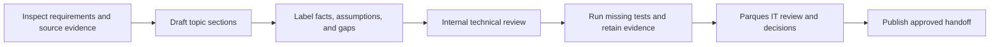

> **INTERNAL — DO NOT SHARE WITH PARQUES IT.** This tracks our own drafting progress on the handoff package in [`english/README.md`](./english/README.md) and its linked documents. It is not part of the deliverable itself.

# Internal Task Tracker — Parques IT Handoff

This page is the working source for the technical handoff to Parques Nacionales Naturales de Colombia IT (GTIC). The drafting approach: document what can be verified from the application and repository, then separate confirmed facts from recommendations, unresolved decisions, and evidence that still needs to be produced.

## Task summary

| ID     | Status                                             | Last Updated (Timestamp) | Task Description                                                                                                                          | Notes                                                                                                                                                                                                                                                                       |
| ------ | -------------------------------------------------- | ------------------------ | ----------------------------------------------------------------------------------------------------------------------------------------- | --------------------------------------------------------------------------------------------------------------------------------------------------------------------------------------------------------------------------------------------------------------------------- |
| DOC-01 | Complete                                           | 2026-07-29 09:30 UTC-4   | Establish the handoff structure and evidence standards.                                                                                   | The package separates verified state, planned evidence, recommendations, and decisions requiring validation.                                                                                                                                                                |
| DOC-02 | Draft complete — validation required               | 2026-07-29 09:28 UTC-4   | Document system architecture, deployment, and server requirements.                                                                        | Architecture and workflows drafted; production platform settings and operational ownership require validation.                                                                                                                                                              |
| DOC-03 | Draft complete — validation required               | 2026-07-29 09:27 UTC-4   | Document current cybersecurity controls, gaps, and decisions.                                                                             | Repository evidence drafted; public data policy and infrastructure ownership require Parques IT decisions.                                                                                                                                                                  |
| DOC-04 | Draft complete — validation and execution required | 2026-09-07 17:40 UTC-4   | Define user, acceptance, and performance testing evidence.                                                                                | Usability, UAT, load, stress, saturation, soak, and evidence-retention plans are drafted. As of 2026-09-07 the suite under `backend/tests/` contains 165 tests. Arbitrary-AOI category-mask behavior still needs targeted review. |
| DOC-05 | Pending internal review                            | 2026-07-29 09:25 UTC-4   | Validate the draft with the project team and Parques IT.                                                                                  | Owners, deployment constraints, security expectations, and acceptance thresholds remain to be confirmed.                                                                                                                                                                    |
| DOC-06 | Complete — owner assignment pending                | 2026-07-29 10:42 UTC-4   | Trace every GTIC and July 2026 deliverable requirement to evidence and an owner.                                                          | Requirements, repository coverage, gaps, unsupported claims, and acceptance priorities are documented; accountable owners still need assignment.                                                                                                                            |
| DOC-07 | Team confirmation required                         | 2026-07-29 10:39 UTC-4   | Resolve model, scenario, and data-provenance questions identified for the national and SIRAP models.                                      | Includes carbon units, freshwater processing, scenario counts and logic, included territories, and SIRAP metadata.                                                                                                                                                          |
| DOC-08 | Not started                                        | 2026-07-29 10:39 UTC-4   | Prepare functional manuals, bilingual user guidance, training, and final workshop evidence.                                               | The July 2026 deliverables explicitly require English/Spanish videos and user-facing engagement.                                                                                                                                                                            |
| DOC-09 | Not started                                        | 2026-07-29 10:39 UTC-4   | Define support, service levels, interoperability, customization, and source-code transfer.                                                | GTIC requests ANS support documents, integration planning, maintainability guidance, and development documentation.                                                                                                                                                         |
| DOC-10 | Complete                                           | 2026-07-29 14:50 UTC-4   | Restructure the handoff from a single Notion page into linked markdown docs in the repo, per the readability and accuracy audit findings. | See `docs/handoffs/parques-it/`. Notion page can now be retired or left as historical record only.                                                                                                                                                                          |
| DOC-11 | Accuracy-audited — operator validation required    | 2026-09-07 20:30 UTC-4   | Document how to add, register, calculate, publish, verify, and roll back backend data and layers.                                         | Seven task-based runbooks now distinguish supported work, gated catalog replacement (`solution-catalog-v1` / `--catalog`), developer-only metric changes, safe boundary promotion, artifact scope, and rollback limits. Catalog replacement is no longer blocked; remaining work is a GTIC-readable national vs SIRAP operator path. |

## To-do list

- [x] **DOC-01 — Establish a trustworthy handoff structure.** Organize the documentation so Parques IT can quickly distinguish verified current behavior from proposed operating practices and missing evidence.
- [ ] **DOC-02 — Explain how the system is built and operated.** Readable architecture and deployment description with diagrams, so an IT reviewer can identify each runtime component, dependency, configuration category, and hosting assumption without reading source code.
- [ ] **DOC-03 — Describe the cybersecurity posture honestly.** Existing safeguards, trust boundaries, sensitive configuration categories, material gaps, recommended controls — enough for Parques IT to assess deployment risk and identify decisions needing institutional approval.
- [ ] **DOC-04 — Create the missing testing evidence plan.** Usability/UAT separate from load/stress/saturation, with scenarios, measurements, acceptance criteria, and retained artifacts so future results are reproducible and auditable.
- [ ] **DOC-05 — Run internal and recipient validation.** Review with the project team before sharing with Parques IT; capture corrections and formal acceptance expectations.
- [x] **DOC-06 — Establish full requirement traceability.** Map every GTIC and July 2026 request to evidence, an owner, and an acceptance status.
- [ ] **DOC-07 — Resolve scientific and model questions.** Freshwater/carbon sources and transformations, scenario count/logic, included territories, SIRAP metadata.
- [ ] **DOC-08 — Produce user guidance and training evidence.** Functional manuals, bilingual guide videos, workshop materials.
- [ ] **DOC-09 — Define long-term operation and institutional integration.** Support ownership, service levels, interoperability, user management, customization, source-code transfer, development guidance.
- [x] **DOC-10 — Migrate the handoff from Notion to repo-native markdown.** Done per user request; see `docs/handoffs/parques-it/`.
- [ ] **DOC-11 — Make data operations transferable.** Validate the new operator guide by having someone other than its author perform one safe staging change from source registration through publication verification and rollback preparation.

## Drafting workflow

## Questions to resolve during internal review (before sharing externally)

- Who will own production hosting, application administration, incident response, backups, and dependency updates after handoff?
- What hosting platform, network boundaries, identity provider, domain, and certificate process will Parques IT require?
- Which data classifications and Colombian institutional security requirements apply to application inputs, outputs, logs, and analytics?
- What representative user population, workflows, datasets, concurrency profile, response-time objectives, and availability target should govern acceptance testing?
- Which environment can be used for load and saturation testing without affecting production users or incurring unapproved service costs?

## Audit history

- **2026-07-29 — Readability & UX Review:** Found significant structure/flow issues (buried performance section, repeated decision lists, unused status legend, dense prose, no TOC) — addressed in the DOC-10 restructure.
- **2026-07-29 — Accuracy & Completeness Audit:** Verified nearly all factual claims against the live repo and both source PDFs — no fabricated facts found. Follow-up fixes applied: corrected stale "optional" wording in `docs/gtic-system-architecture-slides.md` (EN + ES), standardized the backend container and CI on Python 3.12, corrected the drifted backend raster fixture and verified all 24 tests under Python 3.12/3.13, documented the separate arbitrary-AOI production concern, and clarified the `google-identity.service.ts` citation.
- **2026-09-07 — Count and runtime correction:** Stopped treating “24 backend tests pass” and “Python 3.12 canonical container” as current facts. The Dockerfile is `python:3.11-slim`; CI tests 3.11 and 3.12; `backend/tests/` contains 165 tests.
- **2026-07-30 — Data Operations Accuracy Audit:** Rechecked every command, path, scope, archive claim, and operator/developer boundary against source. Corrected unsafe solution and boundary publication ordering, documented blocked catalog replacement, added the metric-development guide, refined recalculation scope, and made asset-level rollback limitations explicit.
