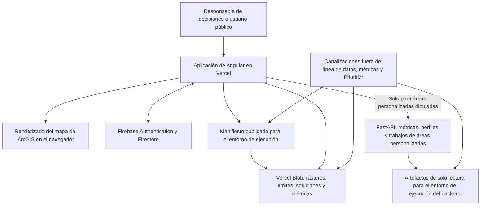

[← Volver a la descripción general de la entrega técnica](./README.md)

# Arquitectura del sistema y modelo operativo

> **Estado: derivado del repositorio y verificado con el código fuente actual.** La configuración de la plataforma de producción (configuración real del proyecto de Vercel, DNS y propiedad de la VM) aún requiere confirmación; consulte [Decisiones de arquitectura que requieren validación](#architecture-decisions-requiring-validation).

## Propósito del sistema

Decision Making Tool es una aplicación web para la planificación de la conservación en Colombia. Los usuarios eligen entre soluciones de conservación precalculadas, las visualizan con capas contextuales en un mapa de ArcGIS, examinan indicadores precalculados para áreas administrativas o de conservación conocidas y solicitan métricas en tiempo real cuando dibujan un área de interés (AOI) personalizada. Las optimizaciones se ejecutan fuera de línea: el navegador nunca ejecuta Prioritizr ni genera nuevas soluciones de optimización.

La arquitectura activa está compuesta por una aplicación de página única de Angular alojada como SPA estática en Vercel (el frontend no está dockerizado), almacenamiento público de objetos que contiene manifiestos y activos geoespaciales, Firebase para identidad y autorización, y un servicio FastAPI en una VM independiente para métricas de áreas personalizadas, perfiles de área y trabajos en cola de cobertura de especies. La implementación archivada de R/Shiny y Node/PostgreSQL en `legacy-r-shiny-app/` **no** forma parte del entorno de ejecución de producción actual.

## Arquitectura de producción



## Responsabilidades de los componentes

| Componente                         | Tecnología y alojamiento                                      | Responsabilidad                                                                                 | Nota operativa                                                                                                                        |
| ---------------------------------- | ------------------------------------------------------------- | ----------------------------------------------------------------------------------------------- | ------------------------------------------------------------------------------------------------------------------------------------- |
| Aplicación web                     | Angular 21 en Vercel                                          | Selección de soluciones, interacción con el mapa, tableros, interfaz de autenticación y exportaciones. | SPA estática en Vercel; no está dockerizada. Requiere HTTPS y enrutamiento alternativo de la SPA a `index.html`. |
| Catálogo y activos de ejecución    | Manifiestos JSON + Vercel Blob con lectura pública            | Indexa y sirve GeoTIFF, GeoJSON, rásteres de soluciones, cachés de métricas y metadatos.        | El manifiesto es el catálogo del entorno de ejecución; la aplicación nunca explora directamente el almacenamiento.                   |
| Identidad y autorización           | Firebase Authentication + Cloud Firestore                     | Inicio de sesión con Google, solicitudes de acceso, niveles de usuarios aprobados y registros administrativos. | La propiedad del proyecto, las copias de seguridad, los dominios autorizados y el ciclo de vida de las cuentas requieren decisiones durante la entrega técnica. |
| Cálculo para áreas personalizadas  | FastAPI, Uvicorn, Rasterio y Docker en una VM independiente   | Métricas en vivo, perfiles de área y trabajos en cola de cobertura de especies para polígonos dibujados. Los artefactos nacionales o SIRAP se eligen por `solution_id`. | Docker Compose solo en la VM de métricas. Expone `/health`, `/ready`, `POST /metrics/custom-polygon`, `POST /area-profile/custom-polygon` y trabajos de cobertura de especies (1 worker, máximo 10 en cola, HTTP 429 si está llena). |
| Publicación protegida (retirada) | Endpoint sin servidor de Vercel                               | **Retirada.** Ya no es la vía de estilo ni de publicación de manifiestos.            | No habilite este endpoint ni `ENABLE_MANIFEST_EDITOR`. La apariencia de capas en la aplicación (panel izquierdo) es la vía de estilo admitida. |
| Procesamiento fuera de línea       | Node, Python, herramientas geoespaciales y flujos de trabajo de Prioritizr previos | Genera soluciones, GeoTIFF optimizados para la nube, manifiestos y métricas precalculadas.       | Son flujos de trabajo para operadores, no servicios de ejecución para usuarios finales.                                              |

## Flujo principal del usuario

```mermaid
sequenceDiagram
    actor User
    participant App as Aplicación de Angular
    participant Blob as Manifiesto y activos de Blob
    participant Map as Mapa de ArcGIS
    participant API as API de métricas para áreas personalizadas

    User->>App: Abrir la aplicación
    App->>Blob: Cargar el manifiesto del entorno de ejecución
    User->>App: Elegir objetivos, áreas incluidas y supuestos de costos
    App->>App: Encontrar en el navegador una solución precalculada
    App->>Blob: Cargar el ráster de la solución y las métricas en caché
    App->>Map: Renderizar la solución y las capas contextuales
    alt Área administrativa o de conservación conocida
        App->>Blob: Leer las métricas precalculadas del área
    else Área personalizada dibujada
        App->>API: POST /metrics/custom-polygon o /area-profile/custom-polygon
        API-->>App: Métricas calculadas o perfil de área
        opt Inventario detallado de especies
            App->>API: POST de trabajo de cobertura de especies
            API-->>App: ID del trabajo (sondeo; 429 si la cola está llena)
        end
    end
    App-->>User: Mostrar evidencia general, del área o comparativa
```

<a id="runtime-and-deployment-requirements"></a>
## Requisitos del entorno de ejecución y despliegue

| Capa                        | Requisito                                                                                                                                                  | Estado                                                                                                                                                 |
| --------------------------- | ---------------------------------------------------------------------------------------------------------------------------------------------------------- | ------------------------------------------------------------------------------------------------------------------------------------------------------ |
| Herramientas del frontend   | Node.js 22 (CI), npm 10.9.2 (declarado en `frontend/package.json`). Compilación de producción mediante `npm run build:vercel` desde `frontend/`.           | ✅ Verificado                                                                                                                                          |
| Alojamiento del frontend    | HTTPS, entrega de archivos estáticos de la SPA de Angular (el frontend no está dockerizado), enrutamiento alternativo de la SPA, variables de entorno en tiempo de compilación y reescritura del mismo origen para `/metrics-api`. | ✅ Verificado                                                                                                                          |
| Python del backend          | FastAPI, Uvicorn, NumPy, Pydantic y Rasterio. CI prueba **Python 3.11 y 3.12**. La imagen del contenedor sigue siendo `python:3.11-slim`. No trate 3.12 como el entorno de contenedor verificado hasta que el Dockerfile coincida con CI. | 🟡 Se requiere confirmación del equipo — las versiones menores de Python de CI y Docker actualmente difieren.    |
| Alojamiento del backend     | Docker + Docker Compose, un volumen de artefactos de ejecución de solo lectura (nacional más paquetes SIRAP opcionales), un volumen SQLite escribible para la cola de trabajos, acceso saliente para recuperar activos de origen durante la creación de artefactos y una ruta HTTPS al puerto 8000. | ✅ Verificado                                                                                              |
| Cliente                     | Navegador moderno compatible con Canvas y WebGL; HTTPS saliente hacia la aplicación, el host de Blob, la identidad de Firebase/Google, las dependencias de ArcGIS y la API de métricas. | ✅ Verificado                                                                                                 |
| Almacenamiento              | ~1–2 GB en la actualidad, ~4–5 GB estimados a corto plazo.                                                                                                | 🟡 Se requiere confirmación del equipo — estas son estimaciones internas de planificación, no un inventario de Blob medido de manera independiente.    |

## Categorías de configuración

Las credenciales y otros valores de configuración confidenciales se excluyen intencionalmente de esta entrega técnica. TI de Parques necesita responsables, una ubicación de almacenamiento segura y un proceso de rotación para cada categoría que aparece a continuación, no los valores en sí.

| Categoría                            | Variables                                                                                                                                                                           |
| ------------------------------------ | ----------------------------------------------------------------------------------------------------------------------------------------------------------------------------------- |
| Configuración del cliente de Firebase | `FIREBASE_API_KEY`, `FIREBASE_AUTH_DOMAIN`, `FIREBASE_PROJECT_ID`, `FIREBASE_STORAGE_BUCKET`, `FIREBASE_MESSAGING_SENDER_ID`, `FIREBASE_APP_ID`, opcional `FIREBASE_MEASUREMENT_ID` |
| Enrutamiento y funciones de la aplicación | `MANIFEST_BLOB_URL`, `BLOB_ASSET_PROXY_PATH`, `METRICS_API_BASE_URL`, configuración opcional de notificaciones de solicitudes de acceso |
| Operaciones protegidas del servidor  | `BLOB_READ_WRITE_TOKEN`, variables de credenciales administrativas de Firebase, protecciones de escritura del manifiesto de producción                                              |
| Artefactos del backend               | `DMT_ARTIFACT_DIR`, `DMT_ARTIFACT_MANIFEST`, `DMT_ARTIFACT_REQUIRED`, `DMT_ARTIFACT_SCHEMA_VERSION`, `DMT_METRICS_PIPELINE_PATH`, `DMT_SIRAP_ARTIFACT_ROOT`, `DMT_CUSTOM_POLYGON_JOB_DB`, `DMT_SOLUTION_CACHE_DIR`, `DMT_MESA_COVERAGE_REQUIRED`, `DMT_EXPECTED_COVERAGE_RELEASE_ID`, `DMT_EXPECTED_COVERAGE_CONTRACT_SHA256` |

## Estado operativo y recuperación

- El servicio de métricas expone `/health` (actividad) y `/ready` (disponibilidad). `/ready` falla cuando los artefactos nacionales requeridos no están disponibles o no son válidos, **o** cuando el worker de especies detalladas está caído. Los artefactos regionales SIRAP faltantes se informan en la carga de disponibilidad y actualmente **no** hacen fallar `/ready`.
- La publicación del manifiesto archiva el manifiesto anterior; un script de reversión puede restaurar una versión archivada.
- 🔴 **Brecha — no se encontró evidencia:** No se encontró en el repositorio activo una configuración centralizada de informes de errores, monitoreo de disponibilidad, envío de registros ni alertas.
- 🔴 **Brecha — no se encontró evidencia:** La automatización de copias de seguridad de Blob, las exportaciones programadas de Firestore, los objetivos de recuperación y un procedimiento probado de recuperación ante desastres aún no tienen responsable ni criterios de aceptación.
- Los artefactos del entorno de ejecución deben volver a generarse después de cambios pertinentes en los rásteres o el manifiesto; de lo contrario, los resultados en tiempo real para áreas personalizadas pueden diferir de los resultados precalculados.

<a id="architecture-decisions-requiring-validation"></a>
## Decisiones de arquitectura que requieren validación

- Confirmar el dominio real de producción, la configuración del proyecto de Vercel, la configuración de compilación y el inventario completo de variables de entorno.
- Confirmar si la aplicación debe leer directamente las URL públicas de Blob o utilizar un proxy institucional autenticado. Existe un punto de configuración para un proxy, pero no se encontró una implementación completa de proxy para Blob.
- Confirmar la responsabilidad sobre la VM de métricas: DNS, renovación de TLS, aplicación de parches del sistema operativo, política de firewall, escalamiento y regeneración de artefactos nacionales y SIRAP de AOI personalizadas, además de la base de datos de trabajos de cobertura de especies.
- Decidir si el inicio de sesión con Google mediante Firebase es aceptable o si se requiere el SSO institucional de Parques.
- Confirmar que la arquitectura archivada de R/Shiny esté excluida formalmente del alcance de despliegue de la entrega técnica.
- Definir el monitoreo, la retención de registros, los objetivos del servicio, la responsabilidad de las copias de seguridad, los objetivos de recuperación y los contactos para escalamiento.

<details>
<summary>Evidencia detallada del repositorio</summary>

- Alcance del proyecto activo y límite con la arquitectura heredada: `README.md`
- Arquitectura de datos del entorno de ejecución: `docs/architecture/data-flow-and-blob-storage.md`
- Notas anteriores de la entrega técnica sobre autenticación y almacenamiento para Parques: `docs/handoffs/parques-it-auth-blob-storage-eng.md`, `docs/handoffs/parques-it-auth-blob-storage-es.md`
- Compilación y dependencias del frontend: `frontend/package.json`, `frontend/angular.json`
- Enrutamiento de Vercel y proxy de métricas: `frontend/vercel.json`
- Carga del manifiesto del entorno de ejecución: `frontend/src/app/core/services/layer-manifest.service.ts`
- Correspondencia de soluciones y catálogo: `frontend/src/app/core/services/solution-catalog.service.ts`, `frontend/src/app/core/models/solution-matching.utils.ts`
- Renderizado del mapa y las soluciones: `frontend/src/app/features/map/map-view/map-view.ts`, `frontend/src/app/features/map/services/solution-layer.service.ts`
- Métricas en caché y de áreas personalizadas: `frontend/src/app/core/services/solution-metrics-loader.service.ts`, `frontend/src/app/core/services/api.service.ts`, `backend/app/main.py`
- Contenedor y operaciones del backend: `backend/Dockerfile`, `backend/docker-compose.yml`, `backend/app/main.py`, `backend/app/config.py`, `backend/README.md`
- Publicación de manifiestos y métricas: `frontend/layer-manifest/README.md`, `data/metrics/README.md`
- Herramientas y verificaciones de CI: `.github/workflows/ci.yml`

</details>

## Superficie FastAPI para áreas personalizadas

El frontend es una SPA estática de Angular en Vercel. No está dockerizado. Solo la API de métricas corre en Docker Compose en una VM independiente. El navegador llama a este servicio para AOI personalizadas dibujadas; las áreas administrativas y de conservación conocidas siguen usando métricas precalculadas de Blob.

Rutas de áreas personalizadas visibles para el usuario:

| Método | Ruta | Qué hace |
| ------ | ---- | -------- |
| GET | `/health` | Actividad del proceso. HTTP 200 significa que el proceso está en pie. |
| GET | `/ready` | Disponibilidad. HTTP 503 cuando faltan o no son válidos los artefactos nacionales requeridos, o cuando el worker de especies detalladas no está disponible. Los artefactos regionales SIRAP faltantes aparecen en la carga y actualmente no hacen fallar esta comprobación. |
| POST | `/metrics/custom-polygon` | Métricas seleccionadas en vivo para un `Polygon` o `MultiPolygon` GeoJSON. El `solution_id` opcional elige el paquete nacional o un paquete regional SIRAP. |
| POST | `/area-profile/custom-polygon` | Perfil de área seccionado para un polígono dibujado frente a una solución seleccionada (ecosistemas, cobertura, resumen de inventario de especies y secciones relacionadas). |
| POST | `/area-profile/custom-polygon/species-coverage/jobs` | Encola un trabajo detallado de cobertura de especies. HTTP 202, o 200 si puede reutilizarse un trabajo idéntico ya completado. Un worker en segundo plano. Como máximo 10 trabajos en cola; POSTs adicionales devuelven HTTP 429 con `Retry-After`. |
| GET | `/area-profile/custom-polygon/species-coverage/jobs/{job_id}` | Consulta el estado y el resultado del trabajo. |
| DELETE | `/area-profile/custom-polygon/species-coverage/jobs/{job_id}` | Cancela un trabajo en cola o en ejecución. |

Almacenamiento de artefactos y trabajos:

- Rásteres nacionales de AOI personalizada: `DMT_ARTIFACT_DIR` / `DMT_ARTIFACT_MANIFEST`.
- Rásteres regionales SIRAP de AOI personalizada: `DMT_SIRAP_ARTIFACT_ROOT` (predeterminado `runtime-artifacts/sirap`), un subdirectorio por región (`eje-cafetero`, `orinoquia`). Compose no fija actualmente esta variable; desde el directorio de trabajo del contenedor `/backend` el valor predeterminado resuelve sobre el volumen de artefactos de solo lectura en `/backend/runtime-artifacts/sirap`.
- Estado de trabajos de cobertura de especies: SQLite en `DMT_CUSTOM_POLYGON_JOB_DB` (predeterminado de Compose `/backend/runtime-cache/jobs.sqlite3` en el volumen escribible `runtime-cache`).

Existe una sonda interna de operaciones para diagnóstico de la cola. No es una función de GTIC orientada al usuario ni forma parte de la interfaz del producto.
