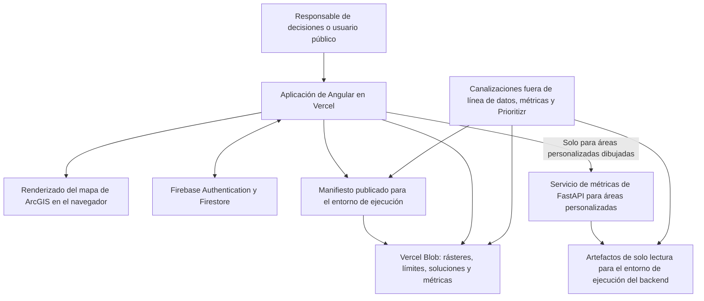
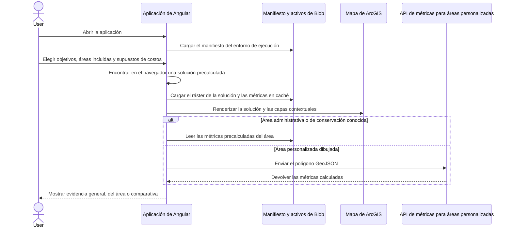

[← Volver a la descripción general de la entrega técnica](./README.md)

# Arquitectura del sistema y modelo operativo

> **Estado: derivado del repositorio y verificado con el código fuente actual.** La configuración de la plataforma de producción (configuración real del proyecto de Vercel, DNS y propiedad de la VM) aún requiere confirmación; consulte [Decisiones de arquitectura que requieren validación](#architecture-decisions-requiring-validation).

## Propósito del sistema

Decision Making Tool es una aplicación web para la planificación de la conservación en Colombia. Los usuarios eligen entre soluciones de conservación precalculadas, las visualizan con capas contextuales en un mapa de ArcGIS, examinan indicadores precalculados para áreas administrativas o de conservación conocidas y solicitan métricas en tiempo real cuando dibujan un área de interés (AOI) personalizada. Las optimizaciones se ejecutan fuera de línea: el navegador nunca ejecuta Prioritizr ni genera nuevas soluciones de optimización.

La arquitectura activa está compuesta por una aplicación de página única de Angular, almacenamiento público de objetos que contiene manifiestos y activos geoespaciales, Firebase para identidad y autorización, y un servicio de cálculo limitado en FastAPI para polígonos personalizados. La implementación archivada de R/Shiny y Node/PostgreSQL en `legacy-r-shiny-app/` **no** forma parte del entorno de ejecución de producción actual.

## Arquitectura de producción

## Responsabilidades de los componentes

| Componente                         | Tecnología y alojamiento                                      | Responsabilidad                                                                                 | Nota operativa                                                                                                                        |
| ---------------------------------- | ------------------------------------------------------------- | ----------------------------------------------------------------------------------------------- | ------------------------------------------------------------------------------------------------------------------------------------- |
| Aplicación web                     | Angular 21 en Vercel                                          | Selección de soluciones, interacción con el mapa, tableros, interfaz de autenticación y exportaciones. | El alojamiento de la SPA estática requiere HTTPS y enrutamiento alternativo de la SPA a `index.html`.                               |
| Catálogo y activos de ejecución    | Manifiestos JSON + Vercel Blob con lectura pública            | Indexa y sirve GeoTIFF, GeoJSON, rásteres de soluciones, cachés de métricas y metadatos.        | El manifiesto es el catálogo del entorno de ejecución; la aplicación nunca explora directamente el almacenamiento.                   |
| Identidad y autorización           | Firebase Authentication + Cloud Firestore                     | Inicio de sesión con Google, solicitudes de acceso, niveles de usuarios aprobados y registros administrativos. | La propiedad del proyecto, las copias de seguridad, los dominios autorizados y el ciclo de vida de las cuentas requieren decisiones durante la entrega técnica. |
| Cálculo para áreas personalizadas  | FastAPI, Uvicorn, Rasterio y Docker en una VM independiente   | Calcula métricas seleccionadas para polígonos dibujados por el usuario.                         | Requiere artefactos ráster del entorno de ejecución; expone `/health` y `/ready`.                                                     |
| Publicación protegida              | Endpoint sin servidor de Vercel                               | Verifica que el administrador esté aprobado antes de publicar cambios similares a manifiestos. | Requiere credenciales administrativas de Firebase y el token de escritura de Blob.                                                   |
| Procesamiento fuera de línea       | Node, Python, herramientas geoespaciales y flujos de trabajo de Prioritizr previos | Genera soluciones, GeoTIFF optimizados para la nube, manifiestos y métricas precalculadas.       | Son flujos de trabajo para operadores, no servicios de ejecución para usuarios finales.                                              |

## Flujo principal del usuario

## Requisitos del entorno de ejecución y despliegue

| Capa                        | Requisito                                                                                                                                                  | Estado                                                                                                                                                 |
| --------------------------- | ---------------------------------------------------------------------------------------------------------------------------------------------------------- | ------------------------------------------------------------------------------------------------------------------------------------------------------ |
| Herramientas del frontend   | Node.js 22 (CI), npm 10.9.2 (declarado en `frontend/package.json`). Compilación de producción mediante `npm run build:vercel` desde `frontend/`.           | ✅ Verificado                                                                                                                                          |
| Alojamiento del frontend    | HTTPS, entrega de archivos estáticos, enrutamiento alternativo de la SPA, variables de entorno en tiempo de compilación y reescritura del mismo origen para `/metrics-api`. | ✅ Verificado                                                                                                                          |
| Python del backend          | **Python 3.12** es el entorno canónico del contenedor y de CI, con FastAPI, Uvicorn, NumPy, Pydantic y Rasterio.                                           | ✅ Verificado — se estandarizó durante la revisión de la entrega técnica para que producción y CI utilicen la misma versión menor de Python.           |
| Alojamiento del backend     | Docker + Docker Compose, un volumen de artefactos de ejecución de solo lectura, acceso saliente para recuperar activos de origen durante la creación de artefactos y una ruta HTTPS al puerto 8000. | ✅ Verificado                                                                                              |
| Cliente                     | Navegador moderno compatible con Canvas y WebGL; HTTPS saliente hacia la aplicación, el host de Blob, la identidad de Firebase/Google, las dependencias de ArcGIS y la API de métricas. | ✅ Verificado                                                                                                 |
| Almacenamiento              | ~1–2 GB en la actualidad, ~4–5 GB estimados a corto plazo.                                                                                                | 🟡 Se requiere confirmación del equipo — estas son estimaciones internas de planificación, no un inventario de Blob medido de manera independiente.    |

## Categorías de configuración

Las credenciales y otros valores de configuración confidenciales se excluyen intencionalmente de esta entrega técnica. TI de Parques necesita responsables, una ubicación de almacenamiento segura y un proceso de rotación para cada categoría que aparece a continuación, no los valores en sí.

| Categoría                            | Variables                                                                                                                                                                           |
| ------------------------------------ | ----------------------------------------------------------------------------------------------------------------------------------------------------------------------------------- |
| Configuración del cliente de Firebase | `FIREBASE_API_KEY`, `FIREBASE_AUTH_DOMAIN`, `FIREBASE_PROJECT_ID`, `FIREBASE_STORAGE_BUCKET`, `FIREBASE_MESSAGING_SENDER_ID`, `FIREBASE_APP_ID`, opcional `FIREBASE_MEASUREMENT_ID` |
| Enrutamiento y funciones de la aplicación | `MANIFEST_BLOB_URL`, `BLOB_ASSET_PROXY_PATH`, `METRICS_API_BASE_URL`, `ENABLE_MANIFEST_EDITOR`, configuración opcional de notificaciones de solicitudes de acceso                |
| Operaciones protegidas del servidor  | `BLOB_READ_WRITE_TOKEN`, variables de credenciales administrativas de Firebase, protecciones de escritura del manifiesto de producción                                              |
| Artefactos del backend               | `DMT_ARTIFACT_DIR`, `DMT_ARTIFACT_MANIFEST`, `DMT_ARTIFACT_REQUIRED`, `DMT_ARTIFACT_SCHEMA_VERSION`, `DMT_METRICS_PIPELINE_PATH`                                                    |

## Estado operativo y recuperación

- El servicio de métricas expone `/health` (actividad) y `/ready` (disponibilidad de los artefactos de ejecución). La comprobación de disponibilidad falla cuando los artefactos requeridos no están disponibles o no son válidos.
- La publicación del manifiesto archiva el manifiesto anterior; un script de reversión puede restaurar una versión archivada.
- 🔴 **Brecha — no se encontró evidencia:** No se encontró en el repositorio activo una configuración centralizada de informes de errores, monitoreo de disponibilidad, envío de registros ni alertas.
- 🔴 **Brecha — no se encontró evidencia:** La automatización de copias de seguridad de Blob, las exportaciones programadas de Firestore, los objetivos de recuperación y un procedimiento probado de recuperación ante desastres aún no tienen responsable ni criterios de aceptación.
- Los artefactos del entorno de ejecución deben volver a generarse después de cambios pertinentes en los rásteres o el manifiesto; de lo contrario, los resultados en tiempo real para áreas personalizadas pueden diferir de los resultados precalculados.

## Decisiones de arquitectura que requieren validación

- Confirmar el dominio real de producción, la configuración del proyecto de Vercel, la configuración de compilación y el inventario completo de variables de entorno.
- Confirmar si la aplicación debe leer directamente las URL públicas de Blob o utilizar un proxy institucional autenticado. Existe un punto de configuración para un proxy, pero no se encontró una implementación completa de proxy para Blob.
- Confirmar la responsabilidad sobre la VM de métricas: DNS, renovación de TLS, aplicación de parches del sistema operativo, política de firewall, escalamiento y regeneración de artefactos.
- Decidir si el inicio de sesión con Google mediante Firebase es aceptable o si se requiere el SSO institucional de Parques.
- Confirmar que la arquitectura archivada de R/Shiny esté excluida formalmente del alcance de despliegue de la entrega técnica.
- Definir el monitoreo, la retención de registros, los objetivos del servicio, la responsabilidad de las copias de seguridad, los objetivos de recuperación y los contactos para escalamiento.

Evidencia detallada del repositorio

- Alcance del proyecto activo y límite con la arquitectura heredada: `README.md`
- Arquitectura de datos del entorno de ejecución: `docs/architecture/data-flow-and-blob-storage.md`
- Notas anteriores de la entrega técnica sobre autenticación y almacenamiento para Parques: `docs/handoffs/parques-it-auth-blob-storage-eng.md`, `docs/handoffs/parques-it-auth-blob-storage-es.md`
- Compilación y dependencias del frontend: `frontend/package.json`, `frontend/angular.json`
- Enrutamiento de Vercel y proxy de métricas: `frontend/vercel.json`
- Carga del manifiesto del entorno de ejecución: `frontend/src/app/core/services/layer-manifest.service.ts`
- Correspondencia de soluciones y catálogo: `frontend/src/app/core/services/solution-catalog.service.ts`, `frontend/src/app/core/models/solution-matching.utils.ts`
- Renderizado del mapa y las soluciones: `frontend/src/app/features/map/map-view/map-view.ts`, `frontend/src/app/features/map/services/solution-layer.service.ts`
- Métricas en caché y de áreas personalizadas: `frontend/src/app/core/services/solution-metrics-loader.service.ts`, `frontend/src/app/core/services/api.service.ts`, `backend/app/main.py`
- Contenedor y operaciones del backend: `backend/Dockerfile`, `backend/docker-compose.yml`, `backend/README.md`
- Publicación de manifiestos y métricas: `frontend/layer-manifest/README.md`, `data/metrics/README.md`
- Herramientas y verificaciones de CI: `.github/workflows/ci.yml`

