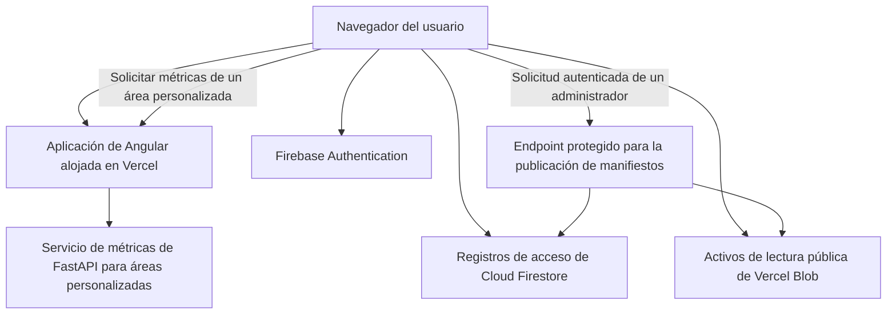

[← Volver a la descripción general de la entrega técnica](./README.md)

# Ciberseguridad y protección de datos

> **Estado: derivado del repositorio y verificado con el código fuente actual.** La política de producción, la responsabilidad sobre la infraestructura y los requisitos institucionales de seguridad de Colombia aún requieren decisiones de TI de Parques; consulte [Decisiones de seguridad solicitadas a TI de Parques](#security-decisions-requested-from-parques-it).

## Descripción general de seguridad

La aplicación activa es una aplicación de página única de Angular alojada en Vercel. Utiliza Firebase Authentication para el inicio de sesión con Google, Cloud Firestore para los registros de acceso y autorización, el almacenamiento Vercel Blob de lectura pública para los activos geoespaciales y los resultados generados, y un servicio FastAPI para las métricas de áreas personalizadas. Una implementación heredada de R/Shiny y Node/PostgreSQL permanece en el repositorio, pero no forma parte de la ruta de producción actual.

**La pregunta central de política para esta entrega técnica:** el diseño actual protege las _escrituras_ con mucha más solidez que las _lecturas_.

|                                                                    | Protección actual                                                                                                                    |
| ------------------------------------------------------------------ | ------------------------------------------------------------------------------------------------------------------------------------ |
| Escrituras privilegiadas (publicación de manifiestos, cambios de roles en Firestore) | Autorización del lado del servidor: verificación del token de ID de Firebase + comprobación del rol en Firestore + indicadores explícitos de despliegue. |
| Lecturas (activos geoespaciales, métricas de polígonos personalizados)              | Se puede acceder sin autenticación de la aplicación; solo están protegidas por no figurar en listados, no mediante una comprobación de acceso.          |

TI de Parques debe decidir si este modelo de datos de investigación con lectura pública es aceptable o si los datos y el cálculo deben restringirse a usuarios aprobados.

## Límites de confianza actuales

## Controles confirmados en el repositorio

- El inicio de sesión con Google mediante Firebase proporciona la identidad del usuario; los registros de usuarios de Firestore determinan el nivel de la aplicación y los privilegios administrativos. (El servicio de inicio de sesión con Google también contiene una ruta alternativa de demostración/simulación que se usa únicamente cuando Firebase está deshabilitado; esa ruta alternativa no es la ruta de producción y no debe citarse como evidencia de una autenticación real).
- Las reglas de seguridad de Firestore validan la estructura de los registros protegidos y deniegan de forma predeterminada todo acceso que no coincida.
- El endpoint de publicación de manifiestos verifica un token de identidad de Firebase, comprueba el rol correspondiente en Firestore y exige indicadores explícitos de despliegue antes de permitir una escritura.
- Se espera que las credenciales privilegiadas de Blob y del servidor de Firebase se suministren mediante variables de entorno y se excluyan del control de código fuente. Las credenciales y otros valores de configuración confidenciales nunca deben copiarse en la documentación de la entrega técnica.
- La publicación de manifiestos crea versiones archivadas que permiten revertir el manifiesto activo.
- Las solicitudes al backend utilizan validación tipada y rechazan los tipos de geometría no admitidos y los identificadores de métricas desconocidos.

## Hallazgos y registro de riesgos

Cada hallazgo que aparece a continuación combina lo que se encontró, por qué es importante, la evaluación de probabilidad/impacto y el responsable que debe actuar; todo se consolidó en una sola tabla para evitar seguimientos duplicados.

## Decisiones prioritarias

- Aceptar las lecturas públicas sin autenticación de los activos geoespaciales publicados, o exigir una entrega privada autenticada (SEC-01).
- Elegir la ubicación a largo plazo de la API de métricas y si permanece sin autenticación (SEC-02).
- Conservar el inicio de sesión con Google mediante Firebase, o exigir un proveedor de identidad institucional de Parques.
- Completar la transferencia del Owner del proyecto de Firebase, la facturación, los dominios autorizados y las copias de seguridad; consulte la [lista de verificación más adelante en esta página](#firebase-project-transfer-checklist). Las calificaciones de probabilidad/impacto del registro siguiente no cambian.

| ID     | Hallazgo                                                                                                                           | Por qué es importante                                                                                                                                                            | Probabilidad / impacto                                                | Respuesta requerida                                                                                                                                            | Responsable por confirmar                                    |
| ------ | ---------------------------------------------------------------------------------------------------------------------------------- | -------------------------------------------------------------------------------------------------------------------------------------------------------------------------------- | --------------------------------------------------------------------- | -------------------------------------------------------------------------------------------------------------------------------------------------------------- | ------------------------------------------------------------ |
| SEC-01 | Los activos geoespaciales son de lectura pública mediante URL.                                                                     | Los conjuntos de datos relacionados con conflictos, territorios indígenas, especies o consultas pueden requerir una decisión de política, incluso si técnicamente provienen de datos públicos. | Alta probabilidad por diseño; el impacto depende de la clasificación de los datos. | TI de Parques aprueba el acceso público o exige almacenamiento privado con entrega autenticada.                                                                | Seguridad de la información y responsables de datos de Parques |
| SEC-02 | El endpoint de métricas de polígonos personalizados no tiene autenticación de la aplicación ni límite de solicitudes.              | Las solicitudes complejas y repetidas podrían agotar la CPU o la memoria, o aumentar los costos operativos.                                                                      | Probabilidad e impacto moderados.                                     | Agregar una puerta de enlace de API o un proxy inverso con autenticación, límites de solicitudes, tiempos de espera, límites de complejidad de polígonos y monitoreo. | Equipo de la aplicación y responsable de infraestructura      |
| SEC-03 | Muchos niveles de la aplicación se aplican en la interfaz y no en el límite de los activos.                                        | Un control oculto en el navegador no impide el acceso directo a una URL pública.                                                                                                 | Depende de la clasificación de los datos de cada activo.              | Definir qué capacidades y conjuntos de datos realmente requieren autorización del lado del servidor.                                                          | Equipo de la aplicación                                       |
| SEC-04 | Los encabezados de seguridad de producción no están configurados explícitamente en el repositorio.                                 | La ausencia de protecciones del navegador aumenta la exposición al secuestro de clics, la inyección de contenido y la confusión de tipos de contenido.                           | Probabilidad moderada, impacto bajo a moderado.                       | Agregar encabezados de referencia; introducir Content Security Policy en modo de solo informe antes de aplicarla.                                              | Equipo de la aplicación                                       |
| SEC-05 | No se encontraron en el repositorio análisis de dependencias, alertas de seguridad, un procedimiento de respuesta a incidentes ni un plan de recuperación ante desastres. | Las vulnerabilidades o los incidentes operativos podrían pasar inadvertidos o gestionarse de manera inconsistente.                                              | Probabilidad moderada, impacto operativo alto.                        | Asignar responsables; definir procedimientos de análisis, alertas, rotación de credenciales, copias de seguridad, recuperación y escalamiento.                  | TI de Parques y dirección del proyecto                        |
| —      | Compromiso de las credenciales de escritura de Blob o de las credenciales administrativas de Firebase                             | Menor probabilidad, pero impacto crítico si ocurre.                                                                                                                               | Baja probabilidad, impacto crítico.                                   | Utilizar una bóveda de secretos administrada por Parques, privilegios mínimos, rotación documentada y actividad de publicación auditada.                       | TI de Parques                                                  |

## Decisiones de seguridad solicitadas a TI de Parques

- ¿Es aceptable el acceso público sin autenticación para todas las capas geoespaciales y los resultados generados que se publican actualmente?
- ¿Debe la aplicación utilizar un proveedor de identidad institucional de Parques en lugar del inicio de sesión con Google mediante Firebase?
- ¿El servicio de métricas debe ser público, autenticarse mediante una puerta de enlace de API, restringirse mediante una política de red o alojarse completamente en la infraestructura de Parques?
- ¿Quién será responsable del proyecto de Firebase, el almacenamiento Blob, las credenciales del servidor, las copias de seguridad, el monitoreo, la gestión de vulnerabilidades y la respuesta a incidentes después de la entrega técnica?
- ¿Qué requisitos de retención, auditoría, cifrado, clasificación de datos y privacidad de Colombia se aplican a los registros de usuarios, los registros de eventos y los conjuntos de datos de planificación?
- ¿Vercel es una plataforma de producción aprobada y qué estándares de WAF, encabezados, TLS, dominio y disponibilidad deben aplicarse?

Evidencia detallada del repositorio

- Autenticación y asignación de niveles: `frontend/src/app/core/services/auth.service.ts`
- Integración del cliente de Firebase: `frontend/src/app/core/services/firebase-client.service.ts`
- Flujo de identidad de Google (ruta de producción; también contiene una ruta alternativa de demostración/simulación que se usa únicamente cuando Firebase está deshabilitado): `frontend/src/app/features/auth/services/google-identity.service.ts`
- Política de autorización de Firestore: `firestore.rules`
- Endpoint protegido para la publicación de manifiestos: `frontend/api/dev/manifest-style-publish.ts`
- Validación y reversión de manifiestos: `frontend/layer-manifest/validate-manifest.mjs`, `frontend/layer-manifest/rollback-manifest.mjs`
- Enrutamiento del frontend al servicio de métricas: `frontend/vercel.json`
- Punto de entrada de FastAPI y política de CORS: `backend/app/main.py`
- Validación de solicitudes de polígonos: `backend/app/models.py`, `backend/app/polygon_metrics.py`
- Verificaciones de CI: `.github/workflows/ci.yml`
- Referencias de arquitectura relacionadas: `docs/architecture/data-flow-and-blob-storage.md`, `docs/handoffs/parques-it-auth-blob-storage-eng.md`, `docs/gtic-system-architecture-slides.md`

## Lista de verificación de transferencia del proyecto Firebase

Este es el procedimiento para que Parques / PNNC-GTIC pase a operar el proyecto de Firebase existente. No cierra la pregunta de política aún abierta de si el inicio de sesión con Google debe reemplazarse más adelante por un proveedor de identidad institucional.

No copie claves del Admin SDK, JSON de cuentas de servicio ni otras credenciales privilegiadas en este documento, en tickets ni en el chat. La configuración web de Angular (`projectId` y otros campos públicos del cliente) no es un secreto privilegiado. Trate las credenciales de administrador únicamente como material de la bóveda.

ID actual del proyecto: `dises-decision-making-tool`. Nombre de host de autenticación que usa la aplicación: `dises-decision-making-tool.firebaseapp.com`. Notas anteriores sobre el flujo de inicio de sesión están en [`parques-it-auth-blob-storage-eng.md`](../parques-it-auth-blob-storage-eng.md); ese archivo está reemplazado en lo que respecta a la arquitectura y debe usarse solo como contexto de fondo.

Hay dos roles de «propietario» distintos, y Parques necesita ambos:

| Capa | Qué controla | Dónde reside |
| --- | --- | --- |
| Google Cloud / Firebase **project Owner** | Facturación, dominios autorizados, proveedores de Auth, despliegues de reglas de Firestore, exportaciones, IAM | Firebase Console / Google Cloud IAM |
| **super-admin** de la aplicación | Aprobar cuentas nuevas, asignar roles de personal, asignar administradores regionales SIRAP | Cloud Firestore `users/{uid}` |

### 1. Agregar a Parques como Owner del proyecto

- En Google Cloud IAM para `dises-decision-making-tool`, agregue al menos dos cuentas de Google de Parques / PNNC-GTIC como **Owner**. Prefiera cuentas institucionales, no Gmail personal, si la política de Parques lo exige.
- Otorgue también a esas cuentas acceso a Firebase Console. Owner es suficiente; no invente roles personalizados adicionales a menos que la política de IAM de Parques indique lo contrario.
- Confirme la organización o carpeta de Google Cloud del proyecto. Si Parques exige que el proyecto viva en una organización de PNNC, complete ese traslado de organización mientras Spatial Lab aún tenga Owner; no deje un único Owner restante a mitad del traslado.
- Conserve al menos un Owner de Spatial Lab hasta que las comprobaciones posteriores de retiro se superen.
- Verifique que un Owner de Parques pueda abrir Authentication, Firestore, Billing e IAM sin prestar un inicio de sesión de Spatial Lab.

### 2. Trasladar la facturación

- Identifique la cuenta de facturación de Google Cloud actualmente asociada al proyecto.
- Asocie una cuenta de facturación de Parques antes de quitar al último Owner de Spatial Lab. Firebase Authentication + Firestore en producción suelen exigir un proyecto facturado (Blaze); confirme el plan en la consola en lugar de asumirlo.
- Confirme quién recibe las alertas de presupuesto y que las facturas lleguen a un centro de costos de Parques.
- No almacene números de cuentas de facturación, instrumentos de pago ni claves de API en esta entrega técnica.

### 3. Confirmar los dominios autorizados

En Firebase Authentication → Settings → Authorized domains, conserve únicamente los hosts que deban poder completar el inicio de sesión con Google:

- `localhost` (desarrollo local)
- `dises-decision-making-tool.firebaseapp.com` y `dises-decision-making-tool.web.app` (valores predeterminados de Firebase)
- El host de producción del frontend en vivo (al momento de redactar esto, la aplicación de Vercel es `decision-making-tool-tau.vercel.app`)
- Cualquier dominio personalizado **aprobado**, una vez que el DNS realmente sirva la aplicación; no agregue un dominio que aún responda 404
- Hosts de vista previa o de ensayo solo si Parques quiere inicio de sesión en esas URL

Cuando la lista sea correcta, pida a un Owner de Parques que complete un inicio de sesión con Google en producción y en localhost. Un dominio ausente de esta lista se ve como un inicio de sesión roto, no como un error de la aplicación.

### 4. Revisar Authentication y Firestore

- La **identidad** es Firebase Authentication (inicio de sesión con Google). La **autorización** es Cloud Firestore. Iniciar sesión no otorga por sí solo privilegios de Decision Maker, Manager o admin.
- Deje habilitado el proveedor de inicio de sesión con Google hasta que Parques elija formalmente un proveedor de identidad distinto.
- Revise y, si Parques operará el proyecto, asuma la responsabilidad de desplegar `firestore.rules` desde este repositorio. Las reglas deniegan de forma predeterminada todo acceso que no coincida.
- Colecciones principales que conviene conocer (no pegue el contenido de los documentos en tickets):

| Colección | Propósito |
| --- | --- |
| `accessRequests/{uid}` | Solicitudes pendientes o revisadas de personas que iniciaron sesión pero aún no están aprobadas como usuarias de la aplicación |
| `users/{uid}` | Registros de usuarios aprobados: `status`, `tier`, `role`, `isAdmin` / `isSuperAdmin`, concesiones SIRAP |
| `userDirectory/{uid}` | Listado de directorio que se usa cuando un administrador regional SIRAP no puede leer todos los documentos de `users` |
| `sirapAccessRequests/{uid}_{sirapId}` | Solicitudes de acceso a datos SIRAP por región |
| `users/{uid}/savedSolutionScenarios/{id}` | Escenarios guardados de las personas con sesión iniciada (datos de usuario; incluirlos en las copias de seguridad) |
| `mail` | Documentos opcionales de notificación a administradores; las reglas deniegan las escrituras del cliente |

- Las credenciales privilegiadas del servidor (Firebase Admin / cuentas de servicio) permanecen en una bóveda de secretos de Parques. Rote cualquier clave que Spatial Lab haya tenido antes del retiro.

### 5. Aprobar o denegar usuarios

La identidad de Google y el acceso a la aplicación son independientes. Una persona puede iniciar sesión y seguir pendiente.

- **Cuentas nuevas.** La persona inicia sesión con Google y envía `accessRequests/{uid}`. Solo un **super-admin** de la aplicación puede aprobar esa solicitud en `users/{uid}` con `status: active`. Hasta entonces la aplicación permanece en el nivel público.
- **Acceso a datos SIRAP.** Después de que la cuenta está activa, la persona puede solicitar Orinoquía y/o Eje Cafetero. Un super-admin, o un administrador regional de ese SIRAP, aprueba o deniega la región. La denegación quita esa región de `allowedSirapIds` sin eliminar la cuenta de Google.
- **Denegación a nivel de cuenta.** Las reglas de Firestore permiten marcar `accessRequests/{uid}` como `denied`. No deje a una persona denegada como `users/{uid}` con `status: active`. Si la consola de la aplicación no tiene un control de denegación de cuenta, un super-admin con acceso a Firestore Console puede poner la solicitud en `denied` y mantener o establecer el registro de usuario como inactivo/denegado.
- Los administradores regionales SIRAP **no pueden** aprobar cuentas nuevas de Firebase. Solo pueden conceder o revocar las regiones SIRAP que administran.

### 6. Promover al personal de Parques

Hágalo después de que al menos un operador de Parques pueda iniciar sesión.

- Si Spatial Lab todavía tiene un super-admin de la aplicación, esa persona promueve la primera cuenta de personal de Parques desde las herramientas de administración (nivel, indicador de super-admin, asignaciones SIRAP).
- Si no queda ningún super-admin de la aplicación, un Owner del proyecto de Firebase arranca el primer super-admin de Parques en Firestore Console sobre `users/{uid}` **después de que esa persona haya iniciado sesión una vez** (para que exista el uid de Auth): `status: active`, `isSuperAdmin: true`, `isAdmin: true`, `role: admin`, `tier: 3`. Luego ese super-admin de Parques promueve a las demás personas. No comparta ese uid en este documento.
- Promueva al menos a dos super-admins de Parques para que una salida no bloquee la cola de aprobaciones.
- Use Manager (`tier` 3 / `science_publisher`) solo para el personal que deba recibir privilegios de producto a nivel de publicación. Las personas aprobadas ordinarias son Decision Maker (`tier` 2 / `authorized_viewer`).

### 7. Administradores regionales SIRAP frente al administrador global

Estos son roles de la aplicación en `users/{uid}`, no roles de IAM de Google Cloud.

| Rol | Señales en Firestore | Qué pueden hacer | Qué no pueden hacer |
| --- | --- | --- | --- |
| Administrador global / super-admin | Usuario activo con `isSuperAdmin`, `isAdmin` o `role: admin` | Aprobar cuentas nuevas, asignar niveles, asignar otros super-admins, asignar administradores regionales, conceder o revocar cualquier SIRAP | — |
| Administrador regional SIRAP | Usuario activo con `administeredSirapIds` definido (y que no sea super-admin) | Ver usuarios superpuestos; aprobar, denegar o revocar el acceso SIRAP **solo** para esas regiones | Aprobar cuentas nuevas de Google/Firebase; cambiar el nivel global o los indicadores de super-admin; administrar un SIRAP que no se les asignó |
| Usuario SIRAP aprobado | Usuario activo solo con `allowedSirapIds` | Usar la línea de producto SIRAP para las regiones concedidas | Administrar a nadie más |

Asigne administradores regionales escribiendo `administeredSirapIds` como `orinoquia` y/o `eje-cafetero`. Existen ocho etiquetas SIRAP en el producto; **solo Orinoquía y Eje Cafetero tienen datos publicados actualmente**, y las reglas de Firestore solo aceptan esos dos ID.

Un administrador regional no es Owner del proyecto de Cloud. No otorgue Owner de Google Cloud a quienes solo necesitan aprobar solicitudes de acceso regional.

### 8. Copias de seguridad y exportaciones

Hoy este repositorio no documenta ningún ejercicio de copia de seguridad o restauración de Firebase. Antes de que Spatial Lab se retire, Parques debería:

- Habilitar o confirmar **exportaciones administradas de Cloud Firestore** programadas hacia un bucket de Cloud Storage de Parques. Incluya las subcolecciones (escenarios guardados).
- Exportar los usuarios de Authentication si la política de identidad/retención de Parques exige una copia de las cuentas vinculadas a Google.
- Confirmar si la recuperación a un punto en el tiempo de Firestore está activada; habilítela si el RPO de Parques lo requiere.
- Almacenar las exportaciones en un bucket privado de Parques, no en Vercel Blob público.
- Registrar quién puede ejecutar una restauración y probar una restauración en un proyecto que no sea de producción si la política de recuperación ante desastres de Parques lo exige.

### 9. Retirar a Spatial Lab

Solo después de que un Owner de Parques haya demostrado todo lo siguiente:

- Abrir Firebase Console como Owner sin una cuenta de Spatial Lab
- Cambiar (o verificar) los dominios autorizados
- Ejecutar una exportación de Firestore a un bucket de Parques
- Iniciar sesión en la aplicación de producción
- Promover al menos a un integrante adicional del personal de Parques
- Aprobar una solicitud de acceso de prueba y conceder/revocar una región SIRAP

Después:

- Degrade o quite las cuentas Owner/Editor de Google Cloud de Spatial Lab. Nunca quite al último Owner.
- Revoque o rote las claves del Admin SDK / cuentas de servicio que Spatial Lab usó.
- Deje un contacto de emergencia fechado durante una ventana breve acordada y luego ciérrelo.
- Conserve esta lista de verificación como el registro del operador; no trate un inicio de sesión residual de Spatial Lab como el plan de recuperación.
