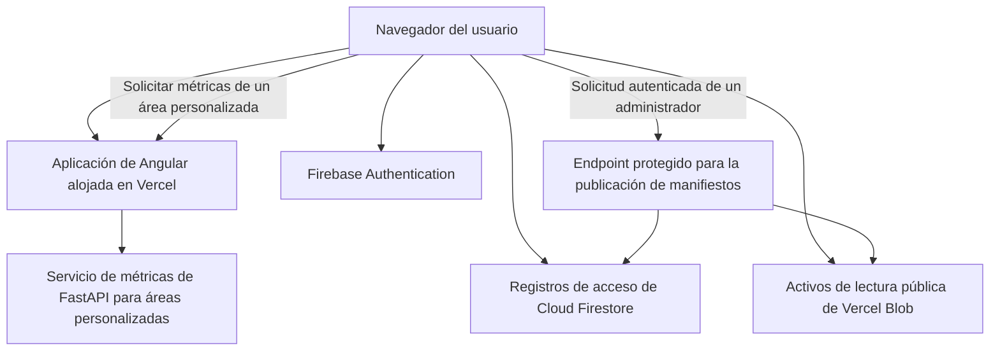

[← Volver a la descripción general de la entrega técnica](./README.md)

# Ciberseguridad y protección de datos

> **Estado: derivado del repositorio y verificado con el código fuente actual.** La política de producción, la responsabilidad sobre la infraestructura y los requisitos institucionales de seguridad de Colombia aún requieren decisiones de TI de Parques; consulte [Decisiones de seguridad solicitadas a TI de Parques](#security-decisions-requested-from-parques-it).

## Descripción general de seguridad

La aplicación activa es una aplicación de página única de Angular alojada en Vercel. Utiliza Firebase Authentication para el inicio de sesión con Google, Cloud Firestore para los registros de acceso y autorización, el almacenamiento Vercel Blob de lectura pública para los activos geoespaciales y los resultados generados, y un servicio FastAPI para las métricas de áreas personalizadas. Una implementación heredada de R/Shiny y Node/PostgreSQL permanece en el repositorio, pero no forma parte de la ruta de producción actual.

**La pregunta central de política para esta entrega técnica:** el diseño actual protege las _escrituras_ con mucha más solidez que las _lecturas_.

|                                                                    | Protección actual                                                                                                                    |
| ------------------------------------------------------------------ | ------------------------------------------------------------------------------------------------------------------------------------ |
| Escrituras privilegiadas (publicación de manifiestos, cambios de roles en Firestore) | Autorización del lado del servidor: verificación del token de ID de Firebase + comprobación del rol en Firestore + indicadores explícitos de despliegue. |
| Lecturas (activos geoespaciales, métricas de polígonos personalizados)              | Se puede acceder sin autenticación de la aplicación; solo están protegidas por no figurar en listados, no mediante una comprobación de acceso.          |

TI de Parques debe decidir si este modelo de datos de investigación con lectura pública es aceptable o si los datos y el cálculo deben restringirse a usuarios aprobados.

## Límites de confianza actuales

## Controles confirmados en el repositorio

- El inicio de sesión con Google mediante Firebase proporciona la identidad del usuario; los registros de usuarios de Firestore determinan el nivel de la aplicación y los privilegios administrativos. (El servicio de inicio de sesión con Google también contiene una ruta alternativa de demostración/simulación que se usa únicamente cuando Firebase está deshabilitado; esa ruta alternativa no es la ruta de producción y no debe citarse como evidencia de una autenticación real).
- Las reglas de seguridad de Firestore validan la estructura de los registros protegidos y deniegan de forma predeterminada todo acceso que no coincida.
- El endpoint de publicación de manifiestos verifica un token de identidad de Firebase, comprueba el rol correspondiente en Firestore y exige indicadores explícitos de despliegue antes de permitir una escritura.
- Se espera que las credenciales privilegiadas de Blob y del servidor de Firebase se suministren mediante variables de entorno y se excluyan del control de código fuente. Las credenciales y otros valores de configuración confidenciales nunca deben copiarse en la documentación de la entrega técnica.
- La publicación de manifiestos crea versiones archivadas que permiten revertir el manifiesto activo.
- Las solicitudes al backend utilizan validación tipada y rechazan los tipos de geometría no admitidos y los identificadores de métricas desconocidos.

## Hallazgos y registro de riesgos

Cada hallazgo que aparece a continuación combina lo que se encontró, por qué es importante, la evaluación de probabilidad/impacto y el responsable que debe actuar; todo se consolidó en una sola tabla para evitar seguimientos duplicados.

| ID     | Hallazgo                                                                                                                           | Por qué es importante                                                                                                                                                            | Probabilidad / impacto                                                | Respuesta requerida                                                                                                                                            | Responsable por confirmar                                    |
| ------ | ---------------------------------------------------------------------------------------------------------------------------------- | -------------------------------------------------------------------------------------------------------------------------------------------------------------------------------- | --------------------------------------------------------------------- | -------------------------------------------------------------------------------------------------------------------------------------------------------------- | ------------------------------------------------------------ |
| SEC-01 | Los activos geoespaciales son de lectura pública mediante URL.                                                                     | Los conjuntos de datos relacionados con conflictos, territorios indígenas, especies o consultas pueden requerir una decisión de política, incluso si técnicamente provienen de datos públicos. | Alta probabilidad por diseño; el impacto depende de la clasificación de los datos. | TI de Parques aprueba el acceso público o exige almacenamiento privado con entrega autenticada.                                                                | Seguridad de la información y responsables de datos de Parques |
| SEC-02 | El endpoint de métricas de polígonos personalizados no tiene autenticación de la aplicación ni límite de solicitudes.              | Las solicitudes complejas y repetidas podrían agotar la CPU o la memoria, o aumentar los costos operativos.                                                                      | Probabilidad e impacto moderados.                                     | Agregar una puerta de enlace de API o un proxy inverso con autenticación, límites de solicitudes, tiempos de espera, límites de complejidad de polígonos y monitoreo. | Equipo de la aplicación y responsable de infraestructura      |
| SEC-03 | Muchos niveles de la aplicación se aplican en la interfaz y no en el límite de los activos.                                        | Un control oculto en el navegador no impide el acceso directo a una URL pública.                                                                                                 | Depende de la clasificación de los datos de cada activo.              | Definir qué capacidades y conjuntos de datos realmente requieren autorización del lado del servidor.                                                          | Equipo de la aplicación                                       |
| SEC-04 | Los encabezados de seguridad de producción no están configurados explícitamente en el repositorio.                                 | La ausencia de protecciones del navegador aumenta la exposición al secuestro de clics, la inyección de contenido y la confusión de tipos de contenido.                           | Probabilidad moderada, impacto bajo a moderado.                       | Agregar encabezados de referencia; introducir Content Security Policy en modo de solo informe antes de aplicarla.                                              | Equipo de la aplicación                                       |
| SEC-05 | No se encontraron en el repositorio análisis de dependencias, alertas de seguridad, un procedimiento de respuesta a incidentes ni un plan de recuperación ante desastres. | Las vulnerabilidades o los incidentes operativos podrían pasar inadvertidos o gestionarse de manera inconsistente.                                              | Probabilidad moderada, impacto operativo alto.                        | Asignar responsables; definir procedimientos de análisis, alertas, rotación de credenciales, copias de seguridad, recuperación y escalamiento.                  | TI de Parques y dirección del proyecto                        |
| —      | Compromiso de las credenciales de escritura de Blob o de las credenciales administrativas de Firebase                             | Menor probabilidad, pero impacto crítico si ocurre.                                                                                                                               | Baja probabilidad, impacto crítico.                                   | Utilizar una bóveda de secretos administrada por Parques, privilegios mínimos, rotación documentada y actividad de publicación auditada.                       | TI de Parques                                                  |

## Decisiones de seguridad solicitadas a TI de Parques

- ¿Es aceptable el acceso público sin autenticación para todas las capas geoespaciales y los resultados generados que se publican actualmente?
- ¿Debe la aplicación utilizar un proveedor de identidad institucional de Parques en lugar del inicio de sesión con Google mediante Firebase?
- ¿El servicio de métricas debe ser público, autenticarse mediante una puerta de enlace de API, restringirse mediante una política de red o alojarse completamente en la infraestructura de Parques?
- ¿Quién será responsable del proyecto de Firebase, el almacenamiento Blob, las credenciales del servidor, las copias de seguridad, el monitoreo, la gestión de vulnerabilidades y la respuesta a incidentes después de la entrega técnica?
- ¿Qué requisitos de retención, auditoría, cifrado, clasificación de datos y privacidad de Colombia se aplican a los registros de usuarios, los registros de eventos y los conjuntos de datos de planificación?
- ¿Vercel es una plataforma de producción aprobada y qué estándares de WAF, encabezados, TLS, dominio y disponibilidad deben aplicarse?

Evidencia detallada del repositorio

- Autenticación y asignación de niveles: `frontend/src/app/core/services/auth.service.ts`
- Integración del cliente de Firebase: `frontend/src/app/core/services/firebase-client.service.ts`
- Flujo de identidad de Google (ruta de producción; también contiene una ruta alternativa de demostración/simulación que se usa únicamente cuando Firebase está deshabilitado): `frontend/src/app/features/auth/services/google-identity.service.ts`
- Política de autorización de Firestore: `firestore.rules`
- Endpoint protegido para la publicación de manifiestos: `frontend/api/dev/manifest-style-publish.ts`
- Validación y reversión de manifiestos: `frontend/layer-manifest/validate-manifest.mjs`, `frontend/layer-manifest/rollback-manifest.mjs`
- Enrutamiento del frontend al servicio de métricas: `frontend/vercel.json`
- Punto de entrada de FastAPI y política de CORS: `backend/app/main.py`
- Validación de solicitudes de polígonos: `backend/app/models.py`, `backend/app/polygon_metrics.py`
- Verificaciones de CI: `.github/workflows/ci.yml`
- Referencias de arquitectura relacionadas: `docs/architecture/data-flow-and-blob-storage.md`, `docs/handoffs/parques-it-auth-blob-storage-eng.md`, `docs/gtic-system-architecture-slides.md`

