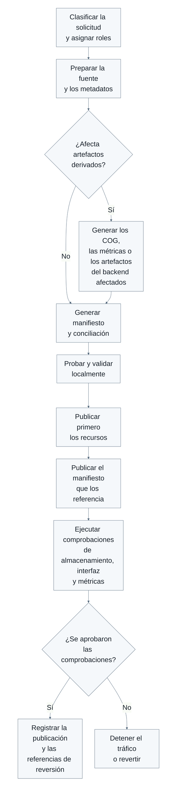

[← Volver a la entrega técnica para TI de Parques](../README.md)

# Guías operativas de datos

Use esta página para elegir la guía operativa más acotada que permita completar un cambio de datos de forma segura. Cargar un archivo solo lo almacena: la aplicación accede a los datos mediante catálogos, manifiestos, artefactos de métricas y artefactos de ejecución del backend. Trate estos componentes como un único contrato de publicación y verifique cada componente que el cambio realmente afecte.

No todos los cambios requieren todos los pasos posteriores. Un cambio únicamente de etiqueta puede requerir solo actualizar el manifiesto; una capa solo de mapa no requiere regenerar métricas; un insumo de cálculo puede requerir métricas y artefactos del backend incluso si su ruta no cambia.

## Cómo funciona el proceso de publicación

1. **Registrar** la fuente, la identidad, los metadatos y el uso previsto.
2. **Generar** únicamente los recursos derivados afectados por ese uso.
3. **Validar** los contratos locales y los informes de conciliación.
4. **Publicar** los recursos antes que los manifiestos que los referencian.
5. **Verificar** el almacenamiento, el comportamiento de la interfaz, las métricas de AOI conocidas y las métricas de AOI personalizadas, según corresponda.
6. **Registrar** las rutas inmutables, las sumas de comprobación, los informes y las referencias para reversión.

El CSV verificado del generador, las copias CSV legibles por personas, el contenido de Blob, el manifiesto de capas de ejecución, el manifiesto de especies, las métricas y el manifiesto de artefactos del backend son registros independientes. Pueden divergir a menos que la publicación los concilie explícitamente.

## Roles

- **Responsable de publicación de datos** — controla las escrituras aprobadas en Blob, confirma las rutas y sumas de comprobación, conserva copias para reversión y registra quién publicó qué y cuándo. Este rol no aprueba el significado científico.
- **Operador del pipeline** — genera COG, manifiestos, métricas, datos dispersos y artefactos del backend; revisa los resultados de validación y conciliación; detiene una publicación cuando fallan los contratos.
- **Desarrollador de la aplicación** — modifica esquemas, conexiones de la interfaz, comportamiento de cálculo, correspondencias de categorías o flujos de trabajo no compatibles. Los nuevos tipos de AOI y la compatibilidad con capas de exclusión requieren este rol.
- **Revisor científico** — confirma la idoneidad de la fuente, las unidades, las transformaciones, el manejo de NoData, el significado de las categorías y los resultados esperados de las métricas. El éxito técnico no constituye aprobación científica.

Una misma persona puede desempeñar más de un rol, pero el registro de publicación debe indicar quién cumplió cada responsabilidad.

## Elegir una guía operativa

| Solicitud                                                                                         | Comience aquí                                                        | Use también cuando sea necesario                                                                                                                               |
| ------------------------------------------------------------------------------------------------- | -------------------------------------------------------------------- | --------------------------------------------------------------------------------------------------------------------------------------------------------------- |
| Agregar o reemplazar una solución y su procedencia                                                | [Agregar soluciones](./adding-solutions.md)                          | [Métricas y artefactos](./metrics-and-artifacts.md), luego [Publicación y reversión](./publishing-and-rollback.md)                                               |
| Reemplazar el catálogo completo de soluciones                                                     | En desarrollo — aún no está listo para operadores; el flujo independiente de versionado y reemplazo del catálogo debe integrarse, documentarse y probarse | La generación actual conserva los ID publicados que no aparecen en el descubrimiento; use el flujo nuevo solo después de verificar la entrega técnica           |
| Agregar, reemplazar, reetiquetar o retirar una capa de elementos, costos, inclusión, referencia o especies | [Administrar capas](./managing-layers.md)                            | [Métricas y artefactos](./metrics-and-artifacts.md) solo cuando cambien los cálculos; luego [Publicación y reversión](./publishing-and-rollback.md)               |
| Agregar o reemplazar un límite de departamento, municipio, SIRAP, RUNAP u OMEC                    | [Administrar AOI](./managing-aois.md)                                | [Métricas y artefactos](./metrics-and-artifacts.md), luego [Publicación y reversión](./publishing-and-rollback.md)                                               |
| Agregar una métrica realmente nueva o habilitar una métrica existente para otro dominio           | [Agregar o habilitar métricas](./adding-or-enabling-metrics.md)      | [Métricas y artefactos](./metrics-and-artifacts.md), luego [Publicación y reversión](./publishing-and-rollback.md)                                               |
| Generar métricas de AOI conocidas, métricas compactas, insumos dispersos o artefactos del backend para AOI personalizadas | [Métricas y artefactos](./metrics-and-artifacts.md)                  | [Publicación y reversión](./publishing-and-rollback.md)                                                                                                         |
| Publicar resultados validados, comprobar la aplicación o recuperarse de una publicación defectuosa | [Publicación y reversión](./publishing-and-rollback.md)              | Vuelva a la guía específica de la fuente si se requiere regeneración                                                                                            |
| Agregar un nuevo tipo geográfico de AOI, control del Finder o flujo de exclusión                   | Revisión del desarrollador de la aplicación                          | Las guías operativas actuales son insuficientes                                                                                                                 |

## Impacto posterior

| Cambio                                                     | Manifiesto                                                                            | Métricas de AOI conocidas                             | Artefactos del backend para AOI personalizadas              | Verificación de la interfaz       |
| ---------------------------------------------------------- | ------------------------------------------------------------------------------------- | ----------------------------------------------------- | ------------------------------------------------------------ | --------------------------------- |
| Solo etiqueta, descripción, categoría o metadatos de renderizado | Regenerar y publicar                                                              | No                                                    | No                                                           | Sí                                |
| Capa de referencia solo de mapa (`roleInMetricCalculation: none`) | Regenerar y publicar                                                              | No                                                    | No                                                           | Sí                                |
| Reemplazar un ráster de cálculo en la misma ruta           | Regenerar para confirmar URL/contratos                                                 | Regenerar las métricas afectadas; omitir cachés obsoletos | Volver a generar y reiniciar cuando se use en producción     | Sí                                |
| Agregar una solución de un tipo existente                  | Regenerar y publicar                                                                   | Generar para la solución                               | Volver a generar solo si los artefactos en producción dependen de insumos modificados | Finder, mapa y métricas |
| Agregar rásteres de especies                               | Regenerar/publicar el manifiesto de especies; el principal solo si cambia su referencia a especies | Regenerar las métricas de especies afectadas | Verificar/volver a generar los artefactos de especies donde sea compatible | Búsqueda, renderizado y métricas |
| Cambiar un límite de AOI conocida                          | Regenerar si cambian la URL o los metadatos                                            | Regenerar todas las soluciones × todas las AOI         | Volver a generar si cambiaron insumos de cálculo en producción | Identificación y métricas       |
| Cambiar únicamente un artefacto de métricas precalculado   | Actualizar el manifiesto solo cuando cambie su URL                                     | Publicar el artefacto afectado                         | No                                                           | Métricas                          |

Se requiere recalcular todas las AOI cuando cambia un catálogo, calculador, aplicabilidad de dominio, fuente compartida de métricas, esquema o contrato de límites. Un cambio únicamente en el ráster de una solución puede limitarse a esa solución, pero su resultado aun así incluye todas las AOI conocidas. Consulte [Agregar o habilitar métricas](./adding-or-enabling-metrics.md) para conocer el contrato del desarrollador.

En caso de duda, el operador del pipeline y el desarrollador de la aplicación deben rastrear los campos del manifiesto y los insumos de cálculo antes de publicar; no vuelva a generar todo automáticamente como sustituto de comprender el impacto.

## Secuencia común de publicación

## Reglas de seguridad no negociables

1. Nunca publique sin identificar antes el entorno, la ruta exacta de Blob, los consumidores afectados y la fuente para reversión.
2. Nunca imprima, pegue ni documente valores de tokens. La documentación solo puede mencionar nombres de variables de entorno.
3. Ejecute simulaciones, generación, pruebas, validación y conciliación antes de escribir, siempre que el repositorio lo permita.
4. Publique los recursos referenciados antes de publicar el manifiesto que apunta a ellos.
5. No edite manualmente un manifiesto en producción. Genérelo, valídelo y conserve la referencia de su archivo.
6. No sobrescriba métricas salvo que se conserven un directorio local de generación conocido como válido y el informe de publicación. Las métricas no tienen archivo automático.
7. Prefiera rutas inmutables de métricas versionadas por publicación; sobrescribir rutas con caché prolongada puede dejar a los clientes usando bytes obsoletos.
8. Actualice el navegador antes de verificar la interfaz y vuelva a crear el contenedor del backend después de volver a generar artefactos de ejecución.
9. Trate `/health` únicamente como indicador de salud del proceso; los artefactos obligatorios del backend solo son seguros para recibir tráfico cuando `/ready` responde correctamente.
10. Deténgase cuando los registros no coincidan, la conciliación presente omisiones sin explicar o fallen las comprobaciones científicas.
11. Las exclusiones no están listas para operadores: los metadatos admiten `excludes[]`, pero no existe un prefijo de fuente dedicado, un escaneo de registro ni un flujo del Finder conectados.
12. La recuperación ante desastres de Blob/almacenamiento no está probada ni automatizada. Un archivo de publicación no constituye un plan completo de recuperación ante desastres.

## Riesgos conocidos de publicación

- El generador lee `data/Capas de entrada _ Input Layers - Capas de entrada requeridas (2).csv`; `data/input_layers_in_use.csv` y `data/input_layers_required.csv` son copias legibles por personas y pueden divergir independientemente.
- Los valores `compressedDataForLiveMetricsUrl` generados pueden usar `metrics/live/{id}.bin.gz`, mientras que los generadores de datos dispersos producen `*.sparse.gz` junto a los insumos fuente. Verifique el formato y la URL desplegados en lugar de asumir que son equivalentes.
- El frontend contiene una alternativa de métricas compactas de staging codificada de forma fija para rutas `solutions/nick-runs/...`. Las publicaciones de producción deben proporcionar valores `precomputedMetricUrls` explícitos y versionados.
- No existe un cargador genérico en el repositorio para recursos de elementos, costos, inclusión, exclusión, referencia, pares de soluciones sin procesar ni la mayoría de los límites.

## Glosario

- **Ruta de Blob** — ruta dentro de Vercel Blob, como `manifest/manifest.json`; es distinta de una ruta local y de la URL pública completa.
- **COG** — Cloud Optimized GeoTIFF usado para una visualización eficiente en el mapa.
- **AOI conocida** — geografía predefinida, como un departamento o SIRAP, cuyas métricas pueden precalcularse.
- **AOI personalizada** — polígono dibujado por el usuario que el backend FastAPI calcula a partir de artefactos de ejecución.
- **Registro** — fuente que declara qué debe existir y cómo debe interpretarse; existen varios registros y deben coincidir.
- **Informe de conciliación** — comparación generada de las entradas esperadas de los registros, los recursos de Blob, las categorías y las soluciones.
- **Manifiesto de capas de ejecución** — catálogo orientado a la aplicación en `manifest/manifest.json`.
- **Manifiesto de especies** — catálogo secundario de especies en `manifests/species.manifest.json`.
- **Manifiesto de artefactos del backend** — archivo local de la VM `backend/runtime-artifacts/manifest.json` usado para la disponibilidad y los insumos de AOI personalizadas.
- **Manifiesto de recursos de despliegue** — archivo de compilación `frontend/scripts/data-deploy/manifest.json`; valida los recursos copiados del frontend y no es el catálogo de ejecución.
- **Ruta inmutable de publicación** — ruta versionada cuyos bytes nunca se sobrescriben.
