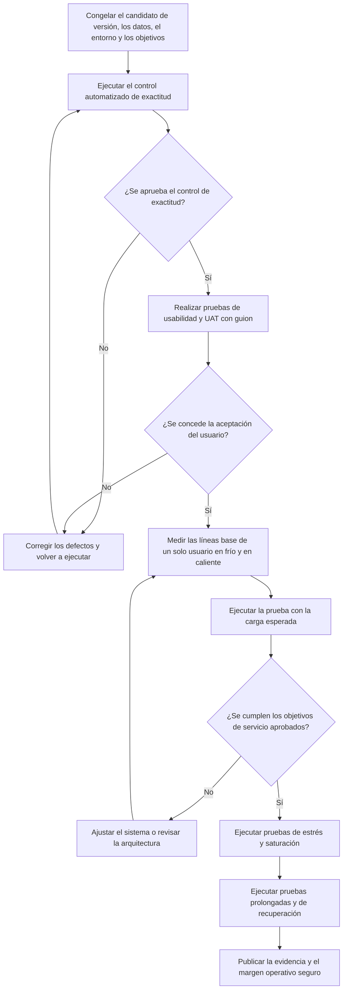

[← Volver a la descripción general de la entrega](./README.md)

# Pruebas de rendimiento, carga y saturación

> **Estado actual: 🔴 Brecha — no se encontró evidencia.** No existe un resultado validado de saturación. Existen pruebas automatizadas de exactitud y una prueba de humo limitada de capacidad de respuesta del navegador, pero no establecen la concurrencia, el rendimiento de procesamiento ni la latencia en producción bajo carga, ni un límite operativo seguro. Esta es la mayor brecha de evidencia de toda la entrega técnica.

## Qué establece cada tipo de prueba

| Tipo de prueba               | Qué mide                                                                                                                                                             |
| ---------------------------- | -------------------------------------------------------------------------------------------------------------------------------------------------------------------- |
| **Pruebas de carga**         | Comportamiento bajo una carga de trabajo esperada y acordada.                                                                                                        |
| **Pruebas de estrés**        | Superan deliberadamente la carga de trabajo esperada para identificar la degradación y el comportamiento ante fallas.                                                |
| **Pruebas de saturación**    | El punto reproducible en el que la carga adicional ya no aumenta el rendimiento útil o hace que falle un objetivo de servicio aprobado.                              |
| **Pruebas prolongadas**      | Crecimiento de recursos, fugas o degradación acumulativa durante una operación sostenida.                                                                             |

Las sesiones de pruebas de usabilidad y las UAT ([`usability-testing.md`](./usability-testing.md)) establecen si las personas pueden comprender y utilizar correctamente el producto. Son evidencia necesaria para la entrega técnica, pero no pueden sustituir estas pruebas de capacidad de ingeniería.

## Evidencia actual de pruebas

Una ejecución local del 29 de julio de 2026 produjo los resultados que aparecen a continuación. Son cifras reales y reproducidas, no estimaciones.

| Conjunto de pruebas                              | Resultado                                                                                                                |
| ------------------------------------------------ | ------------------------------------------------------------------------------------------------------------------------ |
| Pruebas unitarias del frontend (`npm test`)      | ✅ 303 aprobadas / 36 archivos                                                                                           |
| Pruebas de validación del manifiesto             | ✅ 48 aprobadas                                                                                                          |
| Validación del esquema del manifiesto de ejemplo | ✅ Aprobada                                                                                                              |
| Prueba de humo del panel de mapa en Chromium     | ✅ 2 aprobadas                                                                                                           |
| Pruebas del proceso de métricas (Python)         | ✅ 266 aprobadas, 1 omitida                                                                                              |
| **Pruebas del backend (`backend/tests/`, pytest)** | ✅ **24 aprobadas con Python 3.12 y 3.13** después de corregir un fixture desactualizado de ráster sintético            |

Las verificaciones iniciales de evidencia dejaron limpio el árbol de trabajo. La corrección posterior del fixture y las actualizaciones de la documentación de entrega son los cambios revisados que se describen aquí.

<a id="backend-fixture-correction-and-remaining-production-concern"></a>
### Corrección del fixture del backend y problema restante en producción

La primera ejecución del backend produjo seis fallas con:

```
app.polygon_metrics.PolygonMetricError: Custom polygon raster calculation failed:
Solution selected_mask must equal the union of values 1 and 2.
```

El fixture de solución sintética marcaba las cuatro celdas del ráster como categoría `1`, mientras que su AOI seleccionaba únicamente las dos celdas de la izquierda. Esto incumplía el contrato actual de la solución: `selected_mask` debe ser igual a la unión de los valores de categoría `1` y `2`. Ahora, el fixture representa de forma coherente la columna izquierda seleccionada, sin debilitar la validación en producción. El conjunto completo de pruebas se aprueba con Python 3.12 y 3.13.

**Persiste un problema distinto en producción:** `build_custom_aoi_raster()` reemplaza `selected_mask` para el polígono solicitado, pero conserva las máscaras de categoría de la solución original. Un AOI arbitrario que no coincida exactamente con esas categorías puede provocar el mismo error de validación. Esto no se ha corregido ni está cubierto por una prueba de regresión explícita para AOI arbitrarios, y requiere una revisión de ingeniería independiente.

La evidencia actual respalda afirmaciones de exactitud para cálculos específicos, transiciones de estado, contratos de manifiestos y comportamiento de la API basado en fixtures. **No** demuestra la exactitud de las máscaras de categorías para AOI arbitrarios ni respalda una afirmación de capacidad a escala de producción: no existen un conjunto de pruebas y un informe conservados de carga, estrés, pruebas prolongadas o saturación de extremo a extremo. Los resultados remotos recientes de GitHub Actions no se inspeccionaron como parte de esta revisión.

## Brechas de evidencia

- Ningún conjunto formal de pruebas de extremo a extremo en navegador ejercita en conjunto el mapa real de ArcGIS, Firebase, los recursos de Blob y el backend de métricas activo.
- No se encontró ninguna auditoría de accesibilidad ni informe de pruebas conservado.
- No se identificó ningún conjunto de pruebas de carga de trabajo con k6, Locust, Artillery, JMeter, Gatling o una herramienta equivalente.
- No se encontró ningún pronóstico aprobado de usuarios simultáneos, mezcla de transacciones, objetivo de latencia p95/p99, límite máximo de errores, objetivo de margen de recursos ni informe de saturación.
- Actualmente, el backend inicia un proceso de Uvicorn; el modelo de solicitudes no limita explícitamente los vértices del polígono, los bytes de la solicitud, el número de polígonos ni el número de métricas solicitadas.
- La descarga, decodificación y exploración de GeoTIFF, y el renderizado en canvas del lado del navegador, generan riesgos importantes de transferencia, memoria e hilo principal que las pruebas exclusivas del backend no detectarían.

## Plan de evidencia por fases



| Fase                                 | Qué sucede                                                                                                                                                                                                 | Criterios de salida                                                                                                                                                             |
| ------------------------------------ | ---------------------------------------------------------------------------------------------------------------------------------------------------------------------------------------------------------- | ------------------------------------------------------------------------------------------------------------------------------------------------------------------------------- |
| 0 — Congelación                      | Fijar el commit exacto de la versión, el despliegue, el manifiesto, el artefacto del backend, las versiones de los conjuntos de datos, las especificaciones de infraestructura, las cuentas de prueba, la política de tráfico de terceros y el responsable de los resultados esperados. | Parques aprueba los supuestos de carga de trabajo y los objetivos de servicio medibles.                                                                                         |
| 1 — Control automatizado de exactitud | Ejecutar las pruebas del frontend, el manifiesto, el backend y el proceso de métricas; compilar el paquete de producción; validar los recursos y esquemas; agregar cobertura de pruebas de humo de extremo a extremo en el entorno de preproducción. | Todos los conjuntos de pruebas documentados se aprueban ahora, incluido el conjunto del backend. El problema independiente de los AOI arbitrarios descrito anteriormente aún requiere una revisión de ingeniería. Conservar resultados legibles por máquina, enlaces de CI, sumas de comprobación, registros, capturas de pantalla y muestras de la API. |
| 2 — Usabilidad y UAT                 | Ejecutar el proceso descrito en [`usability-testing.md`](./usability-testing.md). La aceptación debe incluir la validación de resultados científicos, no solo el comportamiento funcional.                  | Se concede la aprobación de las UAT.                                                                                                                                             |
| 3 — Línea base de un solo usuario    | Medir los recorridos críticos con caché fría y caliente usando recursos del tamaño de producción y perfiles acordados de navegador, dispositivo y red.                                                     | Se conservan los seguimientos de línea base, archivos HAR, registros de memoria y perfiles del backend.                                                                          |
| 4 — Carga esperada                   | Ejecutar la mezcla de transacciones aprobada con las sesiones máximas o la tasa de solicitudes aprobadas durante un periodo acordado.                                                                        | La latencia, los errores, la exactitud, el estado, la preparación y el margen de recursos se mantienen dentro de los límites aprobados.                                           |
| 5 — Estrés y saturación              | Aumentar el tráfico mediante pasos controlados y repetibles más allá de la carga esperada; probar la API de áreas personalizadas por separado de los recorridos estáticos respaldados por Blob.              | Se registran el primer incumplimiento reproducible de un objetivo, la estabilización del rendimiento, el crecimiento de las colas, el inicio de errores, el recurso limitante y el comportamiento de recuperación. |
| 6 — Prueba prolongada y resiliencia  | Mantener la carga de trabajo normal segura durante un periodo acordado; probar escenarios de reinicio, artefacto no disponible, error del almacenamiento de objetos y tiempo de espera agotado de servicios posteriores. | Uso estable de recursos, resultados correctos y recuperación dentro de los objetivos aprobados.                                                                                  |

## Modelo de carga de trabajo

Modelar cada transacción por separado antes de combinarlas en una mezcla realista:

- Carga inicial de la aplicación, ArcGIS, el manifiesto y el mapa.
- Encontrar y aplicar una solución, incluida la recuperación del ráster y las métricas.
- Agregar, definir el estilo, reordenar y eliminar capas ráster o vectoriales.
- Seleccionar un área conocida y recuperar métricas calculadas previamente.
- Dibujar áreas personalizadas pequeñas, medianas, grandes, multiparte y con muchos vértices, usando conjuntos de métricas tanto livianos como costosos.
- Comparar dos soluciones y renderizar la superposición.
- Exportar imágenes de mapas y métricas en formato CSV.
- Autenticarse, solicitar acceso y realizar operaciones aprobadas de Firestore.
- Ejecutar las sondas de estado y preparación por separado del tráfico de usuarios.

Probar los estados de CDN frío, CDN caliente, navegador caliente y backend caliente; recursos terrestres y marinos; perfiles acordados de equipos de escritorio y redes; y tanto la arquitectura actual de conexión directa con Blob como cualquier arquitectura objetivo aprobada con almacenamiento privado o proxy.

## Mediciones que se deben conservar

| Capa                           | Mediciones requeridas                                                                                                                                                                                                                       |
| ------------------------------ | ------------------------------------------------------------------------------------------------------------------------------------------------------------------------------------------------------------------------------------------- |
| Navegador y mapa               | Web Vitals, tiempo hasta que el mapa se pueda utilizar, tiempo de renderizado de la solución, tareas largas del hilo principal, tiempo de transferencia, decodificación y renderizado de GeoTIFF, memoria máxima, número de solicitudes, comportamiento de la caché, errores y duración de la exportación. |
| Backend de métricas            | Concurrencia, rendimiento de procesamiento, latencias p50/p95/p99 y máxima, tiempos de espera agotados, distribución de estados, CPU, memoria, E/S de archivos, colas, complejidad de geometría, conjunto de métricas, tamaño de respuesta, exactitud de resultados y tiempo de recuperación. |
| Almacenamiento y servicios externos | Tiempo hasta el primer byte, rendimiento de transferencia, estado de la caché, tasa de errores, latencia y eventos de cuota de Firebase, fallas de ArcGIS y comportamiento del origen del proxy/CDN.                                      |
| Contexto de la evidencia       | SHA del commit, sumas de comprobación del manifiesto y los artefactos, especificaciones de infraestructura, script y configuración de la carga de trabajo, muestras sin procesar, registros, paneles, marcas de tiempo, criterios de cancelación y excepciones aceptadas. |

## Regla para la declaración de capacidad

El informe eventual debe indicar el margen operativo seguro observado, el entorno, la mezcla de transacciones, la duración de la prueba, las versiones de los conjuntos de datos y artefactos, los objetivos de servicio, el margen de seguridad, el recurso limitante y las exclusiones conocidas. **Debe informar un punto de quiebre reproducido y el cuello de botella responsable, no simplemente la configuración más alta que se intentó en el generador de carga.**

## Decisiones necesarias antes de las pruebas de rendimiento

- Sesiones activas máximas esperadas, usuarios diarios, distribución geográfica, duración de las sesiones, frecuencia de los recorridos y tiempos de espera realistas entre acciones.
- Objetivos aprobados de latencia p95/p99, tasa de errores, disponibilidad, recuperación y margen de recursos.
- Topología final de alojamiento, tamaño de la máquina virtual o contenedor, proxy inverso, terminación TLS, número de procesos worker y modelo de almacenamiento público o privado.
- Permiso para generar tráfico contra Vercel Blob, ArcGIS, Firebase y Firestore, o sustitutos aprobados.
- Navegadores, dispositivos y redes compatibles; límites de complejidad de AOI, tamaño de solicitud y métricas; límites de velocidad y criterios de cancelación de las pruebas.
- Telemetría, registro centralizado, alertas, conservación y la persona autorizada para aprobar el margen operativo final.

<details>
<summary>Referencias detalladas de la evidencia de pruebas</summary>

- Carriles de pruebas de CI: `.github/workflows/ci.yml`
- Comandos de pruebas del frontend: `frontend/package.json`
- Configuración de pruebas unitarias del frontend: `frontend/angular.json`, `frontend/vitest.config.ts`
- Prueba de humo de capacidad de respuesta del navegador: `frontend/src/app/features/left-sidebar/map-layers-panel/map-layers-panel.browser.spec.ts`
- Pruebas del proceso de métricas: `data/metrics/python/tests/`, `data/metrics/python/pytest.ini`
- Pruebas del backend: `backend/tests/`, `backend/pytest.ini` (consulte la falla anterior: `backend/tests/test_raster_polygon_metrics.py`)
- Entorno de ejecución del backend y prueba comparativa histórica del fixture: `backend/README.md`
- Procesamiento de GeoTIFF en el navegador: `frontend/src/app/features/map/services/geotiff-loader.service.ts`
- Modelo y procesamiento de solicitudes para áreas personalizadas: `backend/app/models.py`, `backend/app/polygon_metrics.py`
- Regla de validación compartida que incumplen las pruebas con fallas: `data/metrics/python/metrics_pipeline/raster_metrics.py`
- Configuración de procesos worker y contenedor del backend: `backend/Dockerfile`, `backend/docker-compose.yml`

</details>
