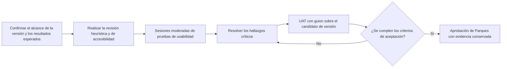

[← Volver a la descripción general de la entrega](./README.md)

# Validación con usuarios y pruebas de aceptación

> **Estado: ⚪ Planificado, aún no ejecutado.** Las sesiones de pruebas de usabilidad y las pruebas de aceptación de usuario (UAT) comenzarán después de que se integren las capas restantes y las funcionalidades de último momento, y el equipo congele un candidato de versión estable. Esta página contiene el plan de pruebas acordado, no evidencia de pruebas completadas. Es distinto de las pruebas técnicas de carga, estrés y saturación; consulte [`performance-testing.md`](./performance-testing.md).

Las pruebas de aceptación de usuario (UAT) son pruebas con guion y resultado aprobado/no aprobado sobre un candidato de versión congelado, usando cuentas reales para cada rol del producto. Son distintas de las sesiones moderadas de usabilidad, que preguntan si las personas comprenden la interfaz, y de las pruebas de carga, estrés y saturación.

## Cómo usar esta página

Esta página es el plan acordado, no un informe de sesiones ya hechas. Congelar primero un candidato de versión. Escribir los guiones de UAT contra las cinco cuentas de **Cuentas y roles de UAT**; la cuenta de invitado es obligatoria porque el producto nacional funciona sin iniciar sesión. Las particularidades de invitado, Finder y estados vacíos que aparecen al final son hechos del producto actual: no repruebe a quienes prueban por esos hechos, salvo que el guion de congelamiento diga lo contrario.

## Cronograma y criterios de entrada

Probar esta versión en desarrollo produciría hallazgos sobre flujos de trabajo que todavía podrían cambiar. El reclutamiento y la ejecución formal solo deben comenzar después de que el equipo del proyecto:

- Integre las capas aprobadas restantes y las funcionalidades de último momento.
- Congele el commit de la versión, la URL de despliegue, el catálogo de soluciones, los conjuntos de datos, los flujos de trabajo compatibles, los roles y los navegadores.
- Resuelva o excluya explícitamente los defectos que bloqueen la versión y los flujos de trabajo incompletos.
- Apruebe los resultados científicos esperados, la terminología en español, las medidas de protección de los participantes y la autoridad de aceptación.

Si el alcance de la versión cambia después de que comiencen las pruebas, se debe documentar el cambio y volver a ejecutar los escenarios afectados antes de la aprobación final.

## Modelo de validación recomendado

Dos etapas: primero, sesiones moderadas de pruebas de usabilidad con profesionales de la conservación y responsables de la toma de decisiones representativos; segundo, pruebas de aceptación de usuario (UAT) con guion sobre un candidato de versión estable. Esto sigue el principio de Nielsen de probar la interfaz con usuarios reales, al tiempo que conserva una etapa formal de aprobación o rechazo para la aceptación por parte de Parques.

## Participantes y alcance

- Reclutar ~8–12 participantes para las sesiones moderadas: profesionales de la conservación, planificadores y responsables de la toma de decisiones, con distintos niveles de experiencia en SIG y uso principalmente en español.
- Incluir representantes de TI de Parques en las UAT formales para validar la autenticación, los permisos, la compatibilidad con navegadores, las exportaciones y el comportamiento operativo. Las UAT deben usar las cinco cuentas de **Cuentas y roles de UAT**, incluida la de invitado.
- Incluir participantes que usen intensivamente el teclado y participantes relevantes para la accesibilidad cuando el reclutamiento lo permita; probar de acuerdo con las expectativas de WCAG 2.2 AA.
- Tratar los hallazgos de la muestra como evidencia indicativa, no como prueba estadística a nivel poblacional.

## Escenarios representativos

- Encontrar y aplicar una solución nacional o marina mediante objetivos declarados, áreas de conservación incluidas y un supuesto de costos; luego explicar el resultado en lenguaje sencillo.
- Agregar y administrar capas contextuales del mapa, cambiar su visibilidad u opacidad e interpretar la relación entre la capa y la solución activa.
- Seleccionar un área conocida o dibujar un área personalizada, interpretar sus métricas y verificar la evidencia exportada.
- Comparar dos soluciones y explicar correctamente la superposición, las áreas exclusivas y una disyuntiva significativa (cuando la comparación esté incluida en el alcance de la versión).
- Cambiar entre español e inglés sin perder el estado del flujo de trabajo ni crear incoherencias en la terminología, las etiquetas o las unidades.
- Recuperarse de resultados vacíos, datos faltantes, demoras de carga, capas no disponibles, errores de validación y flujos de trabajo interrumpidos.
- Completar el inicio de sesión o una solicitud de acceso y verificar la funcionalidad esperada restringida por rol (cuando la autenticación esté incluida en el alcance de la versión).

## Medidas y señales iniciales de aceptación

Estos umbrales son puntos de partida propuestos y deben ser aprobados por la dirección del proyecto y Parques antes de que comiencen las pruebas. Inicialmente, el tiempo por tarea debe utilizarse para fines de diagnóstico, no como umbral de aprobación o rechazo.

| Medida                                      | Qué establece                                                                                                     | Señal inicial propuesta                                                                           |
| ------------------------------------------- | ----------------------------------------------------------------------------------------------------------------- | -------------------------------------------------------------------------------------------------- |
| Finalización independiente de tareas        | Si los usuarios pueden completar flujos de trabajo críticos sin instrucciones del moderador.                      | Al menos 80% en las tareas principales.                                                            |
| Pregunta única de facilidad (SEQ)           | Dificultad percibida después de cada escenario.                                                                   | Mediana de al menos 5 de 7 para cada flujo de trabajo crítico.                                     |
| Escala de usabilidad del sistema (SUS)      | Referencia indicativa de usabilidad general.                                                                      | Al menos 70; no se considera prueba contractual.                                                   |
| Exactitud de la interpretación              | Si los usuarios explican correctamente las soluciones, la simbología del mapa, las métricas de área y comparaciones. | Al menos 80%, sin interpretaciones engañosas de conservación que permanezcan sin resolver.       |
| UAT formal                                  | Si el comportamiento acordado para la versión funciona para cada rol requerido y navegador compatible.           | Todos los casos dentro del alcance se aprueban o cuentan con una excepción aceptada explícitamente. |
| Accesibilidad                               | Si los flujos críticos siguen siendo perceptibles y operables.                                                    | Ningún bloqueo grave de teclado, foco, etiquetado, contraste, zoom o lector de pantalla.           |

## Paquete de evidencia que se debe conservar

- Alcance aprobado de la versión, roles y navegadores compatibles, conjuntos de datos y resultados esperados.
- Filtro de selección de participantes, resumen anonimizado de perfiles, estado del consentimiento y política de grabación.
- Guía de moderación, guiones de escenarios, casos de UAT, resultados esperados y cuentas de prueba.
- Observaciones de tareas, calificaciones de finalización, errores, asistencia brindada, resultados de accesibilidad y marcas de tiempo.
- Grabaciones y capturas de pantalla permitidas, además de archivos PNG y CSV exportados representativos.
- Hallazgos clasificados por gravedad y vinculados con principios de usabilidad, un registro de defectos, responsables, correcciones y evidencia de repetición de pruebas.
- Decisiones aprobadas sobre la terminología en español e inglés.
- Aprobación final de las UAT que identifique las excepciones aceptadas y las personas responsables de aprobarlas.

## Verificaciones de accesibilidad

- Completar los flujos de trabajo críticos usando únicamente el teclado; verificar el orden y la visibilidad del foco, la contención en ventanas modales, el comportamiento de Escape y la restauración del foco.
- Probar un zoom del navegador de 200% y diseños estrechos.
- Verificar que el significado del mapa, los gráficos, los estados y las comparaciones no dependa únicamente del color.
- Verificar con un lector de pantalla los nombres, roles, estados y errores accesibles, el progreso de carga y el estado expandido o contraído.
- Asegurar que la evidencia exportada incluya suficiente contexto textual; una imagen de mapa independiente no constituye un registro analítico accesible.

## Preguntas abiertas antes del reclutamiento

- ¿Qué flujos de trabajo y roles se incluyen en el candidato de versión: entorno marino, comparación, áreas personalizadas, autenticación, administración y cada tipo de exportación?
- ¿Qué navegadores, tamaños de pantalla, condiciones de red, soluciones canónicas, áreas, capas y valores esperados admitirán las UAT?
- ¿Quién aprueba la terminología de conservación en español y quién valida el significado científico y la procedencia de los cálculos?
- ¿Qué reglas se aplican a la privacidad y el consentimiento de los participantes, la grabación, la conservación de datos y la aprobación formal?
- ¿Qué niveles de gravedad de los defectos bloquean la aceptación y quién puede aprobar una excepción?

Consulte la [tabla de decisiones principales](./README.md#top-decisions-parques-it-must-make) en la descripción general de la entrega para ver cómo estas preguntas se relacionan con el resto del paquete.

## Cuentas y roles de UAT

Las UAT necesitan cinco cuentas, incluida la de invitado. El producto nacional funciona sin iniciar sesión; la cuenta de invitado es obligatoria aunque los otros cuatro roles inicien sesión. Quienes administran abren **Gestión de acceso** en el encabezado (Solicitudes SIRAP pendientes, Acceso SIRAP actual, Usuarios activos). Hoy el catálogo y las concesiones de datos SIRAP existen solo para Orinoquía y Eje Cafetero.

Un administrador SIRAP no puede nombrar a otras personas como administradoras SIRAP. Las casillas de asignación de administradores, Superadmin, la aprobación de cuentas nuevas y el nivel de la aplicación 2 frente a 3 son exclusivos de superadmin.

| Rol | Cómo se reconoce | Qué puede hacer esta cuenta | Qué no puede hacer esta cuenta |
| --- | --- | --- | --- |
| Invitado | Sin iniciar sesión | Finder nacional, mapa, AOI y análisis | Guardar escenarios con nombre (los guardados están en Firestore); ver catálogos SIRAP; abrir administración |
| Usuario con sesión iniciada | Cuenta de Google, sin concesión SIRAP | Capacidades de invitado más guardar, renombrar, recuperar y eliminar soluciones con nombre (máximo 12) en Firestore. La etiqueta de la barra lateral izquierda es lo que se almacena. | Ver catálogos SIRAP; abrir administración |
| Usuario SIRAP | `allowedSirapIds` tiene al menos una región (Orinoquía y/o Eje Cafetero) | Soluciones SIRAP de la(s) región(es) concedida(s), más los guardados de usuario regular | Abrir administración; usar regiones que no le fueron concedidas |
| Administrador SIRAP | `administeredSirapIds` tiene al menos una región y la cuenta no es superadmin | Aprobar o denegar solicitudes de acceso SIRAP de la(s) región(es) asignada(s); conceder o revocar el acceso a **datos** SIRAP (`allowedSirapIds`) solo para esas regiones | Nombrar a otras personas como administradoras SIRAP; marcar Superadmin; aprobar cuentas nuevas; fijar el nivel de la aplicación 2 frente a 3. La interfaz de asignaciones de administrador está envuelta en `isSuperAdmin()` y no se muestra a administradores SIRAP. |
| Superadmin | `isSuperAdmin` | Aprobar cuentas nuevas; fijar Nivel 2 frente a Nivel 3; asignar administradores regionales SIRAP (`administeredSirapIds`); conceder cualquier acceso a datos SIRAP; ver todas las regiones | — |

## Particularidades de invitado, Finder y estados vacíos que encontrarán quienes prueben

No repruebe a quienes prueban por estos hechos. Son hechos del producto publicado, no defectos, salvo que un guion de congelamiento los trate de otro modo.

- **Lo nacional funciona sin iniciar sesión.** Las personas invitadas pueden usar Finder, mapa, AOI y el análisis nacional. El inicio de sesión con Google se exige para solicitar y usar ámbitos SIRAP, no para usar el producto nacional.
- **El inicio de sesión por correo y el «solicitar acceso» por correo son demostraciones de interfaz.** No están conectados a Firebase. La identidad de producción es Google. Quien evite Google verá una ruta de correo inerte; eso no es una caída de autenticación en producción.
- **La separación entre cobertura existente protegida y cobertura nueva está activa por defecto** cuando hay una solución en el mapa. La apariencia de capas puede recolorear esas dos clases. La separación en sí no es optativa.
- **El Finder terrestre nacional exige Huella Humana 2022 o 2030** como elección de costo. Una tarjeta de Carbon Opportunity Cost es visible y siempre está deshabilitada; es una indisponibilidad intencional, no un control roto.
- **Las AOI administrativas conocidas (departamento, municipio, SIRAP, RUNAP, OMEC) muestran barras de uso del suelo vacías en la producción GTIC** («aún no disponible»). El compacto de producción (`catalog-releases/3.0.5` → `manifest/manifest.json`) no incluye `land_use_*_pct_of_aoi`. Las barras CLC de uso del suelo en vivo funcionan en polígonos personalizados **dibujados**. Esta rama / 3.0.6 usa el índice de prueba `land-use-aoi-test` (mismas cifras); las barras locales pueden llenarse. Eso no es producción GTIC. No repruebe una UAT por uso del suelo vacío en AOI conocidas de producción.
- **Las cifras de carbono en la interfaz usan `Mg·km²`.** Es una cadena de visualización. El visto bueno científico de las unidades sigue abierto; no trate la etiqueta como MgC/ha validado.
- **Net Benefit está oculto en Costos y los peces de agua dulce se quitaron de la lista de taxones de especies.** Son recortes intencionales del producto, no capas faltantes.
