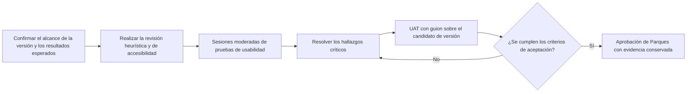

[← Volver a la descripción general de la entrega](./README.md)

# Validación con usuarios y pruebas de aceptación

> **Estado: ⚪ Planificado, aún no ejecutado.** Las sesiones de pruebas de usabilidad y las pruebas de aceptación de usuario (UAT) comenzarán después de que se integren las capas restantes y las funcionalidades de último momento, y el equipo congele un candidato de versión estable. Esta página contiene el plan de pruebas acordado, no evidencia de pruebas completadas. Es distinto de las pruebas técnicas de carga, estrés y saturación; consulte [`performance-testing.md`](./performance-testing.md).

## Cronograma y criterios de entrada

Probar esta versión en desarrollo produciría hallazgos sobre flujos de trabajo que todavía podrían cambiar. El reclutamiento y la ejecución formal solo deben comenzar después de que el equipo del proyecto:

- Integre las capas aprobadas restantes y las funcionalidades de último momento.
- Congele el commit de la versión, la URL de despliegue, el catálogo de soluciones, los conjuntos de datos, los flujos de trabajo compatibles, los roles y los navegadores.
- Resuelva o excluya explícitamente los defectos que bloqueen la versión y los flujos de trabajo incompletos.
- Apruebe los resultados científicos esperados, la terminología en español, las medidas de protección de los participantes y la autoridad de aceptación.

Si el alcance de la versión cambia después de que comiencen las pruebas, se debe documentar el cambio y volver a ejecutar los escenarios afectados antes de la aprobación final.

## Modelo de validación recomendado

Dos etapas: primero, sesiones moderadas de pruebas de usabilidad con profesionales de la conservación y responsables de la toma de decisiones representativos; segundo, pruebas de aceptación de usuario (UAT) con guion sobre un candidato de versión estable. Esto sigue el principio de Nielsen de probar la interfaz con usuarios reales, al tiempo que conserva una etapa formal de aprobación o rechazo para la aceptación por parte de Parques.

## Participantes y alcance

- Reclutar ~8–12 participantes para las sesiones moderadas: profesionales de la conservación, planificadores y responsables de la toma de decisiones, con distintos niveles de experiencia en SIG y uso principalmente en español.
- Incluir representantes de TI de Parques en las UAT formales para validar la autenticación, los permisos, la compatibilidad con navegadores, las exportaciones y el comportamiento operativo.
- Incluir participantes que usen intensivamente el teclado y participantes relevantes para la accesibilidad cuando el reclutamiento lo permita; probar de acuerdo con las expectativas de WCAG 2.2 AA.
- Tratar los hallazgos de la muestra como evidencia indicativa, no como prueba estadística a nivel poblacional.

## Escenarios representativos

- Encontrar y aplicar una solución nacional o marina mediante objetivos declarados, áreas de conservación incluidas y un supuesto de costos; luego explicar el resultado en lenguaje sencillo.
- Agregar y administrar capas contextuales del mapa, cambiar su visibilidad u opacidad e interpretar la relación entre la capa y la solución activa.
- Seleccionar un área conocida o dibujar un área personalizada, interpretar sus métricas y verificar la evidencia exportada.
- Comparar dos soluciones y explicar correctamente la superposición, las áreas exclusivas y una disyuntiva significativa (cuando la comparación esté incluida en el alcance de la versión).
- Cambiar entre español e inglés sin perder el estado del flujo de trabajo ni crear incoherencias en la terminología, las etiquetas o las unidades.
- Recuperarse de resultados vacíos, datos faltantes, demoras de carga, capas no disponibles, errores de validación y flujos de trabajo interrumpidos.
- Completar el inicio de sesión o una solicitud de acceso y verificar la funcionalidad esperada restringida por rol (cuando la autenticación esté incluida en el alcance de la versión).

## Medidas y señales iniciales de aceptación

Estos umbrales son puntos de partida propuestos y deben ser aprobados por la dirección del proyecto y Parques antes de que comiencen las pruebas. Inicialmente, el tiempo por tarea debe utilizarse para fines de diagnóstico, no como umbral de aprobación o rechazo.

| Medida                                      | Qué establece                                                                                                     | Señal inicial propuesta                                                                           |
| ------------------------------------------- | ----------------------------------------------------------------------------------------------------------------- | -------------------------------------------------------------------------------------------------- |
| Finalización independiente de tareas        | Si los usuarios pueden completar flujos de trabajo críticos sin instrucciones del moderador.                      | Al menos 80% en las tareas principales.                                                            |
| Pregunta única de facilidad (SEQ)           | Dificultad percibida después de cada escenario.                                                                   | Mediana de al menos 5 de 7 para cada flujo de trabajo crítico.                                     |
| Escala de usabilidad del sistema (SUS)      | Referencia indicativa de usabilidad general.                                                                      | Al menos 70; no se considera prueba contractual.                                                   |
| Exactitud de la interpretación              | Si los usuarios explican correctamente las soluciones, la simbología del mapa, las métricas de área y comparaciones. | Al menos 80%, sin interpretaciones engañosas de conservación que permanezcan sin resolver.       |
| UAT formal                                  | Si el comportamiento acordado para la versión funciona para cada rol requerido y navegador compatible.           | Todos los casos dentro del alcance se aprueban o cuentan con una excepción aceptada explícitamente. |
| Accesibilidad                               | Si los flujos críticos siguen siendo perceptibles y operables.                                                    | Ningún bloqueo grave de teclado, foco, etiquetado, contraste, zoom o lector de pantalla.           |

## Paquete de evidencia que se debe conservar

- Alcance aprobado de la versión, roles y navegadores compatibles, conjuntos de datos y resultados esperados.
- Filtro de selección de participantes, resumen anonimizado de perfiles, estado del consentimiento y política de grabación.
- Guía de moderación, guiones de escenarios, casos de UAT, resultados esperados y cuentas de prueba.
- Observaciones de tareas, calificaciones de finalización, errores, asistencia brindada, resultados de accesibilidad y marcas de tiempo.
- Grabaciones y capturas de pantalla permitidas, además de archivos PNG y CSV exportados representativos.
- Hallazgos clasificados por gravedad y vinculados con principios de usabilidad, un registro de defectos, responsables, correcciones y evidencia de repetición de pruebas.
- Decisiones aprobadas sobre la terminología en español e inglés.
- Aprobación final de las UAT que identifique las excepciones aceptadas y las personas responsables de aprobarlas.

## Verificaciones de accesibilidad

- Completar los flujos de trabajo críticos usando únicamente el teclado; verificar el orden y la visibilidad del foco, la contención en ventanas modales, el comportamiento de Escape y la restauración del foco.
- Probar un zoom del navegador de 200% y diseños estrechos.
- Verificar que el significado del mapa, los gráficos, los estados y las comparaciones no dependa únicamente del color.
- Verificar con un lector de pantalla los nombres, roles, estados y errores accesibles, el progreso de carga y el estado expandido o contraído.
- Asegurar que la evidencia exportada incluya suficiente contexto textual; una imagen de mapa independiente no constituye un registro analítico accesible.

## Preguntas abiertas antes del reclutamiento

- ¿Qué flujos de trabajo y roles se incluyen en el candidato de versión: entorno marino, comparación, áreas personalizadas, autenticación, administración y cada tipo de exportación?
- ¿Qué navegadores, tamaños de pantalla, condiciones de red, soluciones canónicas, áreas, capas y valores esperados admitirán las UAT?
- ¿Quién aprueba la terminología de conservación en español y quién valida el significado científico y la procedencia de los cálculos?
- ¿Qué reglas se aplican a la privacidad y el consentimiento de los participantes, la grabación, la conservación de datos y la aprobación formal?
- ¿Qué niveles de gravedad de los defectos bloquean la aceptación y quién puede aprobar una excepción?

Consulte la [tabla de decisiones principales](./README.md#top-decisions-parques-it-must-make) en la descripción general de la entrega para ver cómo estas preguntas se relacionan con el resto del paquete.
